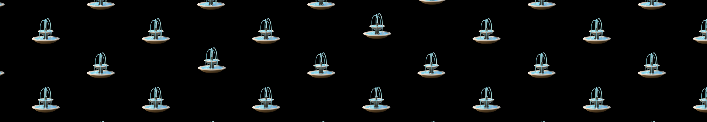

Constant-product automated market makers (CPAMMs), like those used on
emojicoin.fun, automatically set the trading price of two token, in this case an
emojicoin denominated in APT. The initial ratio of these tokens sets price at
the start of the CPAMM, while the liquidity curve dictates price changes for
each swap transaction.

## How it works

### 1. Swapping tokens

- Users swap one token for another, paying a small transaction fee.

### 2. Providing liquidity

- Liquidity providers (LPs) contribute both emojicoins and APT to the pool.
- In exchange, LPs receive LP tokens, representing their share in the pool,
  which are required to withdraw their liquidity.
- LPs earn a portion of the transaction fees from swaps, which are automatically
  reinvested in the pool after each swap.

## Constant function (key concept)

CPAMMs, popularized by Uniswap v2, use a constant function to calculate the
relative prices of the two tokens. This formula takes the following form:

$$
X \cdot Y = K
$$

- $X$ = Emojicoin
- $Y$ = APT
- $K$ = Constant

This design ensures that the pool maintains its liquidity and cannot be
completely drained. The standard liquidity curve function introduced by Uniswap
v2 is crucial for price stability and liquidity availability.
