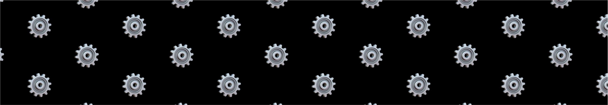

## Bonding curve, state transition, and more

When a new emojicoin launches, its trading mechanics are dictated by a bonding
curve where the price of the emojicion is a function of how much has been
purchased thus far. Specifically, the bonding curve is implemented as a
concentrated liquidity automated market maker (CLAMM) with a single price range.

Once the market capitalization of the emojicoin reaches 45,000 APT, the APT in
the CLAMM is burned into a traditional constant-product automated market maker
(CPAMM), along with emojicoin reserves set aside at the market launch. This
mechanism ensures a liquidity backstop after the state transition, and a
constant price throughout the state transition. Moreover, after the bonding
curve state transition, anyone can provide liquidity into the CPAMM!

## Emojicoin or else

The only coins that can be launched are emojicoins from the
[Unicode emoji library].

## Emojicoin CPAMM Pool

The emojicoin CPAMM follows the equation popularized by Uniswap v2:

$$
X \cdot Y = K
$$

## Emojicoin lifecycle: Launch to pool

**Introduction**: Congratulations! You've decided to launch an emojicoin! Head
on over to emojicoin.fun for a seamless experience, powered by the Aptos
blockchain.

### First steps: Launch your emojicoin

Launching an emojicion costs just 1 APT! Note the following:

- Emojis up to 10 bytes are not supported.
- Emoji combinations are supported, as long as the total is 10 bytes or less.
- Only one market may be launched for a given emoji combination.
- Emojis that became part of the [Unicode emoji library] after the launch of
  emojicoin.fun are not supported.

### Growing Up: Exiting the Bonding Curve

As users buy or sell against the bonding curve, the market capitalization of the
emojicoin changes. Once 10,000 APT of cumulative sell pressure has pushed the
market capitalization up to 45,000 APT, the emojicoin leaves the bonding curve.

### Going to college: Emojicoin liquidity pools

Once an emojicoin's market capitalization reaches 45,000 APT, the underlying
market undergoes a state transition: the 10,000 APT that has been deposited into
the bonding curve is transferred into an emojicoin CPAMM liquidity pool,
alongside roughly 23\% of the remaining emojicoin token supply that has not yet
gone into circulation. The LP coins generated from this step are then burned
into the pool to ensure continued market liquidity. Note that this entire step
is autonomous, handled by the protocol itself without any human interference.

Once an emojicoin has left the bonding curve, users may earn yield on their
emojicoins by providing liquidity to the new CPAMM liquidity pool!

[unicode emoji library]: https://www.unicode.org/emoji/charts/full-emoji-list.html
