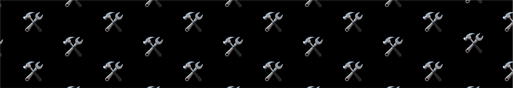

<!---
cspell:word memecoins
cspell:word presales
-->

## Accessibility, fairness, and fun

- **Engagement**: Since emojis are universally recognized and loved,
  emojicon.fun is instantly engaging and approachable. By using emojis as coin
  symbols, emojicoin.fun lowers the barrier to entry for those who might find
  traditional crypto trading intimidating or too complex.

- **Fairly Launched**: In the world of memecoins, new participants frequently
  fall victim to scams or unfair token supply distributions, and lose funds.
  The emojicoin.fun platform enables users to launch emojicoins in a fair launch
  with predefined supply amounts, where transparent distribution is ensured
  without presales or team allocations.

- **Fun**: The emojicoin.fun platform provides an enjoyable environment for
  users to engage with the DeFi universe through a simple interface, where there
  is no house with better odds than the user.

## Community building

- **Social Interaction**: Emojis are inherently social, and are often used to
  express emotions and ideas in digital communication. The emojicoin.fun
  platform encourages a community-driven atmosphere where users can bond over
  their emojicoins through a per-market chat feature based entirely on emojis.
- **Inclusive Environment**: By leveraging the universal appeal of emojis,
  emojicoin.fun creates an inclusive trading environment that welcomes users
  from all walks of life.

## Showcasing the Aptos tech stack

- Aptos is not just fast and affordable, it’s one of the quickest and most
  inexpensive decentralized networks in the world. The emojicoin.fun platform
  leverages the powerful Aptos tech stack to showcase what can be done with
  next-generation blockchain technology, with fun and ease. Say goodbye to
  failed transactions and high gas fees, and say hello to joy!
