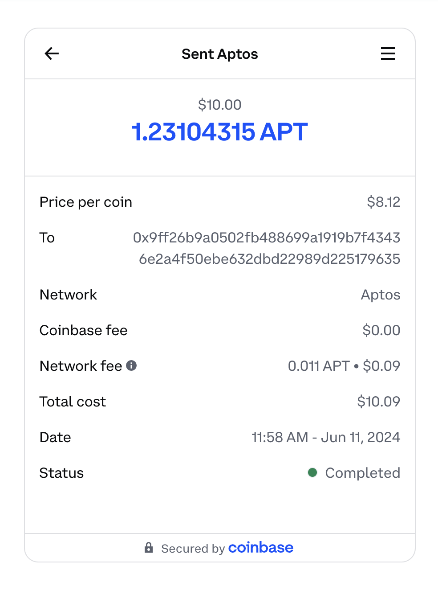

Use this guide if you are using an Aptos wallet and using Coinbase to onramp.

1. Open Petra wallet and click Buy
   
1. Choose Coinbase Pay
   
1. Click Buy or Transfer with Coinbase
   
1. Login
   
1. Choose transfer or buy new asset
   
1. Choose amount you want to buy or transfer
   
1. Confirm purchase
   
1. Wait a few seconds for the purchased APT to hit your wallet
   
   Congrats! You are now ready to start trading at Emojicoin.fun with the
   APT you now have in your wallet!
