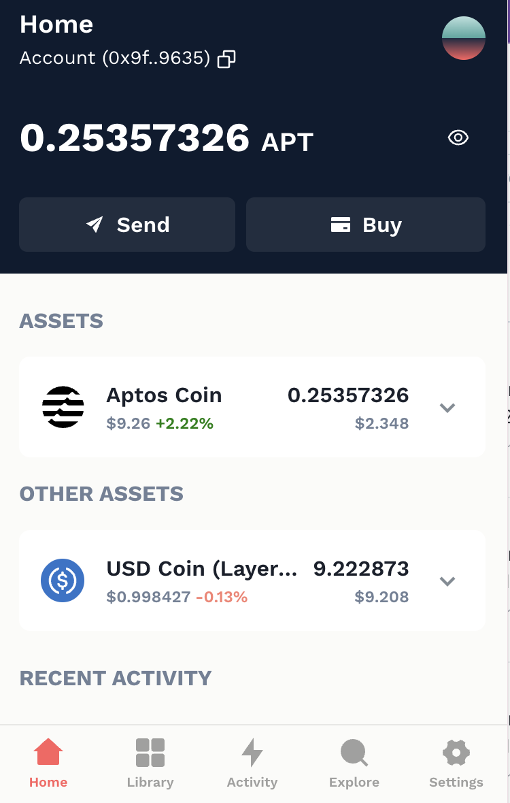
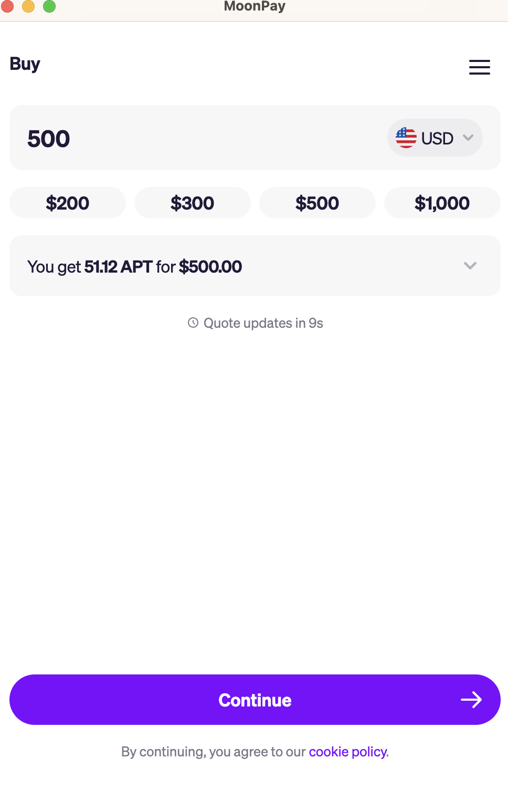

Use this guide if you are using an Aptos wallet and Moonpay.
1. Open your Petra wallet and click Buy

2. Choose Moonpay 

3. Enter amount you want to purchase

Congrats! You are now ready to start trading at Emojicoin.fun with the APT you now have in your wallet!