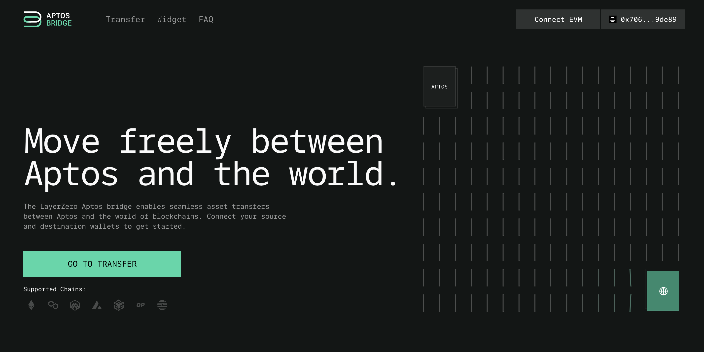
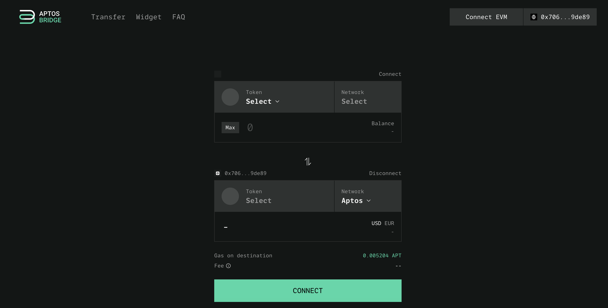
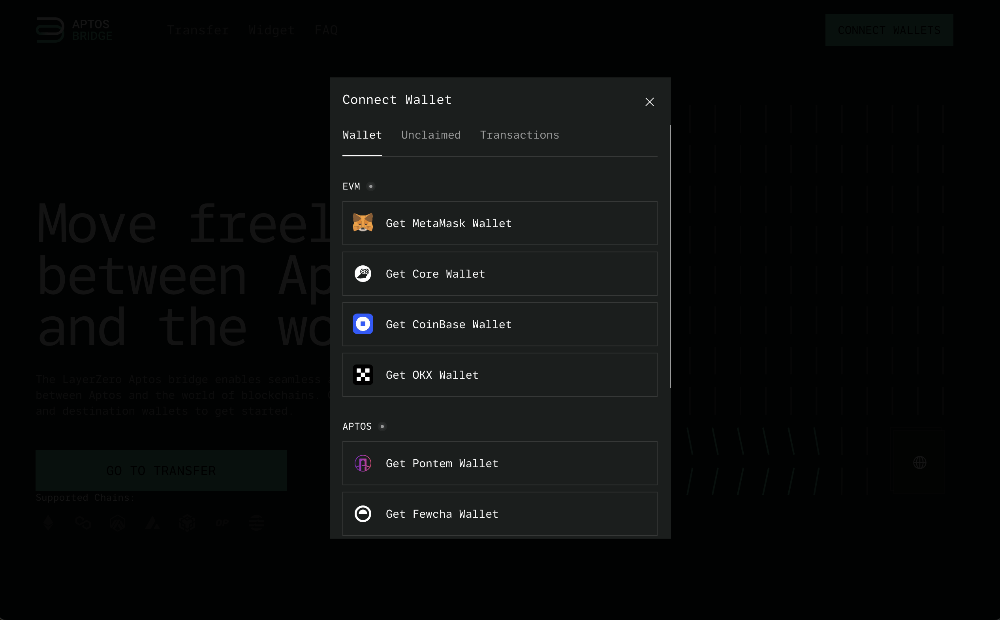
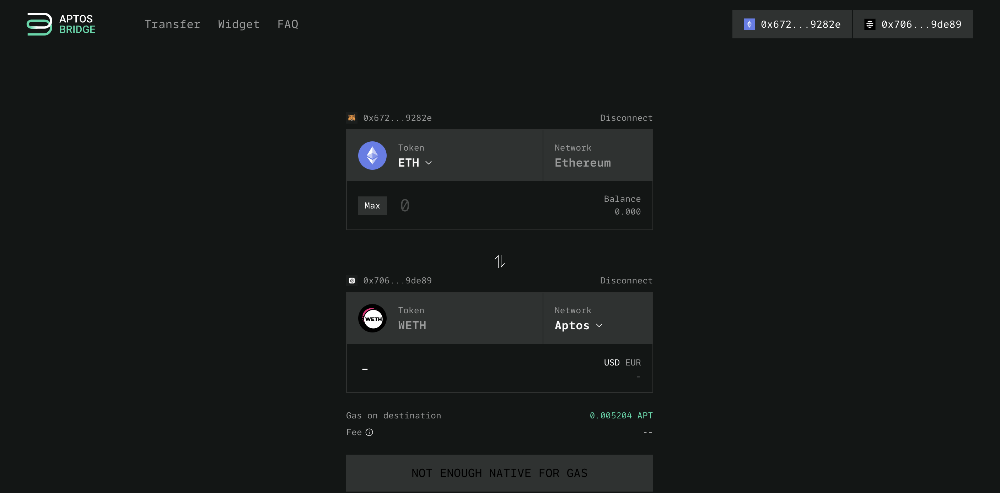
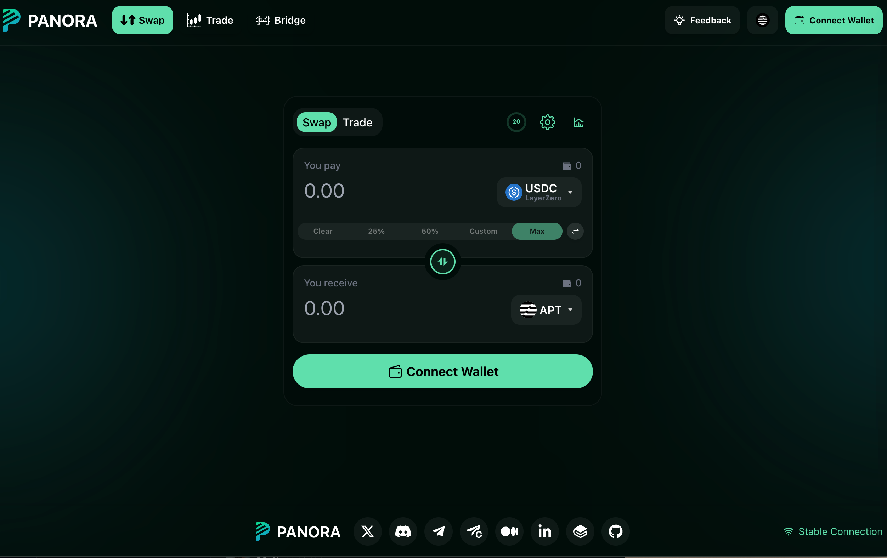
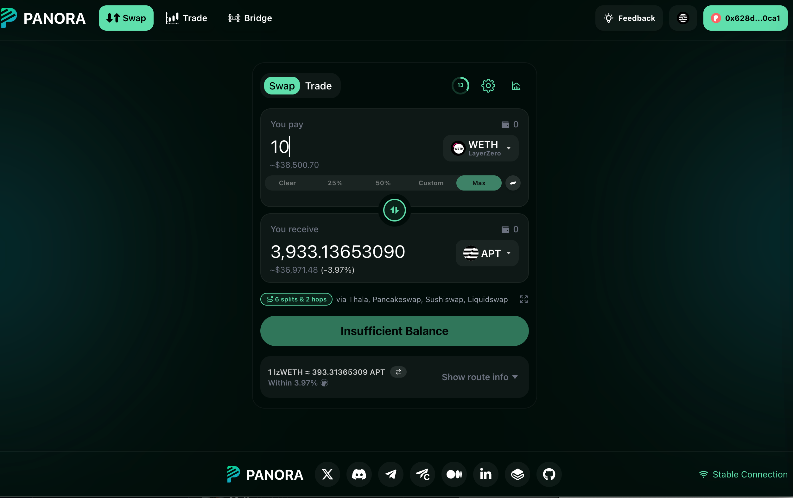

<!--- cspell:word Panora -->

Use this guide if you are bridging from Ethereum to Aptos.

### Prerequisites

Before we begin, you will need to have the following:

- A wallet with USDC or ETH
- A browser with wallet extensions installed
- An Aptos wallet

### Steps to Bridge USDC (LayerZero) into Aptos

1. Go to [The Aptos Bridge] website
   
1. Click Transfer
   
1. Connect your EVM and Aptos Wallet
   
1. Select the "From" and "To" tokens. In this case,  select " ETH" ( or USDC
   on your given chain) or ETH for the "From" token and "WETH" on APT for the
   "To" token.
   
1. Enter the amount
1. Click on the "Bridge" button
1. Review the transaction details and click on the "Confirm" button
1. The bridge will be executed and your wrapped USDC (LayerZero) coins for
   Aptos will be deposited into your Aptos wallet
1. Now heading over to Panora to swap WETH_lz to APT
   
1. Connect wallet
   
1. Enter the amount of funds you would like to turn into APT

Congrats! You are now ready to start trading at Emojicoin.fun with the APT you
now have in your wallet!

[the aptos bridge]: https://theaptosbridge.com/
