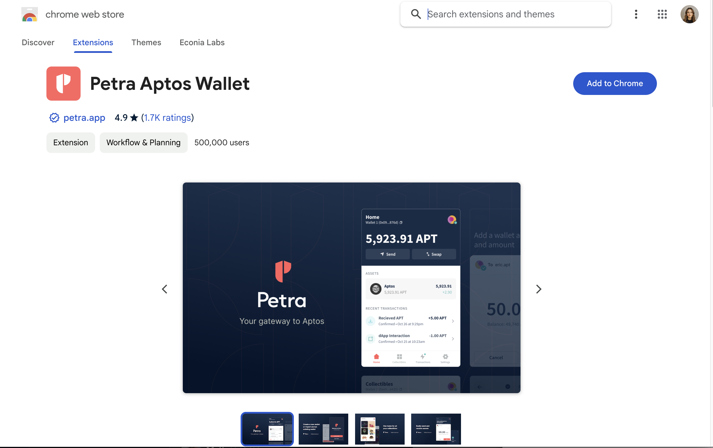
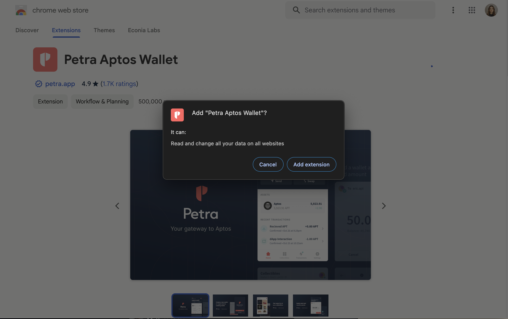
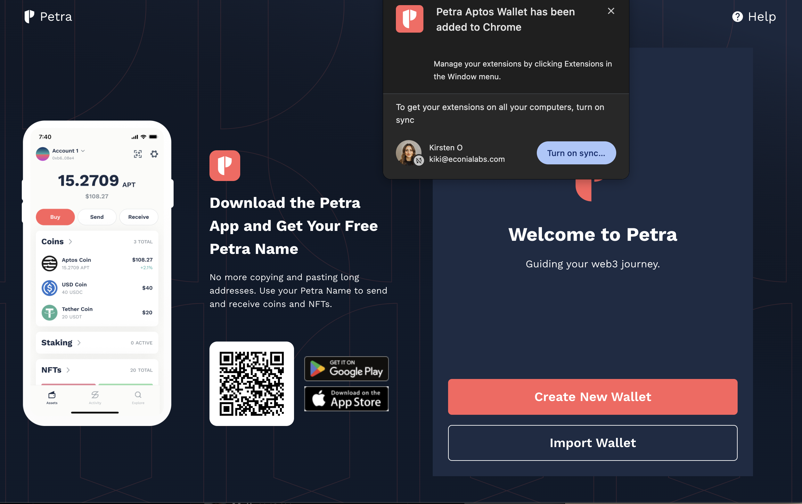
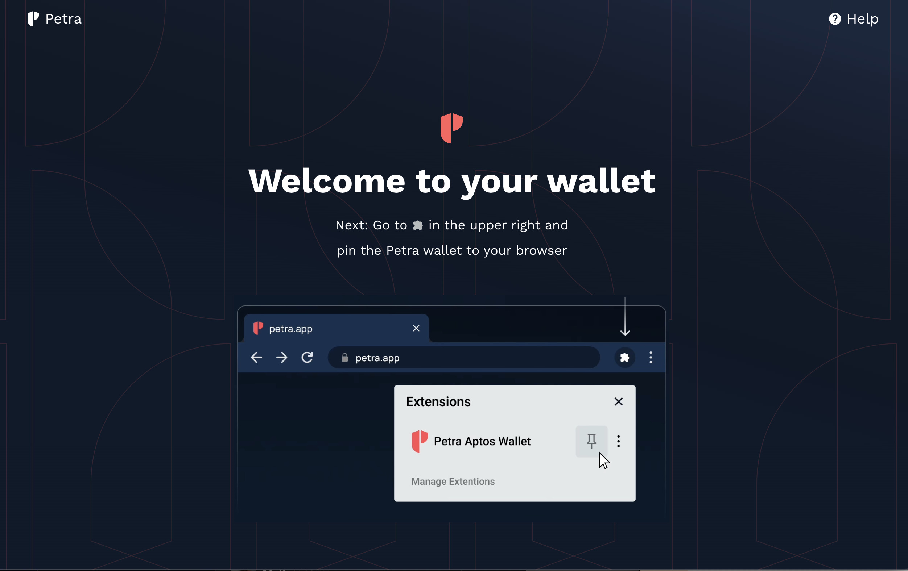

Use this guide for step by step instructions on how to download Petra wallet.

1. Download Petra Wallet: Chrome Extension, Mobile App (App Store, Google Play)
   
1. Add "Petra Aptos Wallet" pop-up
   
1. Create new wallet
   
1. Once wallet has been created,  pin it to the browser
   

Congrats! You are one step closer to trading on emojicoin.fun. Click below for
the next steps of how to get APT into your wallet.
