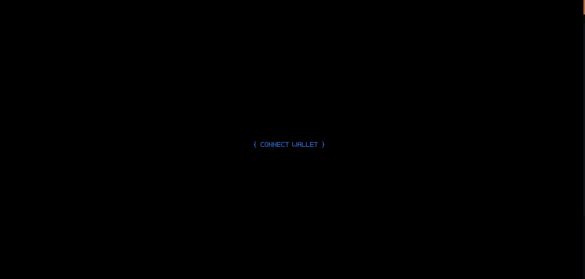
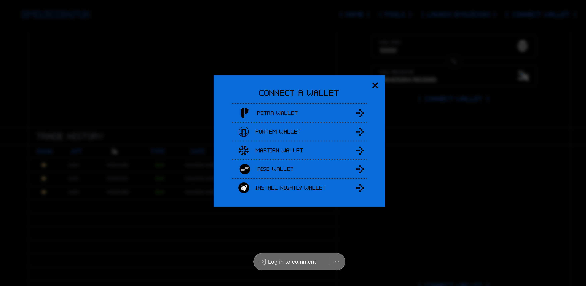
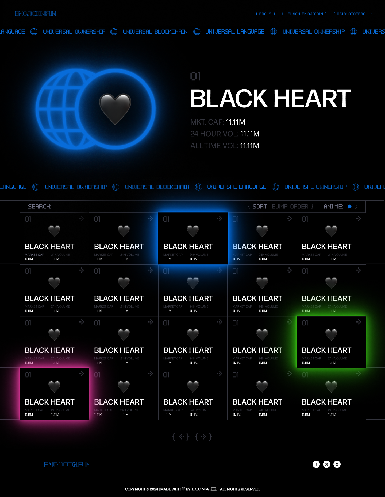
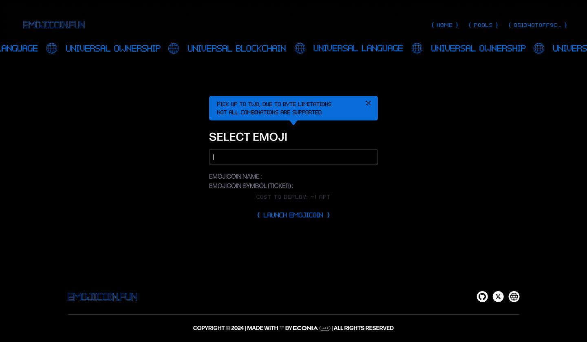
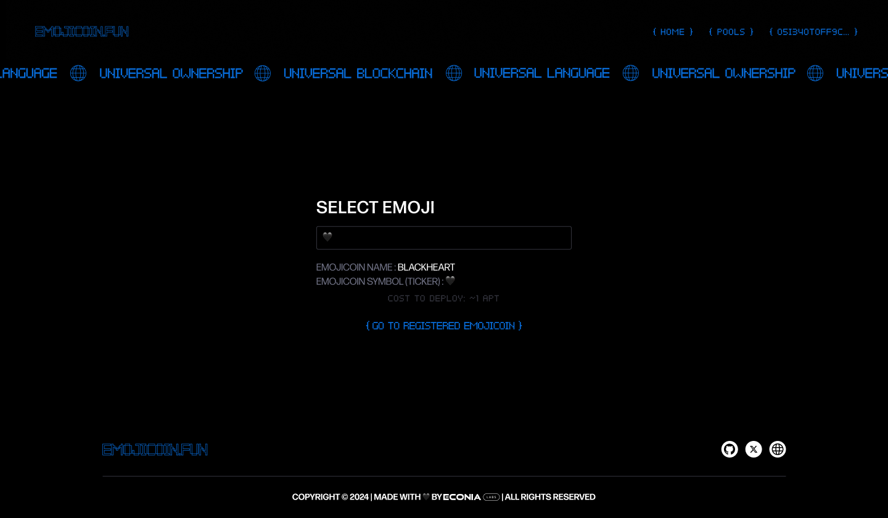
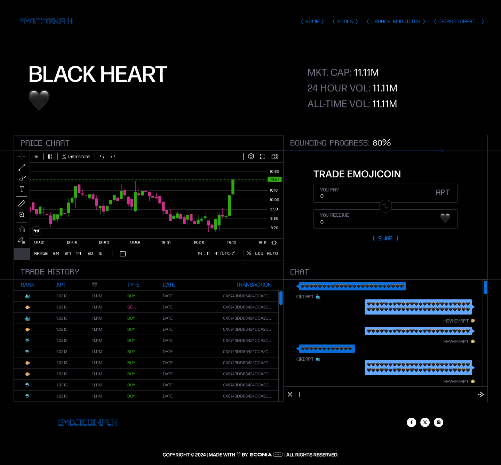
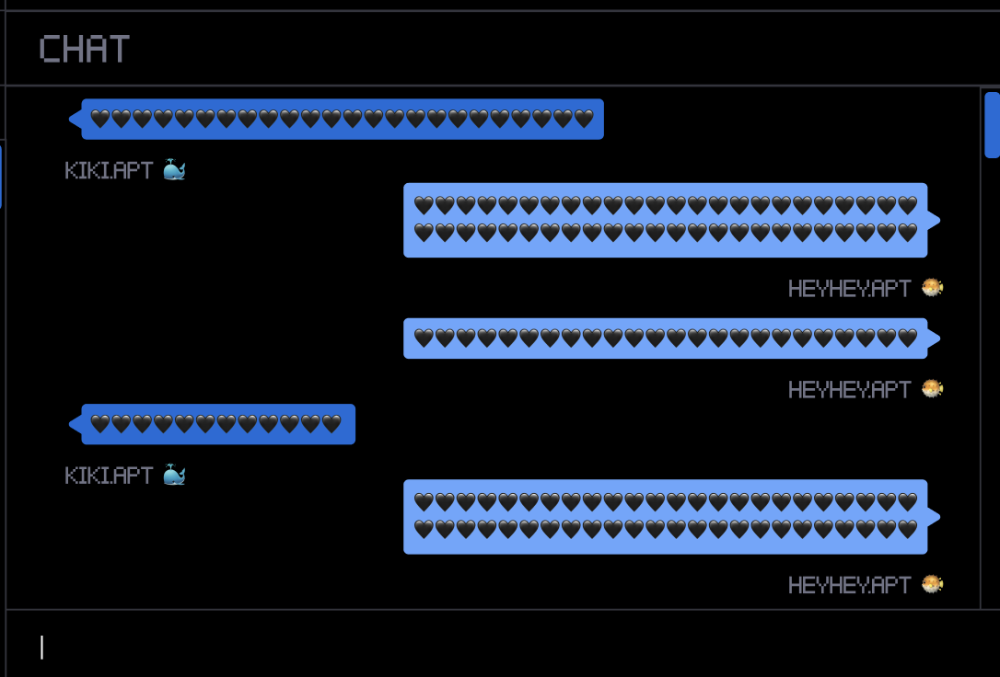

1. Go to emojicoin.fun
   
1. Connect wallet
   
1. Enter Site
   
1. Click Launch Emojicoin
   
1. Select the Emoji you want to launch and how much you want to ape
   
1. Go to the registered emojicoin and swap your APT for more tokens ( you can
   also track bonding curve progress here)
   
1. Start chatting in the chat on the right-hand side. If your emoji shows up
   as a:
   - 🐳 (Whale) you are Top 1% of all holders
   - 🐬 (Dolphin)  you are top 30% but not top 1%.
   - 🐡 (Blowfish) you are bottom 70% of all holders.
     
1. Once the emojicoin has exited the bonding curve you can provide
   liquidity in the Pools tab or other emojicoin pools
   
   Congrats you've just completed the life cycle of an emojicoin!
   Happy pumping!
