<div className="welcome-heading">
    <div>
        <h2 style={{ marginBottom: "40px" }}>Welcome</h2>
        
        <p style={{ marginTop: "20px" }}>e·co·ni·a | /ə'känēə/</p>
    </div>
    
</div>

<div className="welcome-heading-mobile">
    <div style={{
        display: "flex",
        justifyContent: "space-between",
        alignItems: "flex-start",
    }}>
        <h2 style={{ marginBottom: "40px" }}>Welcome</h2>
        
    </div>
    
    <p style={{ marginTop: "20px" }}>e·co·ni·a | /ə'känēə/</p>
</div>

This is text.

This is also text

## Mermaid diagram

```mermaid
flowchart TB

subgraph gcp[Google Cloud Platform]
    subgraph load-balancer[Global Load Balancer]
        subgraph armor[GCP Cloud Armor]
        direction LR
            rate-limiting[IP Rate Limiting]
            ddos[Layer 7 DDoS Protection]
        end
    end
    load-balancer-->rest-service
    subgraph rest-service[REST API Cloud Run Service]
        subgraph r-instance-1[PostgREST Instance]
            ri1c[Container]
        end
        subgraph r-instance-2[PostgREST Instance]
            ri2c[Container]
        end
    end
    rest-service --> rest-connector
    subgraph vpc[PostgreSQL VPC]
        aggregator-container-->|Private IP|cloud-pg
        processor-container-->|Private IP|cloud-pg
        subgraph processor-image[Processor VM]
            processor-container[Container]
        end
        subgraph aggregator-image[Aggregator VM]
            aggregator-container[Container]
        end
        processor-container-->processor_disk[Config disk]
        cloud-pg[(PostgreSQL via Cloud SQL)]
        rest-connector(REST VPC connector)--->cloud-pg
    end
end
processor-container-->grpc[Aptos Labs gRPC]
pg_admin[PostgreSQL Admin]-->|Public IP|cloud-pg
leaderboard[Vercel Leaderboard]-->load-balancer

classDef blue fill:#134d52
classDef green fill:#13521d
classDef yellow fill:#979e37
classDef purple fill:#800080
class load-balancer purple;
class gcp blue;
class vpc green;
class ws-service yellow;
class rest-service yellow;
```



## Header

This sentence uses reference links: [independent audits].

## A table

The Econia Move package is persisted indefinitely on both Aptos mainnet and testnet at the following multisig addresses:

| Chain     | Account address                                                      |
| --------- | -------------------------------------------------------------------- |
| [mainnet] | [0xc0deb00c405f84c85dc13442e305df75d1288100cdd82675695f6148c7ece51c] |
| [testnet] | [0xc0de11113b427d35ece1d8991865a941c0578b0f349acabbe9753863c24109ff] |

:::tip

This is a tip admonition.

:::

:::note

This is a note admonition.

:::

:::caution

This is a caution admonition.

:::

Check out this monospace code block:

> ```
>                                    1001 [35 -> 38]
>                                   /    \
>               [50 -> 60 -> 55] 1000    1003 [20]
> AVL queue head ^                      /    \
>                          [15 -> 5] 1002    1004 [4 -> 10]
>                                                       ^ AVL queue tail
> ```

Check out this fenced code block:

```toml
[dependencies.Econia]
git = "https://github.com/econia-labs/econia"
subdir = "src/move/econia"
rev = "mainnet"
```

## External resources

This is a list where each item is a reference link:

- [Discord]
- [GitHub]
- [Medium]
- [Twitter]

[0xc0de11113b427d35ece1d8991865a941c0578b0f349acabbe9753863c24109ff]: https://explorer.aptoslabs.com/account/0xc0de11113b427d35ece1d8991865a941c0578b0f349acabbe9753863c24109ff?network=testnet
[0xc0deb00c405f84c85dc13442e305df75d1288100cdd82675695f6148c7ece51c]: https://explorer.aptoslabs.com/account/0xc0deb00c405f84c85dc13442e305df75d1288100cdd82675695f6148c7ece51c?network=mainnet
[aptos]: https://aptos.dev
[discord]: https://discord.gg/econia
[github]: https://github.com/econia-labs/econia
[independent audits]: security
[mainnet]: https://github.com/econia-labs/econia/tree/mainnet
[medium]: https://medium.com/econialabs
[permissionless faucet]: https://github.com/econia-labs/econia/tree/v4.1.0-audited/src/move/faucet/sources
[teach yourself move on aptos]: https://github.com/econia-labs/teach-yourself-move
[testnet]: https://github.com/econia-labs/econia/tree/testnet
[twitter]: https://twitter.com/econialabs
