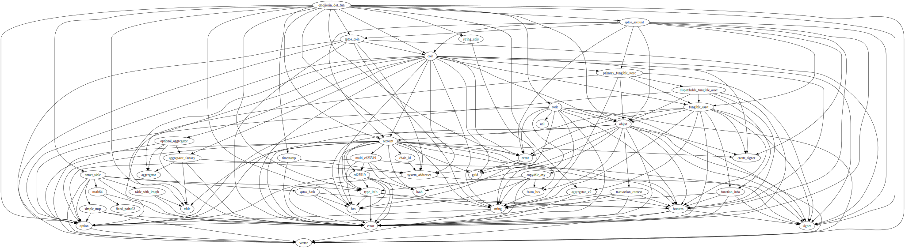

<a id="0xc0de_emojicoin_dot_fun"></a>

# Module `0xc0de::emojicoin_dot_fun`


-  [Resource `RegistryAddress`](#0xc0de_emojicoin_dot_fun_RegistryAddress)
-  [Resource `Registry`](#0xc0de_emojicoin_dot_fun_Registry)
-  [Resource `Market`](#0xc0de_emojicoin_dot_fun_Market)
-  [Resource `LPCoinCapabilities`](#0xc0de_emojicoin_dot_fun_LPCoinCapabilities)
-  [Struct `GlobalState`](#0xc0de_emojicoin_dot_fun_GlobalState)
-  [Struct `State`](#0xc0de_emojicoin_dot_fun_State)
-  [Struct `PeriodicState`](#0xc0de_emojicoin_dot_fun_PeriodicState)
-  [Struct `MarketRegistration`](#0xc0de_emojicoin_dot_fun_MarketRegistration)
-  [Struct `Swap`](#0xc0de_emojicoin_dot_fun_Swap)
-  [Struct `Chat`](#0xc0de_emojicoin_dot_fun_Chat)
-  [Struct `Liquidity`](#0xc0de_emojicoin_dot_fun_Liquidity)
-  [Struct `RegistryView`](#0xc0de_emojicoin_dot_fun_RegistryView)
-  [Struct `MarketView`](#0xc0de_emojicoin_dot_fun_MarketView)
-  [Struct `CumulativeStats`](#0xc0de_emojicoin_dot_fun_CumulativeStats)
-  [Struct `GlobalStats`](#0xc0de_emojicoin_dot_fun_GlobalStats)
-  [Struct `InstantaneousStats`](#0xc0de_emojicoin_dot_fun_InstantaneousStats)
-  [Struct `LastSwap`](#0xc0de_emojicoin_dot_fun_LastSwap)
-  [Struct `MarketMetadata`](#0xc0de_emojicoin_dot_fun_MarketMetadata)
-  [Struct `ParallelizableSequenceInfo`](#0xc0de_emojicoin_dot_fun_ParallelizableSequenceInfo)
-  [Struct `PeriodicStateMetadata`](#0xc0de_emojicoin_dot_fun_PeriodicStateMetadata)
-  [Struct `PeriodicStateTracker`](#0xc0de_emojicoin_dot_fun_PeriodicStateTracker)
-  [Struct `Reserves`](#0xc0de_emojicoin_dot_fun_Reserves)
-  [Struct `SequenceInfo`](#0xc0de_emojicoin_dot_fun_SequenceInfo)
-  [Struct `StateMetadata`](#0xc0de_emojicoin_dot_fun_StateMetadata)
-  [Struct `TVLtoLPCoinRatio`](#0xc0de_emojicoin_dot_fun_TVLtoLPCoinRatio)
-  [Constants](#@Constants_0)
-  [Function `register_market`](#0xc0de_emojicoin_dot_fun_register_market)
-  [Function `swap`](#0xc0de_emojicoin_dot_fun_swap)
-  [Function `chat`](#0xc0de_emojicoin_dot_fun_chat)
    -  [Emoji arguments](#@Emoji_arguments_1)
    -  [Example](#@Example_2)
-  [Function `provide_liquidity`](#0xc0de_emojicoin_dot_fun_provide_liquidity)
-  [Function `remove_liquidity`](#0xc0de_emojicoin_dot_fun_remove_liquidity)
-  [Function `is_a_supported_symbol_emoji`](#0xc0de_emojicoin_dot_fun_is_a_supported_symbol_emoji)
-  [Function `is_a_supported_chat_emoji`](#0xc0de_emojicoin_dot_fun_is_a_supported_chat_emoji)
-  [Function `is_a_supplemental_chat_emoji`](#0xc0de_emojicoin_dot_fun_is_a_supplemental_chat_emoji)
-  [Function `verified_symbol_emoji_bytes`](#0xc0de_emojicoin_dot_fun_verified_symbol_emoji_bytes)
-  [Function `registry_address`](#0xc0de_emojicoin_dot_fun_registry_address)
-  [Function `registry_view`](#0xc0de_emojicoin_dot_fun_registry_view)
-  [Function `unpack_registry_view`](#0xc0de_emojicoin_dot_fun_unpack_registry_view)
-  [Function `market_metadata_by_emoji_bytes`](#0xc0de_emojicoin_dot_fun_market_metadata_by_emoji_bytes)
-  [Function `market_metadata_by_market_address`](#0xc0de_emojicoin_dot_fun_market_metadata_by_market_address)
-  [Function `market_metadata_by_market_id`](#0xc0de_emojicoin_dot_fun_market_metadata_by_market_id)
-  [Function `unpack_market_metadata`](#0xc0de_emojicoin_dot_fun_unpack_market_metadata)
-  [Function `market_view`](#0xc0de_emojicoin_dot_fun_market_view)
-  [Function `unpack_market_view`](#0xc0de_emojicoin_dot_fun_unpack_market_view)
-  [Function `simulate_swap`](#0xc0de_emojicoin_dot_fun_simulate_swap)
-  [Function `unpack_swap`](#0xc0de_emojicoin_dot_fun_unpack_swap)
-  [Function `simulate_provide_liquidity`](#0xc0de_emojicoin_dot_fun_simulate_provide_liquidity)
-  [Function `simulate_remove_liquidity`](#0xc0de_emojicoin_dot_fun_simulate_remove_liquidity)
-  [Function `unpack_liquidity`](#0xc0de_emojicoin_dot_fun_unpack_liquidity)
-  [Function `tvl_per_lp_coin_growth_q64`](#0xc0de_emojicoin_dot_fun_tvl_per_lp_coin_growth_q64)
-  [Function `unpack_cumulative_stats`](#0xc0de_emojicoin_dot_fun_unpack_cumulative_stats)
-  [Function `unpack_instantaneous_stats`](#0xc0de_emojicoin_dot_fun_unpack_instantaneous_stats)
-  [Function `unpack_last_swap`](#0xc0de_emojicoin_dot_fun_unpack_last_swap)
-  [Function `unpack_periodic_state_tracker`](#0xc0de_emojicoin_dot_fun_unpack_periodic_state_tracker)
-  [Function `unpack_reserves`](#0xc0de_emojicoin_dot_fun_unpack_reserves)
-  [Function `unpack_sequence_info`](#0xc0de_emojicoin_dot_fun_unpack_sequence_info)
-  [Function `unpack_tvl_to_lp_coin_ratio`](#0xc0de_emojicoin_dot_fun_unpack_tvl_to_lp_coin_ratio)
-  [Function `init_module`](#0xc0de_emojicoin_dot_fun_init_module)
-  [Function `register_market_inner`](#0xc0de_emojicoin_dot_fun_register_market_inner)
-  [Function `simulate_swap_inner`](#0xc0de_emojicoin_dot_fun_simulate_swap_inner)
-  [Function `trigger_periodic_state`](#0xc0de_emojicoin_dot_fun_trigger_periodic_state)
-  [Function `assert_valid_coin_types`](#0xc0de_emojicoin_dot_fun_assert_valid_coin_types)
-  [Function `assign_supply_minuend_reserves_ref`](#0xc0de_emojicoin_dot_fun_assign_supply_minuend_reserves_ref)
-  [Function `assign_supply_minuend_reserves_ref_mut`](#0xc0de_emojicoin_dot_fun_assign_supply_minuend_reserves_ref_mut)
-  [Function `borrow_registry_ref`](#0xc0de_emojicoin_dot_fun_borrow_registry_ref)
-  [Function `borrow_registry_ref_mut`](#0xc0de_emojicoin_dot_fun_borrow_registry_ref_mut)
-  [Function `bump_market_state`](#0xc0de_emojicoin_dot_fun_bump_market_state)
-  [Function `burn_lp_coins`](#0xc0de_emojicoin_dot_fun_burn_lp_coins)
-  [Function `cpamm_simple_swap_output_amount`](#0xc0de_emojicoin_dot_fun_cpamm_simple_swap_output_amount)
-  [Function `create_market`](#0xc0de_emojicoin_dot_fun_create_market)
-  [Function `emit_periodic_state`](#0xc0de_emojicoin_dot_fun_emit_periodic_state)
-  [Function `ensure_coins_initialized`](#0xc0de_emojicoin_dot_fun_ensure_coins_initialized)
-  [Function `ensure_supplemental_chat_emojis_initialized`](#0xc0de_emojicoin_dot_fun_ensure_supplemental_chat_emojis_initialized)
-  [Function `fdv`](#0xc0de_emojicoin_dot_fun_fdv)
-  [Function `fdv_market_cap`](#0xc0de_emojicoin_dot_fun_fdv_market_cap)
-  [Function `fdv_market_cap_start_end`](#0xc0de_emojicoin_dot_fun_fdv_market_cap_start_end)
-  [Function `get_bps_fee`](#0xc0de_emojicoin_dot_fun_get_bps_fee)
-  [Function `get_concatenation`](#0xc0de_emojicoin_dot_fun_get_concatenation)
-  [Function `get_market_ref_and_signer_checked`](#0xc0de_emojicoin_dot_fun_get_market_ref_and_signer_checked)
-  [Function `get_market_ref_mut_and_signer_checked`](#0xc0de_emojicoin_dot_fun_get_market_ref_mut_and_signer_checked)
-  [Function `get_registry_address`](#0xc0de_emojicoin_dot_fun_get_registry_address)
-  [Function `get_verified_symbol_emoji_bytes`](#0xc0de_emojicoin_dot_fun_get_verified_symbol_emoji_bytes)
-  [Function `instantaneous_stats`](#0xc0de_emojicoin_dot_fun_instantaneous_stats)
-  [Function `is_a_supported_chat_emoji_inner`](#0xc0de_emojicoin_dot_fun_is_a_supported_chat_emoji_inner)
-  [Function `last_period_boundary`](#0xc0de_emojicoin_dot_fun_last_period_boundary)
-  [Function `liquidity_provision_operation_epilogue`](#0xc0de_emojicoin_dot_fun_liquidity_provision_operation_epilogue)
-  [Function `mint_lp_coins`](#0xc0de_emojicoin_dot_fun_mint_lp_coins)
-  [Function `mul_div`](#0xc0de_emojicoin_dot_fun_mul_div)
-  [Function `simulate_provide_liquidity_inner`](#0xc0de_emojicoin_dot_fun_simulate_provide_liquidity_inner)
-  [Function `simulate_remove_liquidity_inner`](#0xc0de_emojicoin_dot_fun_simulate_remove_liquidity_inner)
-  [Function `total_quote_locked`](#0xc0de_emojicoin_dot_fun_total_quote_locked)
-  [Function `tvl`](#0xc0de_emojicoin_dot_fun_tvl)
-  [Function `tvl_clamm`](#0xc0de_emojicoin_dot_fun_tvl_clamm)
-  [Function `tvl_cpamm`](#0xc0de_emojicoin_dot_fun_tvl_cpamm)
-  [Function `tvl_per_lp_coin_growth_q64_inline`](#0xc0de_emojicoin_dot_fun_tvl_per_lp_coin_growth_q64_inline)
-  [Function `update_global_fdv_market_cap_for_liquidity_operation`](#0xc0de_emojicoin_dot_fun_update_global_fdv_market_cap_for_liquidity_operation)
-  [Function `valid_coin_types`](#0xc0de_emojicoin_dot_fun_valid_coin_types)


<pre><code><b>use</b> <a href="">0x1::account</a>;
<b>use</b> <a href="">0x1::aggregator_v2</a>;
<b>use</b> <a href="">0x1::aptos_account</a>;
<b>use</b> <a href="">0x1::aptos_coin</a>;
<b>use</b> <a href="">0x1::bcs</a>;
<b>use</b> <a href="">0x1::code</a>;
<b>use</b> <a href="">0x1::coin</a>;
<b>use</b> <a href="">0x1::event</a>;
<b>use</b> <a href="">0x1::object</a>;
<b>use</b> <a href="">0x1::option</a>;
<b>use</b> <a href="">0x1::signer</a>;
<b>use</b> <a href="">0x1::smart_table</a>;
<b>use</b> <a href="">0x1::string</a>;
<b>use</b> <a href="">0x1::string_utils</a>;
<b>use</b> <a href="">0x1::table</a>;
<b>use</b> <a href="">0x1::timestamp</a>;
<b>use</b> <a href="">0x1::type_info</a>;
<b>use</b> <a href="">0x1::vector</a>;
</code></pre>


##### Show all the modules that "emojicoin_dot_fun" depends on directly or indirectly





##### Show all the modules that depend on "emojicoin_dot_fun" directly or indirectly


<a id="0xc0de_emojicoin_dot_fun_RegistryAddress"></a>

## Resource `RegistryAddress`

Exists at package address, tracks the address of the registry object.


<pre><code><b>struct</b> <a href="emojicoin_dot_fun.md#0xc0de_emojicoin_dot_fun_RegistryAddress">RegistryAddress</a> <b>has</b> key
</code></pre>


##### Fields


<dl>
<dt>
<code>registry_address: <b>address</b></code>
</dt>
<dd>

</dd>
</dl>


<a id="0xc0de_emojicoin_dot_fun_Registry"></a>

## Resource `Registry`


<pre><code>#[resource_group = <a href="_ObjectGroup">0x1::object::ObjectGroup</a>]
<b>struct</b> <a href="emojicoin_dot_fun.md#0xc0de_emojicoin_dot_fun_Registry">Registry</a> <b>has</b> key
</code></pre>


##### Fields


<dl>
<dt>
<code>registry_address: <b>address</b></code>
</dt>
<dd>

</dd>
<dt>
<code>sequence_info: <a href="emojicoin_dot_fun.md#0xc0de_emojicoin_dot_fun_ParallelizableSequenceInfo">emojicoin_dot_fun::ParallelizableSequenceInfo</a></code>
</dt>
<dd>

</dd>
<dt>
<code>coin_symbol_emojis: <a href="_Table">table::Table</a>&lt;<a href="">vector</a>&lt;u8&gt;, u8&gt;</code>
</dt>
<dd>

</dd>
<dt>
<code>supplemental_chat_emojis: <a href="_Table">table::Table</a>&lt;<a href="">vector</a>&lt;u8&gt;, u8&gt;</code>
</dt>
<dd>

</dd>
<dt>
<code>markets_by_emoji_bytes: <a href="_SmartTable">smart_table::SmartTable</a>&lt;<a href="">vector</a>&lt;u8&gt;, <b>address</b>&gt;</code>
</dt>
<dd>

</dd>
<dt>
<code>markets_by_market_id: <a href="_SmartTable">smart_table::SmartTable</a>&lt;u64, <b>address</b>&gt;</code>
</dt>
<dd>

</dd>
<dt>
<code>extend_ref: <a href="_ExtendRef">object::ExtendRef</a></code>
</dt>
<dd>

</dd>
<dt>
<code>global_stats: <a href="emojicoin_dot_fun.md#0xc0de_emojicoin_dot_fun_GlobalStats">emojicoin_dot_fun::GlobalStats</a></code>
</dt>
<dd>

</dd>
</dl>


<a id="0xc0de_emojicoin_dot_fun_Market"></a>

## Resource `Market`


<pre><code>#[resource_group = <a href="_ObjectGroup">0x1::object::ObjectGroup</a>]
<b>struct</b> <a href="emojicoin_dot_fun.md#0xc0de_emojicoin_dot_fun_Market">Market</a> <b>has</b> key
</code></pre>


##### Fields


<dl>
<dt>
<code>metadata: <a href="emojicoin_dot_fun.md#0xc0de_emojicoin_dot_fun_MarketMetadata">emojicoin_dot_fun::MarketMetadata</a></code>
</dt>
<dd>

</dd>
<dt>
<code>sequence_info: <a href="emojicoin_dot_fun.md#0xc0de_emojicoin_dot_fun_SequenceInfo">emojicoin_dot_fun::SequenceInfo</a></code>
</dt>
<dd>

</dd>
<dt>
<code>extend_ref: <a href="_ExtendRef">object::ExtendRef</a></code>
</dt>
<dd>

</dd>
<dt>
<code>clamm_virtual_reserves: <a href="emojicoin_dot_fun.md#0xc0de_emojicoin_dot_fun_Reserves">emojicoin_dot_fun::Reserves</a></code>
</dt>
<dd>

</dd>
<dt>
<code>cpamm_real_reserves: <a href="emojicoin_dot_fun.md#0xc0de_emojicoin_dot_fun_Reserves">emojicoin_dot_fun::Reserves</a></code>
</dt>
<dd>

</dd>
<dt>
<code>lp_coin_supply: u128</code>
</dt>
<dd>

</dd>
<dt>
<code>cumulative_stats: <a href="emojicoin_dot_fun.md#0xc0de_emojicoin_dot_fun_CumulativeStats">emojicoin_dot_fun::CumulativeStats</a></code>
</dt>
<dd>

</dd>
<dt>
<code>last_swap: <a href="emojicoin_dot_fun.md#0xc0de_emojicoin_dot_fun_LastSwap">emojicoin_dot_fun::LastSwap</a></code>
</dt>
<dd>

</dd>
<dt>
<code>periodic_state_trackers: <a href="">vector</a>&lt;<a href="emojicoin_dot_fun.md#0xc0de_emojicoin_dot_fun_PeriodicStateTracker">emojicoin_dot_fun::PeriodicStateTracker</a>&gt;</code>
</dt>
<dd>

</dd>
</dl>


<a id="0xc0de_emojicoin_dot_fun_LPCoinCapabilities"></a>

## Resource `LPCoinCapabilities`

Exists at object address for a market.


<pre><code>#[resource_group = <a href="_ObjectGroup">0x1::object::ObjectGroup</a>]
<b>struct</b> <a href="emojicoin_dot_fun.md#0xc0de_emojicoin_dot_fun_LPCoinCapabilities">LPCoinCapabilities</a>&lt;Emojicoin, EmojicoinLP&gt; <b>has</b> key
</code></pre>


##### Fields


<dl>
<dt>
<code>burn: <a href="_BurnCapability">coin::BurnCapability</a>&lt;EmojicoinLP&gt;</code>
</dt>
<dd>

</dd>
<dt>
<code>mint: <a href="_MintCapability">coin::MintCapability</a>&lt;EmojicoinLP&gt;</code>
</dt>
<dd>

</dd>
</dl>


<a id="0xc0de_emojicoin_dot_fun_GlobalState"></a>

## Struct `GlobalState`

Emitted globally whenever a one-day period lapses.


<pre><code>#[<a href="">event</a>]
<b>struct</b> <a href="emojicoin_dot_fun.md#0xc0de_emojicoin_dot_fun_GlobalState">GlobalState</a> <b>has</b> drop, store
</code></pre>


##### Fields


<dl>
<dt>
<code>emit_time: u64</code>
</dt>
<dd>

</dd>
<dt>
<code>registry_nonce: <a href="_AggregatorSnapshot">aggregator_v2::AggregatorSnapshot</a>&lt;u64&gt;</code>
</dt>
<dd>

</dd>
<dt>
<code>trigger: u8</code>
</dt>
<dd>

</dd>
<dt>
<code>cumulative_quote_volume: <a href="_AggregatorSnapshot">aggregator_v2::AggregatorSnapshot</a>&lt;u128&gt;</code>
</dt>
<dd>

</dd>
<dt>
<code>total_quote_locked: <a href="_AggregatorSnapshot">aggregator_v2::AggregatorSnapshot</a>&lt;u128&gt;</code>
</dt>
<dd>

</dd>
<dt>
<code>total_value_locked: <a href="_AggregatorSnapshot">aggregator_v2::AggregatorSnapshot</a>&lt;u128&gt;</code>
</dt>
<dd>

</dd>
<dt>
<code>market_cap: <a href="_AggregatorSnapshot">aggregator_v2::AggregatorSnapshot</a>&lt;u128&gt;</code>
</dt>
<dd>

</dd>
<dt>
<code>fully_diluted_value: <a href="_AggregatorSnapshot">aggregator_v2::AggregatorSnapshot</a>&lt;u128&gt;</code>
</dt>
<dd>

</dd>
<dt>
<code>cumulative_integrator_fees: <a href="_AggregatorSnapshot">aggregator_v2::AggregatorSnapshot</a>&lt;u128&gt;</code>
</dt>
<dd>

</dd>
<dt>
<code>cumulative_swaps: <a href="_AggregatorSnapshot">aggregator_v2::AggregatorSnapshot</a>&lt;u64&gt;</code>
</dt>
<dd>

</dd>
<dt>
<code>cumulative_chat_messages: <a href="_AggregatorSnapshot">aggregator_v2::AggregatorSnapshot</a>&lt;u64&gt;</code>
</dt>
<dd>

</dd>
</dl>


<a id="0xc0de_emojicoin_dot_fun_State"></a>

## Struct `State`

Emitted for each operation in a market.


<pre><code>#[<a href="">event</a>]
<b>struct</b> <a href="emojicoin_dot_fun.md#0xc0de_emojicoin_dot_fun_State">State</a> <b>has</b> <b>copy</b>, drop, store
</code></pre>


##### Fields


<dl>
<dt>
<code>market_metadata: <a href="emojicoin_dot_fun.md#0xc0de_emojicoin_dot_fun_MarketMetadata">emojicoin_dot_fun::MarketMetadata</a></code>
</dt>
<dd>

</dd>
<dt>
<code>state_metadata: <a href="emojicoin_dot_fun.md#0xc0de_emojicoin_dot_fun_StateMetadata">emojicoin_dot_fun::StateMetadata</a></code>
</dt>
<dd>

</dd>
<dt>
<code>clamm_virtual_reserves: <a href="emojicoin_dot_fun.md#0xc0de_emojicoin_dot_fun_Reserves">emojicoin_dot_fun::Reserves</a></code>
</dt>
<dd>

</dd>
<dt>
<code>cpamm_real_reserves: <a href="emojicoin_dot_fun.md#0xc0de_emojicoin_dot_fun_Reserves">emojicoin_dot_fun::Reserves</a></code>
</dt>
<dd>

</dd>
<dt>
<code>lp_coin_supply: u128</code>
</dt>
<dd>

</dd>
<dt>
<code>cumulative_stats: <a href="emojicoin_dot_fun.md#0xc0de_emojicoin_dot_fun_CumulativeStats">emojicoin_dot_fun::CumulativeStats</a></code>
</dt>
<dd>

</dd>
<dt>
<code>instantaneous_stats: <a href="emojicoin_dot_fun.md#0xc0de_emojicoin_dot_fun_InstantaneousStats">emojicoin_dot_fun::InstantaneousStats</a></code>
</dt>
<dd>

</dd>
<dt>
<code>last_swap: <a href="emojicoin_dot_fun.md#0xc0de_emojicoin_dot_fun_LastSwap">emojicoin_dot_fun::LastSwap</a></code>
</dt>
<dd>

</dd>
</dl>


<a id="0xc0de_emojicoin_dot_fun_PeriodicState"></a>

## Struct `PeriodicState`

Emitted for a market when a specific period lapses.


<pre><code>#[<a href="">event</a>]
<b>struct</b> <a href="emojicoin_dot_fun.md#0xc0de_emojicoin_dot_fun_PeriodicState">PeriodicState</a> <b>has</b> <b>copy</b>, drop, store
</code></pre>


##### Fields


<dl>
<dt>
<code>market_metadata: <a href="emojicoin_dot_fun.md#0xc0de_emojicoin_dot_fun_MarketMetadata">emojicoin_dot_fun::MarketMetadata</a></code>
</dt>
<dd>

</dd>
<dt>
<code>periodic_state_metadata: <a href="emojicoin_dot_fun.md#0xc0de_emojicoin_dot_fun_PeriodicStateMetadata">emojicoin_dot_fun::PeriodicStateMetadata</a></code>
</dt>
<dd>

</dd>
<dt>
<code>open_price_q64: u128</code>
</dt>
<dd>

</dd>
<dt>
<code>high_price_q64: u128</code>
</dt>
<dd>

</dd>
<dt>
<code>low_price_q64: u128</code>
</dt>
<dd>

</dd>
<dt>
<code>close_price_q64: u128</code>
</dt>
<dd>

</dd>
<dt>
<code>volume_base: u128</code>
</dt>
<dd>

</dd>
<dt>
<code>volume_quote: u128</code>
</dt>
<dd>

</dd>
<dt>
<code>integrator_fees: u128</code>
</dt>
<dd>

</dd>
<dt>
<code>pool_fees_base: u128</code>
</dt>
<dd>

</dd>
<dt>
<code>pool_fees_quote: u128</code>
</dt>
<dd>

</dd>
<dt>
<code>n_swaps: u64</code>
</dt>
<dd>

</dd>
<dt>
<code>n_chat_messages: u64</code>
</dt>
<dd>

</dd>
<dt>
<code>starts_in_bonding_curve: bool</code>
</dt>
<dd>

</dd>
<dt>
<code>ends_in_bonding_curve: bool</code>
</dt>
<dd>

</dd>
<dt>
<code>tvl_per_lp_coin_growth_q64: u128</code>
</dt>
<dd>

</dd>
</dl>


<a id="0xc0de_emojicoin_dot_fun_MarketRegistration"></a>

## Struct `MarketRegistration`


<pre><code>#[<a href="">event</a>]
<b>struct</b> <a href="emojicoin_dot_fun.md#0xc0de_emojicoin_dot_fun_MarketRegistration">MarketRegistration</a> <b>has</b> <b>copy</b>, drop, store
</code></pre>


##### Fields


<dl>
<dt>
<code>market_metadata: <a href="emojicoin_dot_fun.md#0xc0de_emojicoin_dot_fun_MarketMetadata">emojicoin_dot_fun::MarketMetadata</a></code>
</dt>
<dd>

</dd>
<dt>
<code>time: u64</code>
</dt>
<dd>

</dd>
<dt>
<code>registrant: <b>address</b></code>
</dt>
<dd>

</dd>
<dt>
<code>integrator: <b>address</b></code>
</dt>
<dd>

</dd>
<dt>
<code>integrator_fee: u64</code>
</dt>
<dd>

</dd>
</dl>


<a id="0xc0de_emojicoin_dot_fun_Swap"></a>

## Struct `Swap`


<pre><code>#[<a href="">event</a>]
<b>struct</b> <a href="emojicoin_dot_fun.md#0xc0de_emojicoin_dot_fun_Swap">Swap</a> <b>has</b> <b>copy</b>, drop, store
</code></pre>


##### Fields


<dl>
<dt>
<code>market_id: u64</code>
</dt>
<dd>

</dd>
<dt>
<code>time: u64</code>
</dt>
<dd>

</dd>
<dt>
<code>market_nonce: u64</code>
</dt>
<dd>

</dd>
<dt>
<code>swapper: <b>address</b></code>
</dt>
<dd>

</dd>
<dt>
<code>input_amount: u64</code>
</dt>
<dd>

</dd>
<dt>
<code>is_sell: bool</code>
</dt>
<dd>

</dd>
<dt>
<code>integrator: <b>address</b></code>
</dt>
<dd>

</dd>
<dt>
<code>integrator_fee_rate_bps: u8</code>
</dt>
<dd>

</dd>
<dt>
<code>net_proceeds: u64</code>
</dt>
<dd>

</dd>
<dt>
<code>base_volume: u64</code>
</dt>
<dd>

</dd>
<dt>
<code>quote_volume: u64</code>
</dt>
<dd>

</dd>
<dt>
<code>avg_execution_price_q64: u128</code>
</dt>
<dd>

</dd>
<dt>
<code>integrator_fee: u64</code>
</dt>
<dd>

</dd>
<dt>
<code>pool_fee: u64</code>
</dt>
<dd>

</dd>
<dt>
<code>starts_in_bonding_curve: bool</code>
</dt>
<dd>

</dd>
<dt>
<code>results_in_state_transition: bool</code>
</dt>
<dd>

</dd>
</dl>


<a id="0xc0de_emojicoin_dot_fun_Chat"></a>

## Struct `Chat`


<pre><code>#[<a href="">event</a>]
<b>struct</b> <a href="emojicoin_dot_fun.md#0xc0de_emojicoin_dot_fun_Chat">Chat</a> <b>has</b> <b>copy</b>, drop, store
</code></pre>


##### Fields


<dl>
<dt>
<code>market_metadata: <a href="emojicoin_dot_fun.md#0xc0de_emojicoin_dot_fun_MarketMetadata">emojicoin_dot_fun::MarketMetadata</a></code>
</dt>
<dd>

</dd>
<dt>
<code>emit_time: u64</code>
</dt>
<dd>

</dd>
<dt>
<code>emit_market_nonce: u64</code>
</dt>
<dd>

</dd>
<dt>
<code>user: <b>address</b></code>
</dt>
<dd>

</dd>
<dt>
<code>message: <a href="_String">string::String</a></code>
</dt>
<dd>

</dd>
<dt>
<code>user_emojicoin_balance: u64</code>
</dt>
<dd>

</dd>
<dt>
<code>circulating_supply: u64</code>
</dt>
<dd>

</dd>
<dt>
<code>balance_as_fraction_of_circulating_supply_q64: u128</code>
</dt>
<dd>

</dd>
</dl>


<a id="0xc0de_emojicoin_dot_fun_Liquidity"></a>

## Struct `Liquidity`


<pre><code>#[<a href="">event</a>]
<b>struct</b> <a href="emojicoin_dot_fun.md#0xc0de_emojicoin_dot_fun_Liquidity">Liquidity</a> <b>has</b> <b>copy</b>, drop, store
</code></pre>


##### Fields


<dl>
<dt>
<code>market_id: u64</code>
</dt>
<dd>

</dd>
<dt>
<code>time: u64</code>
</dt>
<dd>

</dd>
<dt>
<code>market_nonce: u64</code>
</dt>
<dd>

</dd>
<dt>
<code>provider: <b>address</b></code>
</dt>
<dd>

</dd>
<dt>
<code>base_amount: u64</code>
</dt>
<dd>

</dd>
<dt>
<code>quote_amount: u64</code>
</dt>
<dd>

</dd>
<dt>
<code>lp_coin_amount: u64</code>
</dt>
<dd>

</dd>
<dt>
<code>liquidity_provided: bool</code>
</dt>
<dd>

</dd>
<dt>
<code>pro_rata_base_donation_claim_amount: u64</code>
</dt>
<dd>

</dd>
<dt>
<code>pro_rata_quote_donation_claim_amount: u64</code>
</dt>
<dd>

</dd>
</dl>


<a id="0xc0de_emojicoin_dot_fun_RegistryView"></a>

## Struct `RegistryView`


<pre><code><b>struct</b> <a href="emojicoin_dot_fun.md#0xc0de_emojicoin_dot_fun_RegistryView">RegistryView</a> <b>has</b> drop, store
</code></pre>


##### Fields


<dl>
<dt>
<code>registry_address: <b>address</b></code>
</dt>
<dd>

</dd>
<dt>
<code>nonce: <a href="_AggregatorSnapshot">aggregator_v2::AggregatorSnapshot</a>&lt;u64&gt;</code>
</dt>
<dd>

</dd>
<dt>
<code>last_bump_time: u64</code>
</dt>
<dd>

</dd>
<dt>
<code>n_markets: u64</code>
</dt>
<dd>

</dd>
<dt>
<code>cumulative_quote_volume: <a href="_AggregatorSnapshot">aggregator_v2::AggregatorSnapshot</a>&lt;u128&gt;</code>
</dt>
<dd>

</dd>
<dt>
<code>total_quote_locked: <a href="_AggregatorSnapshot">aggregator_v2::AggregatorSnapshot</a>&lt;u128&gt;</code>
</dt>
<dd>

</dd>
<dt>
<code>total_value_locked: <a href="_AggregatorSnapshot">aggregator_v2::AggregatorSnapshot</a>&lt;u128&gt;</code>
</dt>
<dd>

</dd>
<dt>
<code>market_cap: <a href="_AggregatorSnapshot">aggregator_v2::AggregatorSnapshot</a>&lt;u128&gt;</code>
</dt>
<dd>

</dd>
<dt>
<code>fully_diluted_value: <a href="_AggregatorSnapshot">aggregator_v2::AggregatorSnapshot</a>&lt;u128&gt;</code>
</dt>
<dd>

</dd>
<dt>
<code>cumulative_integrator_fees: <a href="_AggregatorSnapshot">aggregator_v2::AggregatorSnapshot</a>&lt;u128&gt;</code>
</dt>
<dd>

</dd>
<dt>
<code>cumulative_swaps: <a href="_AggregatorSnapshot">aggregator_v2::AggregatorSnapshot</a>&lt;u64&gt;</code>
</dt>
<dd>

</dd>
<dt>
<code>cumulative_chat_messages: <a href="_AggregatorSnapshot">aggregator_v2::AggregatorSnapshot</a>&lt;u64&gt;</code>
</dt>
<dd>

</dd>
</dl>


<a id="0xc0de_emojicoin_dot_fun_MarketView"></a>

## Struct `MarketView`


<pre><code><b>struct</b> <a href="emojicoin_dot_fun.md#0xc0de_emojicoin_dot_fun_MarketView">MarketView</a> <b>has</b> <b>copy</b>, drop, store
</code></pre>


##### Fields


<dl>
<dt>
<code>metadata: <a href="emojicoin_dot_fun.md#0xc0de_emojicoin_dot_fun_MarketMetadata">emojicoin_dot_fun::MarketMetadata</a></code>
</dt>
<dd>

</dd>
<dt>
<code>sequence_info: <a href="emojicoin_dot_fun.md#0xc0de_emojicoin_dot_fun_SequenceInfo">emojicoin_dot_fun::SequenceInfo</a></code>
</dt>
<dd>

</dd>
<dt>
<code>clamm_virtual_reserves: <a href="emojicoin_dot_fun.md#0xc0de_emojicoin_dot_fun_Reserves">emojicoin_dot_fun::Reserves</a></code>
</dt>
<dd>

</dd>
<dt>
<code>cpamm_real_reserves: <a href="emojicoin_dot_fun.md#0xc0de_emojicoin_dot_fun_Reserves">emojicoin_dot_fun::Reserves</a></code>
</dt>
<dd>

</dd>
<dt>
<code>lp_coin_supply: u128</code>
</dt>
<dd>

</dd>
<dt>
<code>in_bonding_curve: bool</code>
</dt>
<dd>

</dd>
<dt>
<code>cumulative_stats: <a href="emojicoin_dot_fun.md#0xc0de_emojicoin_dot_fun_CumulativeStats">emojicoin_dot_fun::CumulativeStats</a></code>
</dt>
<dd>

</dd>
<dt>
<code>instantaneous_stats: <a href="emojicoin_dot_fun.md#0xc0de_emojicoin_dot_fun_InstantaneousStats">emojicoin_dot_fun::InstantaneousStats</a></code>
</dt>
<dd>

</dd>
<dt>
<code>last_swap: <a href="emojicoin_dot_fun.md#0xc0de_emojicoin_dot_fun_LastSwap">emojicoin_dot_fun::LastSwap</a></code>
</dt>
<dd>

</dd>
<dt>
<code>periodic_state_trackers: <a href="">vector</a>&lt;<a href="emojicoin_dot_fun.md#0xc0de_emojicoin_dot_fun_PeriodicStateTracker">emojicoin_dot_fun::PeriodicStateTracker</a>&gt;</code>
</dt>
<dd>

</dd>
<dt>
<code>aptos_coin_balance: u64</code>
</dt>
<dd>

</dd>
<dt>
<code>emojicoin_balance: u64</code>
</dt>
<dd>

</dd>
<dt>
<code>emojicoin_lp_balance: u64</code>
</dt>
<dd>

</dd>
</dl>


<a id="0xc0de_emojicoin_dot_fun_CumulativeStats"></a>

## Struct `CumulativeStats`


<pre><code><b>struct</b> <a href="emojicoin_dot_fun.md#0xc0de_emojicoin_dot_fun_CumulativeStats">CumulativeStats</a> <b>has</b> <b>copy</b>, drop, store
</code></pre>


##### Fields


<dl>
<dt>
<code>base_volume: u128</code>
</dt>
<dd>

</dd>
<dt>
<code>quote_volume: u128</code>
</dt>
<dd>

</dd>
<dt>
<code>integrator_fees: u128</code>
</dt>
<dd>

</dd>
<dt>
<code>pool_fees_base: u128</code>
</dt>
<dd>

</dd>
<dt>
<code>pool_fees_quote: u128</code>
</dt>
<dd>

</dd>
<dt>
<code>n_swaps: u64</code>
</dt>
<dd>

</dd>
<dt>
<code>n_chat_messages: u64</code>
</dt>
<dd>

</dd>
</dl>


<a id="0xc0de_emojicoin_dot_fun_GlobalStats"></a>

## Struct `GlobalStats`


<pre><code><b>struct</b> <a href="emojicoin_dot_fun.md#0xc0de_emojicoin_dot_fun_GlobalStats">GlobalStats</a> <b>has</b> drop, store
</code></pre>


##### Fields


<dl>
<dt>
<code>cumulative_quote_volume: <a href="_Aggregator">aggregator_v2::Aggregator</a>&lt;u128&gt;</code>
</dt>
<dd>

</dd>
<dt>
<code>total_quote_locked: <a href="_Aggregator">aggregator_v2::Aggregator</a>&lt;u128&gt;</code>
</dt>
<dd>

</dd>
<dt>
<code>total_value_locked: <a href="_Aggregator">aggregator_v2::Aggregator</a>&lt;u128&gt;</code>
</dt>
<dd>

</dd>
<dt>
<code>market_cap: <a href="_Aggregator">aggregator_v2::Aggregator</a>&lt;u128&gt;</code>
</dt>
<dd>

</dd>
<dt>
<code>fully_diluted_value: <a href="_Aggregator">aggregator_v2::Aggregator</a>&lt;u128&gt;</code>
</dt>
<dd>

</dd>
<dt>
<code>cumulative_integrator_fees: <a href="_Aggregator">aggregator_v2::Aggregator</a>&lt;u128&gt;</code>
</dt>
<dd>

</dd>
<dt>
<code>cumulative_swaps: <a href="_Aggregator">aggregator_v2::Aggregator</a>&lt;u64&gt;</code>
</dt>
<dd>

</dd>
<dt>
<code>cumulative_chat_messages: <a href="_Aggregator">aggregator_v2::Aggregator</a>&lt;u64&gt;</code>
</dt>
<dd>

</dd>
</dl>


<a id="0xc0de_emojicoin_dot_fun_InstantaneousStats"></a>

## Struct `InstantaneousStats`


<pre><code><b>struct</b> <a href="emojicoin_dot_fun.md#0xc0de_emojicoin_dot_fun_InstantaneousStats">InstantaneousStats</a> <b>has</b> <b>copy</b>, drop, store
</code></pre>


##### Fields


<dl>
<dt>
<code>total_quote_locked: u64</code>
</dt>
<dd>

</dd>
<dt>
<code>total_value_locked: u128</code>
</dt>
<dd>

</dd>
<dt>
<code>market_cap: u128</code>
</dt>
<dd>

</dd>
<dt>
<code>fully_diluted_value: u128</code>
</dt>
<dd>

</dd>
</dl>


<a id="0xc0de_emojicoin_dot_fun_LastSwap"></a>

## Struct `LastSwap`


<pre><code><b>struct</b> <a href="emojicoin_dot_fun.md#0xc0de_emojicoin_dot_fun_LastSwap">LastSwap</a> <b>has</b> <b>copy</b>, drop, store
</code></pre>


##### Fields


<dl>
<dt>
<code>is_sell: bool</code>
</dt>
<dd>

</dd>
<dt>
<code>avg_execution_price_q64: u128</code>
</dt>
<dd>

</dd>
<dt>
<code>base_volume: u64</code>
</dt>
<dd>

</dd>
<dt>
<code>quote_volume: u64</code>
</dt>
<dd>

</dd>
<dt>
<code>nonce: u64</code>
</dt>
<dd>

</dd>
<dt>
<code>time: u64</code>
</dt>
<dd>

</dd>
</dl>


<a id="0xc0de_emojicoin_dot_fun_MarketMetadata"></a>

## Struct `MarketMetadata`


<pre><code><b>struct</b> <a href="emojicoin_dot_fun.md#0xc0de_emojicoin_dot_fun_MarketMetadata">MarketMetadata</a> <b>has</b> <b>copy</b>, drop, store
</code></pre>


##### Fields


<dl>
<dt>
<code>market_id: u64</code>
</dt>
<dd>

</dd>
<dt>
<code>market_address: <b>address</b></code>
</dt>
<dd>

</dd>
<dt>
<code>emoji_bytes: <a href="">vector</a>&lt;u8&gt;</code>
</dt>
<dd>

</dd>
</dl>


<a id="0xc0de_emojicoin_dot_fun_ParallelizableSequenceInfo"></a>

## Struct `ParallelizableSequenceInfo`


<pre><code><b>struct</b> <a href="emojicoin_dot_fun.md#0xc0de_emojicoin_dot_fun_ParallelizableSequenceInfo">ParallelizableSequenceInfo</a> <b>has</b> drop, store
</code></pre>


##### Fields


<dl>
<dt>
<code>nonce: <a href="_Aggregator">aggregator_v2::Aggregator</a>&lt;u64&gt;</code>
</dt>
<dd>

</dd>
<dt>
<code>last_bump_time: u64</code>
</dt>
<dd>

</dd>
</dl>


<a id="0xc0de_emojicoin_dot_fun_PeriodicStateMetadata"></a>

## Struct `PeriodicStateMetadata`


<pre><code><b>struct</b> <a href="emojicoin_dot_fun.md#0xc0de_emojicoin_dot_fun_PeriodicStateMetadata">PeriodicStateMetadata</a> <b>has</b> <b>copy</b>, drop, store
</code></pre>


##### Fields


<dl>
<dt>
<code>start_time: u64</code>
</dt>
<dd>

</dd>
<dt>
<code>period: u64</code>
</dt>
<dd>

</dd>
<dt>
<code>emit_time: u64</code>
</dt>
<dd>

</dd>
<dt>
<code>emit_market_nonce: u64</code>
</dt>
<dd>

</dd>
<dt>
<code>trigger: u8</code>
</dt>
<dd>

</dd>
</dl>


<a id="0xc0de_emojicoin_dot_fun_PeriodicStateTracker"></a>

## Struct `PeriodicStateTracker`


<pre><code><b>struct</b> <a href="emojicoin_dot_fun.md#0xc0de_emojicoin_dot_fun_PeriodicStateTracker">PeriodicStateTracker</a> <b>has</b> <b>copy</b>, drop, store
</code></pre>


##### Fields


<dl>
<dt>
<code>start_time: u64</code>
</dt>
<dd>

</dd>
<dt>
<code>period: u64</code>
</dt>
<dd>

</dd>
<dt>
<code>open_price_q64: u128</code>
</dt>
<dd>

</dd>
<dt>
<code>high_price_q64: u128</code>
</dt>
<dd>

</dd>
<dt>
<code>low_price_q64: u128</code>
</dt>
<dd>

</dd>
<dt>
<code>close_price_q64: u128</code>
</dt>
<dd>

</dd>
<dt>
<code>volume_base: u128</code>
</dt>
<dd>

</dd>
<dt>
<code>volume_quote: u128</code>
</dt>
<dd>

</dd>
<dt>
<code>integrator_fees: u128</code>
</dt>
<dd>

</dd>
<dt>
<code>pool_fees_base: u128</code>
</dt>
<dd>

</dd>
<dt>
<code>pool_fees_quote: u128</code>
</dt>
<dd>

</dd>
<dt>
<code>n_swaps: u64</code>
</dt>
<dd>

</dd>
<dt>
<code>n_chat_messages: u64</code>
</dt>
<dd>

</dd>
<dt>
<code>starts_in_bonding_curve: bool</code>
</dt>
<dd>

</dd>
<dt>
<code>ends_in_bonding_curve: bool</code>
</dt>
<dd>

</dd>
<dt>
<code>tvl_to_lp_coin_ratio_start: <a href="emojicoin_dot_fun.md#0xc0de_emojicoin_dot_fun_TVLtoLPCoinRatio">emojicoin_dot_fun::TVLtoLPCoinRatio</a></code>
</dt>
<dd>

</dd>
<dt>
<code>tvl_to_lp_coin_ratio_end: <a href="emojicoin_dot_fun.md#0xc0de_emojicoin_dot_fun_TVLtoLPCoinRatio">emojicoin_dot_fun::TVLtoLPCoinRatio</a></code>
</dt>
<dd>

</dd>
</dl>


<a id="0xc0de_emojicoin_dot_fun_Reserves"></a>

## Struct `Reserves`


<pre><code><b>struct</b> <a href="emojicoin_dot_fun.md#0xc0de_emojicoin_dot_fun_Reserves">Reserves</a> <b>has</b> <b>copy</b>, drop, store
</code></pre>


##### Fields


<dl>
<dt>
<code>base: u64</code>
</dt>
<dd>

</dd>
<dt>
<code>quote: u64</code>
</dt>
<dd>

</dd>
</dl>


<a id="0xc0de_emojicoin_dot_fun_SequenceInfo"></a>

## Struct `SequenceInfo`


<pre><code><b>struct</b> <a href="emojicoin_dot_fun.md#0xc0de_emojicoin_dot_fun_SequenceInfo">SequenceInfo</a> <b>has</b> <b>copy</b>, drop, store
</code></pre>


##### Fields


<dl>
<dt>
<code>nonce: u64</code>
</dt>
<dd>

</dd>
<dt>
<code>last_bump_time: u64</code>
</dt>
<dd>

</dd>
</dl>


<a id="0xc0de_emojicoin_dot_fun_StateMetadata"></a>

## Struct `StateMetadata`


<pre><code><b>struct</b> <a href="emojicoin_dot_fun.md#0xc0de_emojicoin_dot_fun_StateMetadata">StateMetadata</a> <b>has</b> <b>copy</b>, drop, store
</code></pre>


##### Fields


<dl>
<dt>
<code>market_nonce: u64</code>
</dt>
<dd>

</dd>
<dt>
<code>bump_time: u64</code>
</dt>
<dd>

</dd>
<dt>
<code>trigger: u8</code>
</dt>
<dd>

</dd>
</dl>


<a id="0xc0de_emojicoin_dot_fun_TVLtoLPCoinRatio"></a>

## Struct `TVLtoLPCoinRatio`


<pre><code><b>struct</b> <a href="emojicoin_dot_fun.md#0xc0de_emojicoin_dot_fun_TVLtoLPCoinRatio">TVLtoLPCoinRatio</a> <b>has</b> <b>copy</b>, drop, store
</code></pre>


##### Fields


<dl>
<dt>
<code>tvl: u128</code>
</dt>
<dd>

</dd>
<dt>
<code>lp_coins: u128</code>
</dt>
<dd>

</dd>
</dl>


<a id="@Constants_0"></a>

## Constants


<a id="0xc0de_emojicoin_dot_fun_MAX_SYMBOL_LENGTH"></a>


<pre><code><b>const</b> <a href="emojicoin_dot_fun.md#0xc0de_emojicoin_dot_fun_MAX_SYMBOL_LENGTH">MAX_SYMBOL_LENGTH</a>: u8 = 10;
</code></pre>


<a id="0xc0de_emojicoin_dot_fun_BASE_REAL_CEILING"></a>


<pre><code><b>const</b> <a href="emojicoin_dot_fun.md#0xc0de_emojicoin_dot_fun_BASE_REAL_CEILING">BASE_REAL_CEILING</a>: u64 = 35000000000000000;
</code></pre>


<a id="0xc0de_emojicoin_dot_fun_BASE_REAL_FLOOR"></a>


<pre><code><b>const</b> <a href="emojicoin_dot_fun.md#0xc0de_emojicoin_dot_fun_BASE_REAL_FLOOR">BASE_REAL_FLOOR</a>: u64 = 0;
</code></pre>


<a id="0xc0de_emojicoin_dot_fun_BASE_VIRTUAL_CEILING"></a>


<pre><code><b>const</b> <a href="emojicoin_dot_fun.md#0xc0de_emojicoin_dot_fun_BASE_VIRTUAL_CEILING">BASE_VIRTUAL_CEILING</a>: u64 = 49000000000000000;
</code></pre>


<a id="0xc0de_emojicoin_dot_fun_BASE_VIRTUAL_FLOOR"></a>


<pre><code><b>const</b> <a href="emojicoin_dot_fun.md#0xc0de_emojicoin_dot_fun_BASE_VIRTUAL_FLOOR">BASE_VIRTUAL_FLOOR</a>: u64 = 14000000000000000;
</code></pre>


<a id="0xc0de_emojicoin_dot_fun_BASIS_POINTS_PER_UNIT"></a>


<pre><code><b>const</b> <a href="emojicoin_dot_fun.md#0xc0de_emojicoin_dot_fun_BASIS_POINTS_PER_UNIT">BASIS_POINTS_PER_UNIT</a>: u128 = 10000;
</code></pre>


<a id="0xc0de_emojicoin_dot_fun_COIN_FACTORY_AS_BYTES"></a>


<pre><code><b>const</b> <a href="emojicoin_dot_fun.md#0xc0de_emojicoin_dot_fun_COIN_FACTORY_AS_BYTES">COIN_FACTORY_AS_BYTES</a>: <a href="">vector</a>&lt;u8&gt; = [99, 111, 105, 110, 95, 102, 97, 99, 116, 111, 114, 121];
</code></pre>


<a id="0xc0de_emojicoin_dot_fun_DECIMALS"></a>


<pre><code><b>const</b> <a href="emojicoin_dot_fun.md#0xc0de_emojicoin_dot_fun_DECIMALS">DECIMALS</a>: u8 = 8;
</code></pre>


<a id="0xc0de_emojicoin_dot_fun_EMOJICOIN_LP_NAME_SUFFIX"></a>


<pre><code><b>const</b> <a href="emojicoin_dot_fun.md#0xc0de_emojicoin_dot_fun_EMOJICOIN_LP_NAME_SUFFIX">EMOJICOIN_LP_NAME_SUFFIX</a>: <a href="">vector</a>&lt;u8&gt; = [32, 101, 109, 111, 106, 105, 99, 111, 105, 110, 32, 76, 80];
</code></pre>


<a id="0xc0de_emojicoin_dot_fun_EMOJICOIN_LP_STRUCT_NAME"></a>


<pre><code><b>const</b> <a href="emojicoin_dot_fun.md#0xc0de_emojicoin_dot_fun_EMOJICOIN_LP_STRUCT_NAME">EMOJICOIN_LP_STRUCT_NAME</a>: <a href="">vector</a>&lt;u8&gt; = [69, 109, 111, 106, 105, 99, 111, 105, 110, 76, 80];
</code></pre>


<a id="0xc0de_emojicoin_dot_fun_EMOJICOIN_LP_SYMBOL_PREFIX"></a>


<pre><code><b>const</b> <a href="emojicoin_dot_fun.md#0xc0de_emojicoin_dot_fun_EMOJICOIN_LP_SYMBOL_PREFIX">EMOJICOIN_LP_SYMBOL_PREFIX</a>: <a href="">vector</a>&lt;u8&gt; = [76, 80, 45];
</code></pre>


<a id="0xc0de_emojicoin_dot_fun_EMOJICOIN_NAME_SUFFIX"></a>


<pre><code><b>const</b> <a href="emojicoin_dot_fun.md#0xc0de_emojicoin_dot_fun_EMOJICOIN_NAME_SUFFIX">EMOJICOIN_NAME_SUFFIX</a>: <a href="">vector</a>&lt;u8&gt; = [32, 101, 109, 111, 106, 105, 99, 111, 105, 110];
</code></pre>


<a id="0xc0de_emojicoin_dot_fun_EMOJICOIN_REMAINDER"></a>


<pre><code><b>const</b> <a href="emojicoin_dot_fun.md#0xc0de_emojicoin_dot_fun_EMOJICOIN_REMAINDER">EMOJICOIN_REMAINDER</a>: u64 = 10000000000000000;
</code></pre>


<a id="0xc0de_emojicoin_dot_fun_EMOJICOIN_STRUCT_NAME"></a>


<pre><code><b>const</b> <a href="emojicoin_dot_fun.md#0xc0de_emojicoin_dot_fun_EMOJICOIN_STRUCT_NAME">EMOJICOIN_STRUCT_NAME</a>: <a href="">vector</a>&lt;u8&gt; = [69, 109, 111, 106, 105, 99, 111, 105, 110];
</code></pre>


<a id="0xc0de_emojicoin_dot_fun_EMOJICOIN_SUPPLY"></a>


<pre><code><b>const</b> <a href="emojicoin_dot_fun.md#0xc0de_emojicoin_dot_fun_EMOJICOIN_SUPPLY">EMOJICOIN_SUPPLY</a>: u64 = 45000000000000000;
</code></pre>


<a id="0xc0de_emojicoin_dot_fun_E_ALREADY_REGISTERED"></a>

Market is already registered.


<pre><code><b>const</b> <a href="emojicoin_dot_fun.md#0xc0de_emojicoin_dot_fun_E_ALREADY_REGISTERED">E_ALREADY_REGISTERED</a>: u64 = 9;
</code></pre>


<a id="0xc0de_emojicoin_dot_fun_E_CHAT_MESSAGE_EMPTY"></a>

The chat message is empty.


<pre><code><b>const</b> <a href="emojicoin_dot_fun.md#0xc0de_emojicoin_dot_fun_E_CHAT_MESSAGE_EMPTY">E_CHAT_MESSAGE_EMPTY</a>: u64 = 13;
</code></pre>


<a id="0xc0de_emojicoin_dot_fun_E_CHAT_MESSAGE_TOO_LONG"></a>

The constructed chat message exceeds the maximum length.


<pre><code><b>const</b> <a href="emojicoin_dot_fun.md#0xc0de_emojicoin_dot_fun_E_CHAT_MESSAGE_TOO_LONG">E_CHAT_MESSAGE_TOO_LONG</a>: u64 = 12;
</code></pre>


<a id="0xc0de_emojicoin_dot_fun_E_EMOJI_BYTES_TOO_LONG"></a>

Too many bytes in emoji symbol.


<pre><code><b>const</b> <a href="emojicoin_dot_fun.md#0xc0de_emojicoin_dot_fun_E_EMOJI_BYTES_TOO_LONG">E_EMOJI_BYTES_TOO_LONG</a>: u64 = 8;
</code></pre>


<a id="0xc0de_emojicoin_dot_fun_E_INVALID_COIN_TYPES"></a>

The type arguments passed in are invalid.


<pre><code><b>const</b> <a href="emojicoin_dot_fun.md#0xc0de_emojicoin_dot_fun_E_INVALID_COIN_TYPES">E_INVALID_COIN_TYPES</a>: u64 = 6;
</code></pre>


<a id="0xc0de_emojicoin_dot_fun_E_INVALID_EMOJI_INDEX"></a>

The given emoji index is out of bounds.


<pre><code><b>const</b> <a href="emojicoin_dot_fun.md#0xc0de_emojicoin_dot_fun_E_INVALID_EMOJI_INDEX">E_INVALID_EMOJI_INDEX</a>: u64 = 14;
</code></pre>


<a id="0xc0de_emojicoin_dot_fun_E_LIQUIDITY_NO_LP_COINS"></a>

No LP coin amount given during liquidity provision/removal.


<pre><code><b>const</b> <a href="emojicoin_dot_fun.md#0xc0de_emojicoin_dot_fun_E_LIQUIDITY_NO_LP_COINS">E_LIQUIDITY_NO_LP_COINS</a>: u64 = 5;
</code></pre>


<a id="0xc0de_emojicoin_dot_fun_E_LIQUIDITY_NO_QUOTE"></a>

No quote amount given during liquidity provision/removal.


<pre><code><b>const</b> <a href="emojicoin_dot_fun.md#0xc0de_emojicoin_dot_fun_E_LIQUIDITY_NO_QUOTE">E_LIQUIDITY_NO_QUOTE</a>: u64 = 4;
</code></pre>


<a id="0xc0de_emojicoin_dot_fun_E_NOT_SUPPORTED_CHAT_EMOJI"></a>

Provided bytes do not indicate a supported chat emoji.


<pre><code><b>const</b> <a href="emojicoin_dot_fun.md#0xc0de_emojicoin_dot_fun_E_NOT_SUPPORTED_CHAT_EMOJI">E_NOT_SUPPORTED_CHAT_EMOJI</a>: u64 = 11;
</code></pre>


<a id="0xc0de_emojicoin_dot_fun_E_NOT_SUPPORTED_SYMBOL_EMOJI"></a>

Provided bytes do not indicate a supported coin symbol emoji.


<pre><code><b>const</b> <a href="emojicoin_dot_fun.md#0xc0de_emojicoin_dot_fun_E_NOT_SUPPORTED_SYMBOL_EMOJI">E_NOT_SUPPORTED_SYMBOL_EMOJI</a>: u64 = 7;
</code></pre>


<a id="0xc0de_emojicoin_dot_fun_E_NO_MARKET"></a>

No market exists at the given address.


<pre><code><b>const</b> <a href="emojicoin_dot_fun.md#0xc0de_emojicoin_dot_fun_E_NO_MARKET">E_NO_MARKET</a>: u64 = 2;
</code></pre>


<a id="0xc0de_emojicoin_dot_fun_E_STILL_IN_BONDING_CURVE"></a>

The market is still in the bonding curve.


<pre><code><b>const</b> <a href="emojicoin_dot_fun.md#0xc0de_emojicoin_dot_fun_E_STILL_IN_BONDING_CURVE">E_STILL_IN_BONDING_CURVE</a>: u64 = 3;
</code></pre>


<a id="0xc0de_emojicoin_dot_fun_E_SWAP_DIVIDE_BY_ZERO"></a>

Swap results in attempted divide by zero.


<pre><code><b>const</b> <a href="emojicoin_dot_fun.md#0xc0de_emojicoin_dot_fun_E_SWAP_DIVIDE_BY_ZERO">E_SWAP_DIVIDE_BY_ZERO</a>: u64 = 0;
</code></pre>


<a id="0xc0de_emojicoin_dot_fun_E_SWAP_INPUT_ZERO"></a>

No input amount provided for swap.


<pre><code><b>const</b> <a href="emojicoin_dot_fun.md#0xc0de_emojicoin_dot_fun_E_SWAP_INPUT_ZERO">E_SWAP_INPUT_ZERO</a>: u64 = 1;
</code></pre>


<a id="0xc0de_emojicoin_dot_fun_E_UNABLE_TO_PAY_MARKET_REGISTRATION_FEE"></a>

Account is unable to pay market registration fee.


<pre><code><b>const</b> <a href="emojicoin_dot_fun.md#0xc0de_emojicoin_dot_fun_E_UNABLE_TO_PAY_MARKET_REGISTRATION_FEE">E_UNABLE_TO_PAY_MARKET_REGISTRATION_FEE</a>: u64 = 10;
</code></pre>


<a id="0xc0de_emojicoin_dot_fun_HI_128"></a>


<pre><code><b>const</b> <a href="emojicoin_dot_fun.md#0xc0de_emojicoin_dot_fun_HI_128">HI_128</a>: u128 = 340282366920938463463374607431768211455;
</code></pre>


<a id="0xc0de_emojicoin_dot_fun_LP_TOKENS_INITIAL"></a>


<pre><code><b>const</b> <a href="emojicoin_dot_fun.md#0xc0de_emojicoin_dot_fun_LP_TOKENS_INITIAL">LP_TOKENS_INITIAL</a>: u64 = 100000000000000;
</code></pre>


<a id="0xc0de_emojicoin_dot_fun_MARKET_CAP"></a>


<pre><code><b>const</b> <a href="emojicoin_dot_fun.md#0xc0de_emojicoin_dot_fun_MARKET_CAP">MARKET_CAP</a>: u64 = 4500000000000;
</code></pre>


<a id="0xc0de_emojicoin_dot_fun_MARKET_REGISTRATION_FEE"></a>

Denominated in <code>AptosCoin</code> subunits.


<pre><code><b>const</b> <a href="emojicoin_dot_fun.md#0xc0de_emojicoin_dot_fun_MARKET_REGISTRATION_FEE">MARKET_REGISTRATION_FEE</a>: u64 = 100000000;
</code></pre>


<a id="0xc0de_emojicoin_dot_fun_MAX_CHAT_MESSAGE_LENGTH"></a>


<pre><code><b>const</b> <a href="emojicoin_dot_fun.md#0xc0de_emojicoin_dot_fun_MAX_CHAT_MESSAGE_LENGTH">MAX_CHAT_MESSAGE_LENGTH</a>: u64 = 100;
</code></pre>


<a id="0xc0de_emojicoin_dot_fun_MONITOR_SUPPLY"></a>


<pre><code><b>const</b> <a href="emojicoin_dot_fun.md#0xc0de_emojicoin_dot_fun_MONITOR_SUPPLY">MONITOR_SUPPLY</a>: bool = <b>true</b>;
</code></pre>


<a id="0xc0de_emojicoin_dot_fun_PERIOD_15M"></a>


<pre><code><b>const</b> <a href="emojicoin_dot_fun.md#0xc0de_emojicoin_dot_fun_PERIOD_15M">PERIOD_15M</a>: u64 = 900000000;
</code></pre>


<a id="0xc0de_emojicoin_dot_fun_PERIOD_1D"></a>


<pre><code><b>const</b> <a href="emojicoin_dot_fun.md#0xc0de_emojicoin_dot_fun_PERIOD_1D">PERIOD_1D</a>: u64 = 86400000000;
</code></pre>


<a id="0xc0de_emojicoin_dot_fun_PERIOD_1H"></a>


<pre><code><b>const</b> <a href="emojicoin_dot_fun.md#0xc0de_emojicoin_dot_fun_PERIOD_1H">PERIOD_1H</a>: u64 = 3600000000;
</code></pre>


<a id="0xc0de_emojicoin_dot_fun_PERIOD_1M"></a>


<pre><code><b>const</b> <a href="emojicoin_dot_fun.md#0xc0de_emojicoin_dot_fun_PERIOD_1M">PERIOD_1M</a>: u64 = 60000000;
</code></pre>


<a id="0xc0de_emojicoin_dot_fun_PERIOD_30M"></a>


<pre><code><b>const</b> <a href="emojicoin_dot_fun.md#0xc0de_emojicoin_dot_fun_PERIOD_30M">PERIOD_30M</a>: u64 = 1800000000;
</code></pre>


<a id="0xc0de_emojicoin_dot_fun_PERIOD_4H"></a>


<pre><code><b>const</b> <a href="emojicoin_dot_fun.md#0xc0de_emojicoin_dot_fun_PERIOD_4H">PERIOD_4H</a>: u64 = 14400000000;
</code></pre>


<a id="0xc0de_emojicoin_dot_fun_PERIOD_5M"></a>


<pre><code><b>const</b> <a href="emojicoin_dot_fun.md#0xc0de_emojicoin_dot_fun_PERIOD_5M">PERIOD_5M</a>: u64 = 300000000;
</code></pre>


<a id="0xc0de_emojicoin_dot_fun_POOL_FEE_RATE_BPS"></a>


<pre><code><b>const</b> <a href="emojicoin_dot_fun.md#0xc0de_emojicoin_dot_fun_POOL_FEE_RATE_BPS">POOL_FEE_RATE_BPS</a>: u8 = 25;
</code></pre>


<a id="0xc0de_emojicoin_dot_fun_QUOTE_REAL_CEILING"></a>


<pre><code><b>const</b> <a href="emojicoin_dot_fun.md#0xc0de_emojicoin_dot_fun_QUOTE_REAL_CEILING">QUOTE_REAL_CEILING</a>: u64 = 1000000000000;
</code></pre>


<a id="0xc0de_emojicoin_dot_fun_QUOTE_REAL_FLOOR"></a>


<pre><code><b>const</b> <a href="emojicoin_dot_fun.md#0xc0de_emojicoin_dot_fun_QUOTE_REAL_FLOOR">QUOTE_REAL_FLOOR</a>: u64 = 0;
</code></pre>


<a id="0xc0de_emojicoin_dot_fun_QUOTE_VIRTUAL_CEILING"></a>


<pre><code><b>const</b> <a href="emojicoin_dot_fun.md#0xc0de_emojicoin_dot_fun_QUOTE_VIRTUAL_CEILING">QUOTE_VIRTUAL_CEILING</a>: u64 = 1400000000000;
</code></pre>


<a id="0xc0de_emojicoin_dot_fun_QUOTE_VIRTUAL_FLOOR"></a>


<pre><code><b>const</b> <a href="emojicoin_dot_fun.md#0xc0de_emojicoin_dot_fun_QUOTE_VIRTUAL_FLOOR">QUOTE_VIRTUAL_FLOOR</a>: u64 = 400000000000;
</code></pre>


<a id="0xc0de_emojicoin_dot_fun_REGISTRY_NAME"></a>

Named object seed for the registry.


<pre><code><b>const</b> <a href="emojicoin_dot_fun.md#0xc0de_emojicoin_dot_fun_REGISTRY_NAME">REGISTRY_NAME</a>: <a href="">vector</a>&lt;u8&gt; = [82, 101, 103, 105, 115, 116, 114, 121];
</code></pre>


<a id="0xc0de_emojicoin_dot_fun_SHIFT_Q64"></a>


<pre><code><b>const</b> <a href="emojicoin_dot_fun.md#0xc0de_emojicoin_dot_fun_SHIFT_Q64">SHIFT_Q64</a>: u8 = 64;
</code></pre>


<a id="0xc0de_emojicoin_dot_fun_TRIGGER_CHAT"></a>


<pre><code><b>const</b> <a href="emojicoin_dot_fun.md#0xc0de_emojicoin_dot_fun_TRIGGER_CHAT">TRIGGER_CHAT</a>: u8 = 6;
</code></pre>


<a id="0xc0de_emojicoin_dot_fun_TRIGGER_MARKET_REGISTRATION"></a>


<pre><code><b>const</b> <a href="emojicoin_dot_fun.md#0xc0de_emojicoin_dot_fun_TRIGGER_MARKET_REGISTRATION">TRIGGER_MARKET_REGISTRATION</a>: u8 = 1;
</code></pre>


<a id="0xc0de_emojicoin_dot_fun_TRIGGER_PACKAGE_PUBLICATION"></a>


<pre><code><b>const</b> <a href="emojicoin_dot_fun.md#0xc0de_emojicoin_dot_fun_TRIGGER_PACKAGE_PUBLICATION">TRIGGER_PACKAGE_PUBLICATION</a>: u8 = 0;
</code></pre>


<a id="0xc0de_emojicoin_dot_fun_TRIGGER_PROVIDE_LIQUIDITY"></a>


<pre><code><b>const</b> <a href="emojicoin_dot_fun.md#0xc0de_emojicoin_dot_fun_TRIGGER_PROVIDE_LIQUIDITY">TRIGGER_PROVIDE_LIQUIDITY</a>: u8 = 4;
</code></pre>


<a id="0xc0de_emojicoin_dot_fun_TRIGGER_REMOVE_LIQUIDITY"></a>


<pre><code><b>const</b> <a href="emojicoin_dot_fun.md#0xc0de_emojicoin_dot_fun_TRIGGER_REMOVE_LIQUIDITY">TRIGGER_REMOVE_LIQUIDITY</a>: u8 = 5;
</code></pre>


<a id="0xc0de_emojicoin_dot_fun_TRIGGER_SWAP_BUY"></a>


<pre><code><b>const</b> <a href="emojicoin_dot_fun.md#0xc0de_emojicoin_dot_fun_TRIGGER_SWAP_BUY">TRIGGER_SWAP_BUY</a>: u8 = 2;
</code></pre>


<a id="0xc0de_emojicoin_dot_fun_TRIGGER_SWAP_SELL"></a>


<pre><code><b>const</b> <a href="emojicoin_dot_fun.md#0xc0de_emojicoin_dot_fun_TRIGGER_SWAP_SELL">TRIGGER_SWAP_SELL</a>: u8 = 3;
</code></pre>


<a id="0xc0de_emojicoin_dot_fun_U64_MAX_AS_u128"></a>


<pre><code><b>const</b> <a href="emojicoin_dot_fun.md#0xc0de_emojicoin_dot_fun_U64_MAX_AS_u128">U64_MAX_AS_u128</a>: u128 = 18446744073709551615;
</code></pre>


<a id="0xc0de_emojicoin_dot_fun_register_market"></a>

## Function `register_market`


<pre><code><b>public</b> entry <b>fun</b> <a href="emojicoin_dot_fun.md#0xc0de_emojicoin_dot_fun_register_market">register_market</a>(registrant: &<a href="">signer</a>, emojis: <a href="">vector</a>&lt;<a href="">vector</a>&lt;u8&gt;&gt;, integrator: <b>address</b>)
</code></pre>


##### Implementation


<pre><code><b>public</b> entry <b>fun</b> <a href="emojicoin_dot_fun.md#0xc0de_emojicoin_dot_fun_register_market">register_market</a>(
    registrant: &<a href="">signer</a>,
    emojis: <a href="">vector</a>&lt;<a href="">vector</a>&lt;u8&gt;&gt;,
    integrator: <b>address</b>,
) <b>acquires</b> <a href="emojicoin_dot_fun.md#0xc0de_emojicoin_dot_fun_Market">Market</a>, <a href="emojicoin_dot_fun.md#0xc0de_emojicoin_dot_fun_Registry">Registry</a>, <a href="emojicoin_dot_fun.md#0xc0de_emojicoin_dot_fun_RegistryAddress">RegistryAddress</a> {
    <a href="emojicoin_dot_fun.md#0xc0de_emojicoin_dot_fun_register_market_inner">register_market_inner</a>(registrant, emojis, integrator, <b>true</b>);
}
</code></pre>


<a id="0xc0de_emojicoin_dot_fun_swap"></a>

## Function `swap`


<pre><code><b>public</b> entry <b>fun</b> <a href="emojicoin_dot_fun.md#0xc0de_emojicoin_dot_fun_swap">swap</a>&lt;Emojicoin, EmojicoinLP&gt;(swapper: &<a href="">signer</a>, market_address: <b>address</b>, input_amount: u64, is_sell: bool, integrator: <b>address</b>, integrator_fee_rate_bps: u8)
</code></pre>


##### Implementation


<pre><code><b>public</b> entry <b>fun</b> <a href="emojicoin_dot_fun.md#0xc0de_emojicoin_dot_fun_swap">swap</a>&lt;Emojicoin, EmojicoinLP&gt;(
    swapper: &<a href="">signer</a>,
    market_address: <b>address</b>,
    input_amount: u64,
    is_sell: bool,
    integrator: <b>address</b>,
    integrator_fee_rate_bps: u8,
) <b>acquires</b> <a href="emojicoin_dot_fun.md#0xc0de_emojicoin_dot_fun_LPCoinCapabilities">LPCoinCapabilities</a>, <a href="emojicoin_dot_fun.md#0xc0de_emojicoin_dot_fun_Market">Market</a>, <a href="emojicoin_dot_fun.md#0xc0de_emojicoin_dot_fun_Registry">Registry</a>, <a href="emojicoin_dot_fun.md#0xc0de_emojicoin_dot_fun_RegistryAddress">RegistryAddress</a> {

    // Mutably borrow market, check its <a href="">coin</a> types, then simulate a swap.
    <b>let</b> (market_ref_mut, market_signer) = <a href="emojicoin_dot_fun.md#0xc0de_emojicoin_dot_fun_get_market_ref_mut_and_signer_checked">get_market_ref_mut_and_signer_checked</a>(market_address);
    <a href="emojicoin_dot_fun.md#0xc0de_emojicoin_dot_fun_ensure_coins_initialized">ensure_coins_initialized</a>&lt;Emojicoin, EmojicoinLP&gt;(
        market_ref_mut,
        &market_signer,
        market_address,
    );
    <b>let</b> swapper_address = <a href="_address_of">signer::address_of</a>(swapper);
    <b>let</b> <a href="">event</a> = <a href="emojicoin_dot_fun.md#0xc0de_emojicoin_dot_fun_simulate_swap_inner">simulate_swap_inner</a>(
        swapper_address,
        input_amount,
        is_sell,
        integrator,
        integrator_fee_rate_bps,
        market_ref_mut,
    );

    // Get TVL before swap, <b>use</b> it <b>to</b> <b>update</b> periodic state.
    <b>let</b> starts_in_bonding_curve = <a href="">event</a>.starts_in_bonding_curve;
    <b>let</b> tvl_start = <a href="emojicoin_dot_fun.md#0xc0de_emojicoin_dot_fun_tvl">tvl</a>(market_ref_mut, starts_in_bonding_curve);
    <b>let</b> registry_ref_mut = <a href="emojicoin_dot_fun.md#0xc0de_emojicoin_dot_fun_borrow_registry_ref_mut">borrow_registry_ref_mut</a>();
    <b>let</b> time = <a href="">event</a>.time;
    <b>let</b> trigger = <b>if</b> (is_sell) <a href="emojicoin_dot_fun.md#0xc0de_emojicoin_dot_fun_TRIGGER_SWAP_SELL">TRIGGER_SWAP_SELL</a> <b>else</b> <a href="emojicoin_dot_fun.md#0xc0de_emojicoin_dot_fun_TRIGGER_SWAP_BUY">TRIGGER_SWAP_BUY</a>;
    <a href="emojicoin_dot_fun.md#0xc0de_emojicoin_dot_fun_trigger_periodic_state">trigger_periodic_state</a>(market_ref_mut, registry_ref_mut, time, trigger, tvl_start);

    // Prepare <b>local</b> variables.
    <b>let</b> quote_volume_as_u128 = (<a href="">event</a>.quote_volume <b>as</b> u128);
    <b>let</b> base_volume_as_u128 = (<a href="">event</a>.base_volume <b>as</b> u128);
    <b>let</b> local_cumulative_stats_ref_mut = &<b>mut</b> market_ref_mut.cumulative_stats;
    <b>let</b> global_stats_ref_mut = &<b>mut</b> registry_ref_mut.global_stats;
    <b>let</b> total_quote_locked_ref_mut = &<b>mut</b> global_stats_ref_mut.total_quote_locked;
    <b>let</b> market_cap_ref_mut = &<b>mut</b> global_stats_ref_mut.market_cap;
    <b>let</b> fdv_ref_mut = &<b>mut</b> global_stats_ref_mut.fully_diluted_value;
    <b>let</b> pool_fees_base_as_u128 = 0;
    <b>let</b> pool_fees_quote_as_u128 = 0;
    <b>let</b> (quote, fdv_start, market_cap_start, fdv_end, market_cap_end);
    <b>let</b> results_in_state_transition = <a href="">event</a>.results_in_state_transition;
    <b>let</b> ends_in_bonding_curve = starts_in_bonding_curve && !results_in_state_transition;

    // Create for swapper an <a href="">account</a> <b>with</b> AptosCoin store <b>if</b> it doesn't exist.
    <b>if</b> (!<a href="_exists_at">account::exists_at</a>(swapper_address)) {
        <a href="_create_account">aptos_account::create_account</a>(swapper_address);
    };
    <a href="_register">coin::register</a>&lt;AptosCoin&gt;(swapper);

    <b>if</b> (is_sell) { // If selling, no possibility of state transition.

        // Transfer funds.
        <a href="_register">coin::register</a>&lt;Emojicoin&gt;(swapper); // For better feedback <b>if</b> insufficient funds.
        <a href="_transfer">coin::transfer</a>&lt;Emojicoin&gt;(swapper, market_address, input_amount);
        <b>let</b> quote_leaving_market = <a href="">event</a>.quote_volume + <a href="">event</a>.integrator_fee;
        quote = <a href="_withdraw">coin::withdraw</a>&lt;AptosCoin&gt;(&market_signer, quote_leaving_market);
        <b>let</b> net_proceeds = <a href="_extract">coin::extract</a>(&<b>mut</b> quote, <a href="">event</a>.quote_volume);
        <a href="_deposit_coins">aptos_account::deposit_coins</a>(swapper_address, net_proceeds);

        // Get minuend for circulating supply calculations and affected reserves.
        <b>let</b> (supply_minuend, reserves_ref_mut) = <a href="emojicoin_dot_fun.md#0xc0de_emojicoin_dot_fun_assign_supply_minuend_reserves_ref_mut">assign_supply_minuend_reserves_ref_mut</a>(
            market_ref_mut,
            starts_in_bonding_curve,
        );

        // Update reserve amounts.
        <b>let</b> reserves_start = *reserves_ref_mut;
        <b>let</b> reserves_end = reserves_start;
        reserves_end.base = reserves_end.base + <a href="">event</a>.input_amount;
        reserves_end.quote = reserves_end.quote - quote_leaving_market;
        *reserves_ref_mut = reserves_end;

        // Get FDV, market cap at start and end.
        (fdv_start, market_cap_start, fdv_end, market_cap_end) =
            <a href="emojicoin_dot_fun.md#0xc0de_emojicoin_dot_fun_fdv_market_cap_start_end">fdv_market_cap_start_end</a>(reserves_start, reserves_end, supply_minuend);

        // Update <b>global</b> stats.
        <a href="_try_sub">aggregator_v2::try_sub</a>(total_quote_locked_ref_mut, (quote_leaving_market <b>as</b> u128));
        <a href="_try_sub">aggregator_v2::try_sub</a>(market_cap_ref_mut, market_cap_start - market_cap_end);
        <a href="_try_sub">aggregator_v2::try_sub</a>(fdv_ref_mut, fdv_start - fdv_end);

        // Update cumulative pool fees.
        <b>let</b> local_cumulative_pool_fees_quote_ref_mut =
            &<b>mut</b> local_cumulative_stats_ref_mut.pool_fees_quote;
        pool_fees_quote_as_u128 = (<a href="">event</a>.pool_fee <b>as</b> u128);
        *local_cumulative_pool_fees_quote_ref_mut =
            *local_cumulative_pool_fees_quote_ref_mut + pool_fees_quote_as_u128;

    } <b>else</b> { // If buying, might need <b>to</b> buy through the state transition.

        // Transfer funds.
        quote = <a href="_withdraw">coin::withdraw</a>&lt;AptosCoin&gt;(swapper, input_amount);
        <a href="_deposit">coin::deposit</a>(market_address, <a href="_extract">coin::extract</a>(&<b>mut</b> quote, <a href="">event</a>.quote_volume));
        <a href="_transfer_coins">aptos_account::transfer_coins</a>&lt;Emojicoin&gt;(
            &market_signer,
            swapper_address,
            <a href="">event</a>.base_volume,
        );

        <b>if</b> (results_in_state_transition) { // Buy <b>with</b> state transition.
            // Mint initial liquidity provider coins.
            <b>let</b> lp_coins =
                <a href="emojicoin_dot_fun.md#0xc0de_emojicoin_dot_fun_mint_lp_coins">mint_lp_coins</a>&lt;Emojicoin, EmojicoinLP&gt;(market_address, <a href="emojicoin_dot_fun.md#0xc0de_emojicoin_dot_fun_LP_TOKENS_INITIAL">LP_TOKENS_INITIAL</a>);
            <a href="_deposit">coin::deposit</a>&lt;EmojicoinLP&gt;(market_address, lp_coins);
            market_ref_mut.lp_coin_supply = (<a href="emojicoin_dot_fun.md#0xc0de_emojicoin_dot_fun_LP_TOKENS_INITIAL">LP_TOKENS_INITIAL</a> <b>as</b> u128);

            // Assign minuend for circulating supply calculations.
            <b>let</b> supply_minuend_start = <a href="emojicoin_dot_fun.md#0xc0de_emojicoin_dot_fun_BASE_VIRTUAL_CEILING">BASE_VIRTUAL_CEILING</a>;
            <b>let</b> supply_minuend_end = <a href="emojicoin_dot_fun.md#0xc0de_emojicoin_dot_fun_EMOJICOIN_SUPPLY">EMOJICOIN_SUPPLY</a>;

            // Determine CLAMM transition variables, then zero out CLAMM reserves.
            <b>let</b> clamm_virtual_reserves_ref_mut = &<b>mut</b> market_ref_mut.clamm_virtual_reserves;
            <b>let</b> reserves_start = *clamm_virtual_reserves_ref_mut;
            <b>let</b> quote_to_transition = <a href="emojicoin_dot_fun.md#0xc0de_emojicoin_dot_fun_QUOTE_VIRTUAL_CEILING">QUOTE_VIRTUAL_CEILING</a> - reserves_start.quote;
            <b>let</b> base_left_in_clamm = reserves_start.base - <a href="emojicoin_dot_fun.md#0xc0de_emojicoin_dot_fun_BASE_VIRTUAL_FLOOR">BASE_VIRTUAL_FLOOR</a>;
            *clamm_virtual_reserves_ref_mut = <a href="emojicoin_dot_fun.md#0xc0de_emojicoin_dot_fun_Reserves">Reserves</a> { base: 0, quote: 0 };

            // Determine ending CPAMM reserve amounts after seeding <b>with</b> initial liquidity.
            <b>let</b> quote_into_cpamm = <a href="">event</a>.quote_volume - quote_to_transition;
            <b>let</b> base_out_of_cpamm = <a href="">event</a>.base_volume - base_left_in_clamm;
            <b>let</b> reserves_end = <a href="emojicoin_dot_fun.md#0xc0de_emojicoin_dot_fun_Reserves">Reserves</a> {
                base: <a href="emojicoin_dot_fun.md#0xc0de_emojicoin_dot_fun_EMOJICOIN_REMAINDER">EMOJICOIN_REMAINDER</a> - base_out_of_cpamm,
                quote: <a href="emojicoin_dot_fun.md#0xc0de_emojicoin_dot_fun_QUOTE_REAL_CEILING">QUOTE_REAL_CEILING</a> + quote_into_cpamm,
            };
            market_ref_mut.cpamm_real_reserves = reserves_end;

            // Get FDV and market cap at start and end.
            (fdv_start, market_cap_start) =
                <a href="emojicoin_dot_fun.md#0xc0de_emojicoin_dot_fun_fdv_market_cap">fdv_market_cap</a>(reserves_start, supply_minuend_start);
            (fdv_end, market_cap_end) =
                <a href="emojicoin_dot_fun.md#0xc0de_emojicoin_dot_fun_fdv_market_cap">fdv_market_cap</a>(reserves_end, supply_minuend_end);

        } <b>else</b> { // Buy without state transition.

            // Get minuend for circulating supply calculations and affected reserves.
            <b>let</b> (supply_minuend, reserves_ref_mut) = <a href="emojicoin_dot_fun.md#0xc0de_emojicoin_dot_fun_assign_supply_minuend_reserves_ref_mut">assign_supply_minuend_reserves_ref_mut</a>(
                market_ref_mut,
                starts_in_bonding_curve,
            );

            // Update reserve amounts.
            <b>let</b> reserves_start = *reserves_ref_mut;
            <b>let</b> reserves_end = reserves_start;
            reserves_end.base = reserves_end.base - <a href="">event</a>.base_volume;
            reserves_end.quote = reserves_end.quote + <a href="">event</a>.quote_volume;
            *reserves_ref_mut = reserves_end;

            // Get FDV, market cap at start and end.
            (fdv_start, market_cap_start, fdv_end, market_cap_end) =
                <a href="emojicoin_dot_fun.md#0xc0de_emojicoin_dot_fun_fdv_market_cap_start_end">fdv_market_cap_start_end</a>(reserves_start, reserves_end, supply_minuend);

        };

        // Update <b>global</b> stats.
        <a href="_try_add">aggregator_v2::try_add</a>(total_quote_locked_ref_mut, quote_volume_as_u128);
        <a href="_try_add">aggregator_v2::try_add</a>(market_cap_ref_mut, market_cap_end - market_cap_start);
        <a href="_try_add">aggregator_v2::try_add</a>(fdv_ref_mut, fdv_end - fdv_start);

        // Update cumulative pool fees.
        <b>let</b> local_cumulative_pool_fees_base_ref_mut =
            &<b>mut</b> local_cumulative_stats_ref_mut.pool_fees_base;
        pool_fees_base_as_u128 = (<a href="">event</a>.pool_fee <b>as</b> u128);
        *local_cumulative_pool_fees_base_ref_mut =
            *local_cumulative_pool_fees_base_ref_mut + pool_fees_base_as_u128;
    };

    <a href="_deposit_coins">aptos_account::deposit_coins</a>(integrator, quote); // Deposit integrator's fees.

    // Update cumulative volume locally and globally.
    <b>let</b> local_cumulative_base_volume_ref_mut = &<b>mut</b> local_cumulative_stats_ref_mut.base_volume;
    <b>let</b> local_cumulative_quote_volume_ref_mut =
        &<b>mut</b> local_cumulative_stats_ref_mut.quote_volume;
    *local_cumulative_base_volume_ref_mut =
        *local_cumulative_base_volume_ref_mut + base_volume_as_u128;
    *local_cumulative_quote_volume_ref_mut =
        *local_cumulative_quote_volume_ref_mut + quote_volume_as_u128;
    <b>let</b> global_cumulative_quote_volume_ref_mut =
        &<b>mut</b> global_stats_ref_mut.cumulative_quote_volume;
    <a href="_try_add">aggregator_v2::try_add</a>(global_cumulative_quote_volume_ref_mut, quote_volume_as_u128);

    // Update integrator fees locally and globally.
    <b>let</b> integrator_fee_as_u128 = (<a href="">event</a>.integrator_fee <b>as</b> u128);
    <b>let</b> local_cumulative_integrator_fees_ref_mut =
        &<b>mut</b> local_cumulative_stats_ref_mut.integrator_fees;
    *local_cumulative_integrator_fees_ref_mut =
        *local_cumulative_integrator_fees_ref_mut + integrator_fee_as_u128;
    <b>let</b> global_cumulative_integrator_fees_ref_mut =
        &<b>mut</b> global_stats_ref_mut.cumulative_integrator_fees;
    <a href="_try_add">aggregator_v2::try_add</a>(global_cumulative_integrator_fees_ref_mut, integrator_fee_as_u128);

    // Update number of swaps locally and globally.
    <b>let</b> local_cumulative_n_swaps = &<b>mut</b> local_cumulative_stats_ref_mut.n_swaps;
    *local_cumulative_n_swaps = *local_cumulative_n_swaps + 1;
    <b>let</b> global_cumulative_swaps_ref_mut = &<b>mut</b> global_stats_ref_mut.cumulative_swaps;
    <a href="_try_add">aggregator_v2::try_add</a>(global_cumulative_swaps_ref_mut, 1);

    // Update <b>global</b> TVL amounts.
    <b>let</b> lp_coin_supply = market_ref_mut.lp_coin_supply;
    <b>let</b> tvl_end = <a href="emojicoin_dot_fun.md#0xc0de_emojicoin_dot_fun_tvl">tvl</a>(market_ref_mut, ends_in_bonding_curve);
    <b>let</b> global_total_value_locked_ref_mut = &<b>mut</b> global_stats_ref_mut.total_value_locked;
    <b>if</b> (tvl_end &gt; tvl_start) {
        <b>let</b> tvl_increase = tvl_end - tvl_start;
        <a href="_try_add">aggregator_v2::try_add</a>(global_total_value_locked_ref_mut, tvl_increase);
    } <b>else</b> {
        <b>let</b> tvl_decrease = tvl_start - tvl_end;
        <a href="_try_sub">aggregator_v2::try_sub</a>(global_total_value_locked_ref_mut, tvl_decrease);
    };

    // Update last swap info.
    <b>let</b> last_swap_ref_mut = &<b>mut</b> market_ref_mut.last_swap;
    <b>let</b> avg_execution_price_q64 = <a href="">event</a>.avg_execution_price_q64;
    *last_swap_ref_mut = <a href="emojicoin_dot_fun.md#0xc0de_emojicoin_dot_fun_LastSwap">LastSwap</a> {
        is_sell,
        avg_execution_price_q64,
        base_volume: <a href="">event</a>.base_volume,
        quote_volume: <a href="">event</a>.quote_volume,
        nonce: <a href="">event</a>.market_nonce,
        time: time,
    };

    // Update periodic state trackers, emit swap <a href="">event</a>.
    <a href="_for_each_mut">vector::for_each_mut</a>(&<b>mut</b> market_ref_mut.periodic_state_trackers, |e| {
        // Type declaration per https://github.com/aptos-labs/aptos-core/issues/9508.
        <b>let</b> tracker_ref_mut: &<b>mut</b> <a href="emojicoin_dot_fun.md#0xc0de_emojicoin_dot_fun_PeriodicStateTracker">PeriodicStateTracker</a> = e;
        <b>if</b> (tracker_ref_mut.open_price_q64 == 0) {
            tracker_ref_mut.open_price_q64 = avg_execution_price_q64;
        };
        <b>if</b> (avg_execution_price_q64 &gt; tracker_ref_mut.high_price_q64) {
            tracker_ref_mut.high_price_q64 = avg_execution_price_q64;
        };
        <b>if</b> (tracker_ref_mut.low_price_q64 == 0 ||
            avg_execution_price_q64 &lt; tracker_ref_mut.low_price_q64) {
            tracker_ref_mut.low_price_q64 = avg_execution_price_q64;
        };
        tracker_ref_mut.close_price_q64 = avg_execution_price_q64;
        tracker_ref_mut.volume_base =
            tracker_ref_mut.volume_base + base_volume_as_u128;
        tracker_ref_mut.volume_quote =
            tracker_ref_mut.volume_quote + quote_volume_as_u128;
        tracker_ref_mut.integrator_fees =
            tracker_ref_mut.integrator_fees + integrator_fee_as_u128;
        tracker_ref_mut.pool_fees_base =
            tracker_ref_mut.pool_fees_base + pool_fees_base_as_u128;
        tracker_ref_mut.pool_fees_quote =
            tracker_ref_mut.pool_fees_quote + pool_fees_quote_as_u128;
        tracker_ref_mut.tvl_to_lp_coin_ratio_end.tvl = tvl_end;
        tracker_ref_mut.tvl_to_lp_coin_ratio_end.lp_coins = lp_coin_supply;
        tracker_ref_mut.n_swaps = tracker_ref_mut.n_swaps + 1;
        tracker_ref_mut.ends_in_bonding_curve = ends_in_bonding_curve;
    });
    <a href="_emit">event::emit</a>(<a href="">event</a>);

    // Get ending total quote locked, bump market state.
    <b>let</b> total_quote_locked_end = <a href="emojicoin_dot_fun.md#0xc0de_emojicoin_dot_fun_total_quote_locked">total_quote_locked</a>(market_ref_mut, ends_in_bonding_curve);
    <a href="emojicoin_dot_fun.md#0xc0de_emojicoin_dot_fun_bump_market_state">bump_market_state</a>(
        market_ref_mut,
        trigger,
        <a href="emojicoin_dot_fun.md#0xc0de_emojicoin_dot_fun_InstantaneousStats">InstantaneousStats</a> {
            total_quote_locked: total_quote_locked_end,
            total_value_locked: tvl_end,
            market_cap: market_cap_end,
            fully_diluted_value: fdv_end,
        },
    );
}
</code></pre>


<a id="0xc0de_emojicoin_dot_fun_chat"></a>

## Function `chat`

Constructs a chat message from a sequence of emojis emitted as an event.


<a id="@Emoji_arguments_1"></a>

### Emoji arguments


- <code>emoji_bytes</code>: The individual emojis to use.
- <code>emoji_indices_sequence</code>: Sequence of indices used to construct a chat message.


<a id="@Example_2"></a>

### Example


```move
let emoji_bytes = vector[x"e29a93", x"e29992", x"e28fb0"];
//                       ^ Anchor   ^ Aquarius ^ Alarm clock
let emoji_indices_sequence = vector[0, 1, 2, 2, 1, 0];
```

produces the message <code>[x"e29a93", x"e29992", x"e28fb0", x"e28fb0", x"e29992", x"e29a93"]</code>.


<pre><code><b>public</b> entry <b>fun</b> <a href="emojicoin_dot_fun.md#0xc0de_emojicoin_dot_fun_chat">chat</a>&lt;Emojicoin, EmojicoinLP&gt;(user: &<a href="">signer</a>, market_address: <b>address</b>, emoji_bytes: <a href="">vector</a>&lt;<a href="">vector</a>&lt;u8&gt;&gt;, emoji_indices_sequence: <a href="">vector</a>&lt;u8&gt;)
</code></pre>


##### Implementation


<pre><code><b>public</b> entry <b>fun</b> <a href="emojicoin_dot_fun.md#0xc0de_emojicoin_dot_fun_chat">chat</a>&lt;Emojicoin, EmojicoinLP&gt;(
    user: &<a href="">signer</a>,
    market_address: <b>address</b>,
    emoji_bytes: <a href="">vector</a>&lt;<a href="">vector</a>&lt;u8&gt;&gt;,
    emoji_indices_sequence: <a href="">vector</a>&lt;u8&gt;,
) <b>acquires</b> <a href="emojicoin_dot_fun.md#0xc0de_emojicoin_dot_fun_Market">Market</a>, <a href="emojicoin_dot_fun.md#0xc0de_emojicoin_dot_fun_Registry">Registry</a>, <a href="emojicoin_dot_fun.md#0xc0de_emojicoin_dot_fun_RegistryAddress">RegistryAddress</a> {

    // Mutably borrow market and check its <a href="">coin</a> types.
    <b>let</b> (market_ref_mut, market_signer) = <a href="emojicoin_dot_fun.md#0xc0de_emojicoin_dot_fun_get_market_ref_mut_and_signer_checked">get_market_ref_mut_and_signer_checked</a>(market_address);
    <a href="emojicoin_dot_fun.md#0xc0de_emojicoin_dot_fun_ensure_coins_initialized">ensure_coins_initialized</a>&lt;Emojicoin, EmojicoinLP&gt;(
        market_ref_mut,
        &market_signer,
        market_address,
    );

    // Verify chat message length.
    <b>let</b> message_length = <a href="_length">vector::length</a>(&emoji_indices_sequence);
    <b>assert</b>!(message_length &lt;= <a href="emojicoin_dot_fun.md#0xc0de_emojicoin_dot_fun_MAX_CHAT_MESSAGE_LENGTH">MAX_CHAT_MESSAGE_LENGTH</a>, <a href="emojicoin_dot_fun.md#0xc0de_emojicoin_dot_fun_E_CHAT_MESSAGE_TOO_LONG">E_CHAT_MESSAGE_TOO_LONG</a>);
    <b>assert</b>!(message_length &gt; 0, <a href="emojicoin_dot_fun.md#0xc0de_emojicoin_dot_fun_E_CHAT_MESSAGE_EMPTY">E_CHAT_MESSAGE_EMPTY</a>);

    // Construct the chat message from the emoji indices, checking index and emoji validity.
    <b>let</b> message: String = <a href="_utf8">string::utf8</a>(b"");
    <b>let</b> n_emojis = <a href="_length">vector::length</a>(&emoji_bytes);
    <a href="_for_each">vector::for_each</a>(emoji_indices_sequence, |idx| {
        <b>assert</b>!((idx <b>as</b> u64) &lt; n_emojis, <a href="emojicoin_dot_fun.md#0xc0de_emojicoin_dot_fun_E_INVALID_EMOJI_INDEX">E_INVALID_EMOJI_INDEX</a>);
        <b>let</b> emoji = *<a href="_borrow">vector::borrow</a>(&emoji_bytes, (idx <b>as</b> u64));
        <b>assert</b>!(<a href="emojicoin_dot_fun.md#0xc0de_emojicoin_dot_fun_is_a_supported_chat_emoji">is_a_supported_chat_emoji</a>(emoji), <a href="emojicoin_dot_fun.md#0xc0de_emojicoin_dot_fun_E_NOT_SUPPORTED_CHAT_EMOJI">E_NOT_SUPPORTED_CHAT_EMOJI</a>);
        <a href="_append_utf8">string::append_utf8</a>(&<b>mut</b> message, emoji);
    });

    // Prep <b>local</b> variables.
    <b>let</b> user_address = <a href="_address_of">signer::address_of</a>(user);
    <b>let</b> registry_ref_mut = <a href="emojicoin_dot_fun.md#0xc0de_emojicoin_dot_fun_borrow_registry_ref_mut">borrow_registry_ref_mut</a>();
    <b>let</b> lp_coin_supply = market_ref_mut.lp_coin_supply;
    <b>let</b> in_bonding_curve = lp_coin_supply == 0;

    // Trigger periodic state.
    <b>let</b> time = <a href="_now_microseconds">timestamp::now_microseconds</a>();
    <b>let</b> tvl = <a href="emojicoin_dot_fun.md#0xc0de_emojicoin_dot_fun_tvl">tvl</a>(market_ref_mut, in_bonding_curve);
    <b>let</b> trigger = <a href="emojicoin_dot_fun.md#0xc0de_emojicoin_dot_fun_TRIGGER_CHAT">TRIGGER_CHAT</a>;
    <a href="emojicoin_dot_fun.md#0xc0de_emojicoin_dot_fun_trigger_periodic_state">trigger_periodic_state</a>(market_ref_mut, registry_ref_mut, time, trigger, tvl);

    // Update number of chat messages locally and globally.
    <b>let</b> local_cumulative_stats_ref_mut = &<b>mut</b> market_ref_mut.cumulative_stats;
    <b>let</b> global_stats_ref_mut = &<b>mut</b> registry_ref_mut.global_stats;
    <b>let</b> local_cumulative_n_chat_messages = &<b>mut</b> local_cumulative_stats_ref_mut.n_chat_messages;
    *local_cumulative_n_chat_messages = *local_cumulative_n_chat_messages + 1;
    <b>let</b> global_cumulative_chat_messages_ref_mut =
        &<b>mut</b> global_stats_ref_mut.cumulative_chat_messages;
    <a href="_try_add">aggregator_v2::try_add</a>(global_cumulative_chat_messages_ref_mut, 1);

    // Update periodic state trackers.
    <a href="_for_each_mut">vector::for_each_mut</a>(&<b>mut</b> market_ref_mut.periodic_state_trackers, |e| {
        // Type declaration per https://github.com/aptos-labs/aptos-core/issues/9508.
        <b>let</b> tracker_ref_mut: &<b>mut</b> <a href="emojicoin_dot_fun.md#0xc0de_emojicoin_dot_fun_PeriodicStateTracker">PeriodicStateTracker</a> = e;
        tracker_ref_mut.n_chat_messages = tracker_ref_mut.n_chat_messages + 1;
    });

    // Emit chat <a href="">event</a>.
    <b>let</b> (supply_minuend, reserves_ref) =
        <a href="emojicoin_dot_fun.md#0xc0de_emojicoin_dot_fun_assign_supply_minuend_reserves_ref">assign_supply_minuend_reserves_ref</a>(market_ref_mut, in_bonding_curve);
    <b>let</b> circulating_supply = supply_minuend - reserves_ref.base;
    <b>let</b> user_emojicoin_balance = <b>if</b> (!<a href="_is_account_registered">coin::is_account_registered</a>&lt;Emojicoin&gt;(user_address)) {
        <b>if</b> (!<a href="_exists_at">account::exists_at</a>(user_address)) {
            <a href="_create_account">aptos_account::create_account</a>(user_address);
        };
        <a href="_register">coin::register</a>&lt;Emojicoin&gt;(user);
        0
    } <b>else</b> {
        <a href="_balance">coin::balance</a>&lt;Emojicoin&gt;(user_address)
    };
    <b>let</b> balance_as_fraction = <b>if</b> (circulating_supply == 0) {
        0
    } <b>else</b> {
        ((user_emojicoin_balance <b>as</b> u128) &lt;&lt; <a href="emojicoin_dot_fun.md#0xc0de_emojicoin_dot_fun_SHIFT_Q64">SHIFT_Q64</a>) / (circulating_supply <b>as</b> u128)
    };
    <a href="_emit">event::emit</a>(<a href="emojicoin_dot_fun.md#0xc0de_emojicoin_dot_fun_Chat">Chat</a> {
        market_metadata: market_ref_mut.metadata,
        emit_time: time,
        emit_market_nonce: market_ref_mut.sequence_info.nonce,
        user: user_address,
        message,
        user_emojicoin_balance,
        circulating_supply,
        balance_as_fraction_of_circulating_supply_q64: balance_as_fraction,
    });

    // Bump market state.
    <b>let</b> (fdv, market_cap) = <a href="emojicoin_dot_fun.md#0xc0de_emojicoin_dot_fun_fdv_market_cap">fdv_market_cap</a>(*reserves_ref, supply_minuend);
    <b>let</b> total_quote_locked = <a href="emojicoin_dot_fun.md#0xc0de_emojicoin_dot_fun_total_quote_locked">total_quote_locked</a>(market_ref_mut, in_bonding_curve);
    <a href="emojicoin_dot_fun.md#0xc0de_emojicoin_dot_fun_bump_market_state">bump_market_state</a>(
        market_ref_mut,
        trigger,
        <a href="emojicoin_dot_fun.md#0xc0de_emojicoin_dot_fun_InstantaneousStats">InstantaneousStats</a> {
            total_quote_locked: total_quote_locked,
            total_value_locked: tvl,
            market_cap: market_cap,
            fully_diluted_value: fdv,
        },
    );
}
</code></pre>


<a id="0xc0de_emojicoin_dot_fun_provide_liquidity"></a>

## Function `provide_liquidity`


<pre><code><b>public</b> entry <b>fun</b> <a href="emojicoin_dot_fun.md#0xc0de_emojicoin_dot_fun_provide_liquidity">provide_liquidity</a>&lt;Emojicoin, EmojicoinLP&gt;(provider: &<a href="">signer</a>, market_address: <b>address</b>, quote_amount: u64)
</code></pre>


##### Implementation


<pre><code><b>public</b> entry <b>fun</b> <a href="emojicoin_dot_fun.md#0xc0de_emojicoin_dot_fun_provide_liquidity">provide_liquidity</a>&lt;Emojicoin, EmojicoinLP&gt;(
    provider: &<a href="">signer</a>,
    market_address: <b>address</b>,
    quote_amount: u64,
) <b>acquires</b> <a href="emojicoin_dot_fun.md#0xc0de_emojicoin_dot_fun_LPCoinCapabilities">LPCoinCapabilities</a>, <a href="emojicoin_dot_fun.md#0xc0de_emojicoin_dot_fun_Market">Market</a>, <a href="emojicoin_dot_fun.md#0xc0de_emojicoin_dot_fun_Registry">Registry</a>, <a href="emojicoin_dot_fun.md#0xc0de_emojicoin_dot_fun_RegistryAddress">RegistryAddress</a> {

    // Sanitize inputs, set up <b>local</b> variables.
    <b>let</b> (market_ref_mut, _) = <a href="emojicoin_dot_fun.md#0xc0de_emojicoin_dot_fun_get_market_ref_mut_and_signer_checked">get_market_ref_mut_and_signer_checked</a>(market_address);
    <a href="emojicoin_dot_fun.md#0xc0de_emojicoin_dot_fun_assert_valid_coin_types">assert_valid_coin_types</a>&lt;Emojicoin, EmojicoinLP&gt;(market_address);
    <b>let</b> provider_address = <a href="_address_of">signer::address_of</a>(provider);
    <b>let</b> <a href="">event</a> = <a href="emojicoin_dot_fun.md#0xc0de_emojicoin_dot_fun_simulate_provide_liquidity_inner">simulate_provide_liquidity_inner</a>(
        provider_address,
        quote_amount,
        market_ref_mut,
    );
    <b>let</b> registry_ref_mut = <a href="emojicoin_dot_fun.md#0xc0de_emojicoin_dot_fun_borrow_registry_ref_mut">borrow_registry_ref_mut</a>();

    // Get TVL before operations, <b>use</b> it <b>to</b> <b>update</b> periodic state.
    <b>let</b> tvl_start = <a href="emojicoin_dot_fun.md#0xc0de_emojicoin_dot_fun_tvl_cpamm">tvl_cpamm</a>(market_ref_mut.cpamm_real_reserves.quote);
    <b>let</b> time = <a href="">event</a>.time;
    <b>let</b> trigger = <a href="emojicoin_dot_fun.md#0xc0de_emojicoin_dot_fun_TRIGGER_PROVIDE_LIQUIDITY">TRIGGER_PROVIDE_LIQUIDITY</a>;
    <a href="emojicoin_dot_fun.md#0xc0de_emojicoin_dot_fun_trigger_periodic_state">trigger_periodic_state</a>(market_ref_mut, registry_ref_mut, time, trigger, tvl_start);

    // Store reserves at start of operation.
    <b>let</b> reserves_start = market_ref_mut.cpamm_real_reserves;

    // Transfer coins.
    <a href="_transfer">coin::transfer</a>&lt;Emojicoin&gt;(provider, market_address, <a href="">event</a>.base_amount);
    <a href="_transfer">coin::transfer</a>&lt;AptosCoin&gt;(provider, market_address, <a href="">event</a>.quote_amount);
    <b>let</b> lp_coins = <a href="emojicoin_dot_fun.md#0xc0de_emojicoin_dot_fun_mint_lp_coins">mint_lp_coins</a>&lt;Emojicoin, EmojicoinLP&gt;(
        market_ref_mut.metadata.market_address,
        <a href="">event</a>.lp_coin_amount,
    );
    <a href="_deposit_coins">aptos_account::deposit_coins</a>(provider_address, lp_coins);

    // Update market state.
    <b>let</b> reserves_ref_mut = &<b>mut</b> market_ref_mut.cpamm_real_reserves;
    <b>let</b> quote_reserves_ref_mut = &<b>mut</b> reserves_ref_mut.quote;
    <b>let</b> start_quote = *quote_reserves_ref_mut;
    reserves_ref_mut.base = reserves_ref_mut.base + <a href="">event</a>.base_amount;
    *quote_reserves_ref_mut = start_quote + <a href="">event</a>.quote_amount;
    <b>let</b> lp_coin_supply = market_ref_mut.lp_coin_supply + (<a href="">event</a>.lp_coin_amount <b>as</b> u128);
    market_ref_mut.lp_coin_supply = lp_coin_supply;
    <b>let</b> tvl_end = <a href="emojicoin_dot_fun.md#0xc0de_emojicoin_dot_fun_tvl_cpamm">tvl_cpamm</a>(*quote_reserves_ref_mut);

    // Update <b>global</b> total quote locked, TVL.
    <b>let</b> global_stats_ref_mut = &<b>mut</b> registry_ref_mut.global_stats;
    <b>let</b> global_total_quote_locked_ref_mut = &<b>mut</b> global_stats_ref_mut.total_quote_locked;
    <b>let</b> global_total_value_locked_ref_mut = &<b>mut</b> global_stats_ref_mut.total_value_locked;
    <b>let</b> delta_tvl = tvl_end - tvl_start;
    <a href="_try_add">aggregator_v2::try_add</a>(global_total_quote_locked_ref_mut, (<a href="">event</a>.quote_amount <b>as</b> u128));
    <a href="_try_add">aggregator_v2::try_add</a>(global_total_value_locked_ref_mut, delta_tvl);

    // Get FDV, market cap, at start and end of operation, <b>update</b> <b>global</b> stats accordingly.
    <b>let</b> (fdv_start, market_cap_start, fdv_end, market_cap_end) =
        <a href="emojicoin_dot_fun.md#0xc0de_emojicoin_dot_fun_fdv_market_cap_start_end">fdv_market_cap_start_end</a>(reserves_start, *reserves_ref_mut, <a href="emojicoin_dot_fun.md#0xc0de_emojicoin_dot_fun_EMOJICOIN_SUPPLY">EMOJICOIN_SUPPLY</a>);
    <a href="emojicoin_dot_fun.md#0xc0de_emojicoin_dot_fun_update_global_fdv_market_cap_for_liquidity_operation">update_global_fdv_market_cap_for_liquidity_operation</a>(
        fdv_start,
        market_cap_start,
        fdv_end,
        market_cap_end,
        global_stats_ref_mut,
    );

    // Emit liquidity provision <a href="">event</a>, follow up on periodic state trackers/market state.
    <a href="_emit">event::emit</a>(<a href="">event</a>);
    <a href="emojicoin_dot_fun.md#0xc0de_emojicoin_dot_fun_liquidity_provision_operation_epilogue">liquidity_provision_operation_epilogue</a>(
        tvl_end,
        fdv_end,
        market_cap_end,
        lp_coin_supply,
        reserves_ref_mut.quote,
        trigger,
        market_ref_mut,
    );
}
</code></pre>


<a id="0xc0de_emojicoin_dot_fun_remove_liquidity"></a>

## Function `remove_liquidity`


<pre><code><b>public</b> entry <b>fun</b> <a href="emojicoin_dot_fun.md#0xc0de_emojicoin_dot_fun_remove_liquidity">remove_liquidity</a>&lt;Emojicoin, EmojicoinLP&gt;(provider: &<a href="">signer</a>, market_address: <b>address</b>, lp_coin_amount: u64)
</code></pre>


##### Implementation


<pre><code><b>public</b> entry <b>fun</b> <a href="emojicoin_dot_fun.md#0xc0de_emojicoin_dot_fun_remove_liquidity">remove_liquidity</a>&lt;Emojicoin, EmojicoinLP&gt;(
    provider: &<a href="">signer</a>,
    market_address: <b>address</b>,
    lp_coin_amount: u64,
) <b>acquires</b> <a href="emojicoin_dot_fun.md#0xc0de_emojicoin_dot_fun_LPCoinCapabilities">LPCoinCapabilities</a>, <a href="emojicoin_dot_fun.md#0xc0de_emojicoin_dot_fun_Market">Market</a>, <a href="emojicoin_dot_fun.md#0xc0de_emojicoin_dot_fun_Registry">Registry</a>, <a href="emojicoin_dot_fun.md#0xc0de_emojicoin_dot_fun_RegistryAddress">RegistryAddress</a> {

    // Sanitize inputs, set up <b>local</b> variables.
    <b>let</b> (market_ref_mut, market_signer) = <a href="emojicoin_dot_fun.md#0xc0de_emojicoin_dot_fun_get_market_ref_mut_and_signer_checked">get_market_ref_mut_and_signer_checked</a>(market_address);
    <a href="emojicoin_dot_fun.md#0xc0de_emojicoin_dot_fun_assert_valid_coin_types">assert_valid_coin_types</a>&lt;Emojicoin, EmojicoinLP&gt;(market_address);
    <b>let</b> provider_address = <a href="_address_of">signer::address_of</a>(provider);
    <b>let</b> <a href="">event</a> = <a href="emojicoin_dot_fun.md#0xc0de_emojicoin_dot_fun_simulate_remove_liquidity_inner">simulate_remove_liquidity_inner</a>&lt;Emojicoin&gt;(
        provider_address,
        lp_coin_amount,
        market_ref_mut,
    );
    <b>let</b> registry_ref_mut = <a href="emojicoin_dot_fun.md#0xc0de_emojicoin_dot_fun_borrow_registry_ref_mut">borrow_registry_ref_mut</a>();

    // Get TVL before operations, <b>use</b> it <b>to</b> <b>update</b> periodic state.
    <b>let</b> tvl_start = <a href="emojicoin_dot_fun.md#0xc0de_emojicoin_dot_fun_tvl_cpamm">tvl_cpamm</a>(market_ref_mut.cpamm_real_reserves.quote);
    <b>let</b> time = <a href="">event</a>.time;
    <b>let</b> trigger = <a href="emojicoin_dot_fun.md#0xc0de_emojicoin_dot_fun_TRIGGER_REMOVE_LIQUIDITY">TRIGGER_REMOVE_LIQUIDITY</a>;
    <a href="emojicoin_dot_fun.md#0xc0de_emojicoin_dot_fun_trigger_periodic_state">trigger_periodic_state</a>(market_ref_mut, registry_ref_mut, time, trigger, tvl_start);

    // Store reserves at start of operation.
    <b>let</b> reserves_start = market_ref_mut.cpamm_real_reserves;

    // Transfer coins.
    <b>let</b> base_total = <a href="">event</a>.base_amount + <a href="">event</a>.pro_rata_base_donation_claim_amount;
    <b>let</b> quote_total = <a href="">event</a>.quote_amount + <a href="">event</a>.pro_rata_quote_donation_claim_amount;
    <a href="_transfer">coin::transfer</a>&lt;Emojicoin&gt;(&market_signer, provider_address, base_total);
    <a href="_transfer">coin::transfer</a>&lt;AptosCoin&gt;(&market_signer, provider_address, quote_total);

    // Burn coins by first withdrawing them from provider's <a href="">coin</a> store, <b>to</b> trigger <a href="">event</a>.
    <b>let</b> lp_coins = <a href="_withdraw">coin::withdraw</a>&lt;EmojicoinLP&gt;(provider, <a href="">event</a>.lp_coin_amount);
    <a href="emojicoin_dot_fun.md#0xc0de_emojicoin_dot_fun_burn_lp_coins">burn_lp_coins</a>&lt;Emojicoin, EmojicoinLP&gt;(market_ref_mut.metadata.market_address, lp_coins);

    // Update market state.
    <b>let</b> reserves_ref_mut = &<b>mut</b> market_ref_mut.cpamm_real_reserves;
    <b>let</b> quote_reserves_ref_mut = &<b>mut</b> reserves_ref_mut.quote;
    <b>let</b> start_quote = *quote_reserves_ref_mut;
    <b>let</b> tvl_start = <a href="emojicoin_dot_fun.md#0xc0de_emojicoin_dot_fun_tvl_cpamm">tvl_cpamm</a>(start_quote);
    reserves_ref_mut.base = reserves_ref_mut.base - <a href="">event</a>.base_amount;
    *quote_reserves_ref_mut = start_quote - <a href="">event</a>.quote_amount;
    <b>let</b> lp_coin_supply = market_ref_mut.lp_coin_supply - (<a href="">event</a>.lp_coin_amount <b>as</b> u128);
    market_ref_mut.lp_coin_supply = lp_coin_supply;
    <b>let</b> tvl_end = <a href="emojicoin_dot_fun.md#0xc0de_emojicoin_dot_fun_tvl_cpamm">tvl_cpamm</a>(*quote_reserves_ref_mut);

    // Update <b>global</b> total quote locked, TVL.
    <b>let</b> global_stats_ref_mut = &<b>mut</b> registry_ref_mut.global_stats;
    <b>let</b> global_total_quote_locked_ref_mut = &<b>mut</b> global_stats_ref_mut.total_quote_locked;
    <b>let</b> global_total_value_locked_ref_mut = &<b>mut</b> global_stats_ref_mut.total_value_locked;
    <b>let</b> delta_tvl = tvl_start - tvl_end;
    <a href="_try_sub">aggregator_v2::try_sub</a>(global_total_quote_locked_ref_mut, (<a href="">event</a>.quote_amount <b>as</b> u128));
    <a href="_try_sub">aggregator_v2::try_sub</a>(global_total_value_locked_ref_mut, delta_tvl);

    // Get FDV, market cap, at start and end of operation, <b>update</b> <b>global</b> stats accordingly.
    <b>let</b> (fdv_start, market_cap_start, fdv_end, market_cap_end) =
        <a href="emojicoin_dot_fun.md#0xc0de_emojicoin_dot_fun_fdv_market_cap_start_end">fdv_market_cap_start_end</a>(reserves_start, *reserves_ref_mut, <a href="emojicoin_dot_fun.md#0xc0de_emojicoin_dot_fun_EMOJICOIN_SUPPLY">EMOJICOIN_SUPPLY</a>);
    <a href="emojicoin_dot_fun.md#0xc0de_emojicoin_dot_fun_update_global_fdv_market_cap_for_liquidity_operation">update_global_fdv_market_cap_for_liquidity_operation</a>(
        fdv_start,
        market_cap_start,
        fdv_end,
        market_cap_end,
        global_stats_ref_mut,
    );

    // Emit liquidity provision <a href="">event</a>, follow up on periodic state trackers/market state.
    <a href="_emit">event::emit</a>(<a href="">event</a>);
    <a href="emojicoin_dot_fun.md#0xc0de_emojicoin_dot_fun_liquidity_provision_operation_epilogue">liquidity_provision_operation_epilogue</a>(
        tvl_end,
        fdv_end,
        market_cap_end,
        lp_coin_supply,
        reserves_ref_mut.quote,
        trigger,
        market_ref_mut,
    );
}
</code></pre>


<a id="0xc0de_emojicoin_dot_fun_is_a_supported_symbol_emoji"></a>

## Function `is_a_supported_symbol_emoji`

Checks if an individual emoji is supported as a coin symbol.


<pre><code>#[view]
<b>public</b> <b>fun</b> <a href="emojicoin_dot_fun.md#0xc0de_emojicoin_dot_fun_is_a_supported_symbol_emoji">is_a_supported_symbol_emoji</a>(hex_bytes: <a href="">vector</a>&lt;u8&gt;): bool
</code></pre>


##### Implementation


<pre><code><b>public</b> <b>fun</b> <a href="emojicoin_dot_fun.md#0xc0de_emojicoin_dot_fun_is_a_supported_symbol_emoji">is_a_supported_symbol_emoji</a>(
    hex_bytes: <a href="">vector</a>&lt;u8&gt;
): bool <b>acquires</b> <a href="emojicoin_dot_fun.md#0xc0de_emojicoin_dot_fun_Registry">Registry</a>, <a href="emojicoin_dot_fun.md#0xc0de_emojicoin_dot_fun_RegistryAddress">RegistryAddress</a> {
    <a href="_contains">table::contains</a>(&<a href="emojicoin_dot_fun.md#0xc0de_emojicoin_dot_fun_borrow_registry_ref">borrow_registry_ref</a>().coin_symbol_emojis, hex_bytes)
}
</code></pre>


<a id="0xc0de_emojicoin_dot_fun_is_a_supported_chat_emoji"></a>

## Function `is_a_supported_chat_emoji`

Checks if an individual emoji is supported for usage in chat.


<pre><code>#[view]
<b>public</b> <b>fun</b> <a href="emojicoin_dot_fun.md#0xc0de_emojicoin_dot_fun_is_a_supported_chat_emoji">is_a_supported_chat_emoji</a>(hex_bytes: <a href="">vector</a>&lt;u8&gt;): bool
</code></pre>


##### Implementation


<pre><code><b>public</b> <b>fun</b> <a href="emojicoin_dot_fun.md#0xc0de_emojicoin_dot_fun_is_a_supported_chat_emoji">is_a_supported_chat_emoji</a>(
    hex_bytes: <a href="">vector</a>&lt;u8&gt;
): bool <b>acquires</b> <a href="emojicoin_dot_fun.md#0xc0de_emojicoin_dot_fun_Registry">Registry</a>, <a href="emojicoin_dot_fun.md#0xc0de_emojicoin_dot_fun_RegistryAddress">RegistryAddress</a> {
    <a href="emojicoin_dot_fun.md#0xc0de_emojicoin_dot_fun_is_a_supported_chat_emoji_inner">is_a_supported_chat_emoji_inner</a>(hex_bytes)
}
</code></pre>


<a id="0xc0de_emojicoin_dot_fun_is_a_supplemental_chat_emoji"></a>

## Function `is_a_supplemental_chat_emoji`

Checks if an individual emoji is supported for usage in chat only.


<pre><code>#[view]
<b>public</b> <b>fun</b> <a href="emojicoin_dot_fun.md#0xc0de_emojicoin_dot_fun_is_a_supplemental_chat_emoji">is_a_supplemental_chat_emoji</a>(hex_bytes: <a href="">vector</a>&lt;u8&gt;): bool
</code></pre>


##### Implementation


<pre><code><b>public</b> <b>fun</b> <a href="emojicoin_dot_fun.md#0xc0de_emojicoin_dot_fun_is_a_supplemental_chat_emoji">is_a_supplemental_chat_emoji</a>(
    hex_bytes: <a href="">vector</a>&lt;u8&gt;
): bool <b>acquires</b> <a href="emojicoin_dot_fun.md#0xc0de_emojicoin_dot_fun_Registry">Registry</a>, <a href="emojicoin_dot_fun.md#0xc0de_emojicoin_dot_fun_RegistryAddress">RegistryAddress</a> {
    <a href="_contains">table::contains</a>(&<a href="emojicoin_dot_fun.md#0xc0de_emojicoin_dot_fun_borrow_registry_ref">borrow_registry_ref</a>().supplemental_chat_emojis, hex_bytes)
}
</code></pre>


<a id="0xc0de_emojicoin_dot_fun_verified_symbol_emoji_bytes"></a>

## Function `verified_symbol_emoji_bytes`


<pre><code>#[view]
<b>public</b> <b>fun</b> <a href="emojicoin_dot_fun.md#0xc0de_emojicoin_dot_fun_verified_symbol_emoji_bytes">verified_symbol_emoji_bytes</a>(emojis: <a href="">vector</a>&lt;<a href="">vector</a>&lt;u8&gt;&gt;): <a href="">vector</a>&lt;u8&gt;
</code></pre>


##### Implementation


<pre><code><b>public</b> <b>fun</b> <a href="emojicoin_dot_fun.md#0xc0de_emojicoin_dot_fun_verified_symbol_emoji_bytes">verified_symbol_emoji_bytes</a>(emojis: <a href="">vector</a>&lt;<a href="">vector</a>&lt;u8&gt;&gt;): <a href="">vector</a>&lt;u8&gt;
<b>acquires</b> <a href="emojicoin_dot_fun.md#0xc0de_emojicoin_dot_fun_Registry">Registry</a>, <a href="emojicoin_dot_fun.md#0xc0de_emojicoin_dot_fun_RegistryAddress">RegistryAddress</a> {
    <a href="emojicoin_dot_fun.md#0xc0de_emojicoin_dot_fun_get_verified_symbol_emoji_bytes">get_verified_symbol_emoji_bytes</a>(<a href="emojicoin_dot_fun.md#0xc0de_emojicoin_dot_fun_borrow_registry_ref">borrow_registry_ref</a>(), emojis)
}
</code></pre>


<a id="0xc0de_emojicoin_dot_fun_registry_address"></a>

## Function `registry_address`


<pre><code>#[view]
<b>public</b> <b>fun</b> <a href="emojicoin_dot_fun.md#0xc0de_emojicoin_dot_fun_registry_address">registry_address</a>(): <b>address</b>
</code></pre>


##### Implementation


<pre><code><b>public</b> <b>fun</b> <a href="emojicoin_dot_fun.md#0xc0de_emojicoin_dot_fun_registry_address">registry_address</a>(): <b>address</b> <b>acquires</b> <a href="emojicoin_dot_fun.md#0xc0de_emojicoin_dot_fun_RegistryAddress">RegistryAddress</a> { <a href="emojicoin_dot_fun.md#0xc0de_emojicoin_dot_fun_get_registry_address">get_registry_address</a>() }
</code></pre>


<a id="0xc0de_emojicoin_dot_fun_registry_view"></a>

## Function `registry_view`


<pre><code>#[view]
<b>public</b> <b>fun</b> <a href="emojicoin_dot_fun.md#0xc0de_emojicoin_dot_fun_registry_view">registry_view</a>(): <a href="emojicoin_dot_fun.md#0xc0de_emojicoin_dot_fun_RegistryView">emojicoin_dot_fun::RegistryView</a>
</code></pre>


##### Implementation


<pre><code><b>public</b> <b>fun</b> <a href="emojicoin_dot_fun.md#0xc0de_emojicoin_dot_fun_registry_view">registry_view</a>(): <a href="emojicoin_dot_fun.md#0xc0de_emojicoin_dot_fun_RegistryView">RegistryView</a> <b>acquires</b> <a href="emojicoin_dot_fun.md#0xc0de_emojicoin_dot_fun_Registry">Registry</a>, <a href="emojicoin_dot_fun.md#0xc0de_emojicoin_dot_fun_RegistryAddress">RegistryAddress</a> {
    <b>let</b> registry_ref = <a href="emojicoin_dot_fun.md#0xc0de_emojicoin_dot_fun_borrow_registry_ref">borrow_registry_ref</a>();
    <a href="emojicoin_dot_fun.md#0xc0de_emojicoin_dot_fun_RegistryView">RegistryView</a> {
        registry_address: registry_ref.registry_address,
        nonce: <a href="_snapshot">aggregator_v2::snapshot</a>(&registry_ref.sequence_info.nonce),
        last_bump_time: registry_ref.sequence_info.last_bump_time,
        n_markets: <a href="_length">smart_table::length</a>(&registry_ref.markets_by_market_id),
        cumulative_quote_volume:
            <a href="_snapshot">aggregator_v2::snapshot</a>(&registry_ref.global_stats.cumulative_quote_volume),
        total_quote_locked:
            <a href="_snapshot">aggregator_v2::snapshot</a>(&registry_ref.global_stats.total_quote_locked),
        total_value_locked:
            <a href="_snapshot">aggregator_v2::snapshot</a>(&registry_ref.global_stats.total_value_locked),
        market_cap:
            <a href="_snapshot">aggregator_v2::snapshot</a>(&registry_ref.global_stats.market_cap),
        fully_diluted_value:
            <a href="_snapshot">aggregator_v2::snapshot</a>(&registry_ref.global_stats.fully_diluted_value),
        cumulative_integrator_fees:
            <a href="_snapshot">aggregator_v2::snapshot</a>(&registry_ref.global_stats.cumulative_integrator_fees),
        cumulative_swaps:
            <a href="_snapshot">aggregator_v2::snapshot</a>(&registry_ref.global_stats.cumulative_swaps),
        cumulative_chat_messages:
            <a href="_snapshot">aggregator_v2::snapshot</a>(&registry_ref.global_stats.cumulative_chat_messages),
    }
}
</code></pre>


<a id="0xc0de_emojicoin_dot_fun_unpack_registry_view"></a>

## Function `unpack_registry_view`


<pre><code><b>public</b> <b>fun</b> <a href="emojicoin_dot_fun.md#0xc0de_emojicoin_dot_fun_unpack_registry_view">unpack_registry_view</a>(registry_view: <a href="emojicoin_dot_fun.md#0xc0de_emojicoin_dot_fun_RegistryView">emojicoin_dot_fun::RegistryView</a>): (<b>address</b>, <a href="_AggregatorSnapshot">aggregator_v2::AggregatorSnapshot</a>&lt;u64&gt;, u64, u64, <a href="_AggregatorSnapshot">aggregator_v2::AggregatorSnapshot</a>&lt;u128&gt;, <a href="_AggregatorSnapshot">aggregator_v2::AggregatorSnapshot</a>&lt;u128&gt;, <a href="_AggregatorSnapshot">aggregator_v2::AggregatorSnapshot</a>&lt;u128&gt;, <a href="_AggregatorSnapshot">aggregator_v2::AggregatorSnapshot</a>&lt;u128&gt;, <a href="_AggregatorSnapshot">aggregator_v2::AggregatorSnapshot</a>&lt;u128&gt;, <a href="_AggregatorSnapshot">aggregator_v2::AggregatorSnapshot</a>&lt;u128&gt;, <a href="_AggregatorSnapshot">aggregator_v2::AggregatorSnapshot</a>&lt;u64&gt;, <a href="_AggregatorSnapshot">aggregator_v2::AggregatorSnapshot</a>&lt;u64&gt;)
</code></pre>


##### Implementation


<pre><code><b>public</b> <b>fun</b> <a href="emojicoin_dot_fun.md#0xc0de_emojicoin_dot_fun_unpack_registry_view">unpack_registry_view</a>(registry_view: <a href="emojicoin_dot_fun.md#0xc0de_emojicoin_dot_fun_RegistryView">RegistryView</a>): (
    <b>address</b>,
    AggregatorSnapshot&lt;u64&gt;,
    u64,
    u64,
    AggregatorSnapshot&lt;u128&gt;,
    AggregatorSnapshot&lt;u128&gt;,
    AggregatorSnapshot&lt;u128&gt;,
    AggregatorSnapshot&lt;u128&gt;,
    AggregatorSnapshot&lt;u128&gt;,
    AggregatorSnapshot&lt;u128&gt;,
    AggregatorSnapshot&lt;u64&gt;,
    AggregatorSnapshot&lt;u64&gt;,
) {
    <b>let</b> <a href="emojicoin_dot_fun.md#0xc0de_emojicoin_dot_fun_RegistryView">RegistryView</a> {
        registry_address,
        nonce,
        last_bump_time,
        n_markets,
        cumulative_quote_volume,
        total_quote_locked,
        total_value_locked,
        market_cap,
        fully_diluted_value,
        cumulative_integrator_fees,
        cumulative_swaps,
        cumulative_chat_messages,
    } = registry_view;
    (
        registry_address,
        nonce,
        last_bump_time,
        n_markets,
        cumulative_quote_volume,
        total_quote_locked,
        total_value_locked,
        market_cap,
        fully_diluted_value,
        cumulative_integrator_fees,
        cumulative_swaps,
        cumulative_chat_messages,
    )
}
</code></pre>


<a id="0xc0de_emojicoin_dot_fun_market_metadata_by_emoji_bytes"></a>

## Function `market_metadata_by_emoji_bytes`


<pre><code>#[view]
<b>public</b> <b>fun</b> <a href="emojicoin_dot_fun.md#0xc0de_emojicoin_dot_fun_market_metadata_by_emoji_bytes">market_metadata_by_emoji_bytes</a>(emoji_bytes: <a href="">vector</a>&lt;u8&gt;): <a href="_Option">option::Option</a>&lt;<a href="emojicoin_dot_fun.md#0xc0de_emojicoin_dot_fun_MarketMetadata">emojicoin_dot_fun::MarketMetadata</a>&gt;
</code></pre>


##### Implementation


<pre><code><b>public</b> <b>fun</b> <a href="emojicoin_dot_fun.md#0xc0de_emojicoin_dot_fun_market_metadata_by_emoji_bytes">market_metadata_by_emoji_bytes</a>(emoji_bytes: <a href="">vector</a>&lt;u8&gt;): Option&lt;<a href="emojicoin_dot_fun.md#0xc0de_emojicoin_dot_fun_MarketMetadata">MarketMetadata</a>&gt;
<b>acquires</b> <a href="emojicoin_dot_fun.md#0xc0de_emojicoin_dot_fun_Market">Market</a>, <a href="emojicoin_dot_fun.md#0xc0de_emojicoin_dot_fun_Registry">Registry</a>, <a href="emojicoin_dot_fun.md#0xc0de_emojicoin_dot_fun_RegistryAddress">RegistryAddress</a> {
    <b>let</b> registry_ref = <a href="emojicoin_dot_fun.md#0xc0de_emojicoin_dot_fun_borrow_registry_ref">borrow_registry_ref</a>();
    <b>let</b> markets_by_emoji_bytes_ref = &registry_ref.markets_by_emoji_bytes;
    <b>if</b> (<a href="_contains">smart_table::contains</a>(markets_by_emoji_bytes_ref, emoji_bytes)) {
        <b>let</b> market_address = *<a href="_borrow">smart_table::borrow</a>(markets_by_emoji_bytes_ref, emoji_bytes);
        <a href="_some">option::some</a>(<b>borrow_global</b>&lt;<a href="emojicoin_dot_fun.md#0xc0de_emojicoin_dot_fun_Market">Market</a>&gt;(market_address).metadata)
    } <b>else</b> {
        <a href="_none">option::none</a>()
    }
}
</code></pre>


<a id="0xc0de_emojicoin_dot_fun_market_metadata_by_market_address"></a>

## Function `market_metadata_by_market_address`


<pre><code>#[view]
<b>public</b> <b>fun</b> <a href="emojicoin_dot_fun.md#0xc0de_emojicoin_dot_fun_market_metadata_by_market_address">market_metadata_by_market_address</a>(market_address: <b>address</b>): <a href="_Option">option::Option</a>&lt;<a href="emojicoin_dot_fun.md#0xc0de_emojicoin_dot_fun_MarketMetadata">emojicoin_dot_fun::MarketMetadata</a>&gt;
</code></pre>


##### Implementation


<pre><code><b>public</b> <b>fun</b> <a href="emojicoin_dot_fun.md#0xc0de_emojicoin_dot_fun_market_metadata_by_market_address">market_metadata_by_market_address</a>(market_address: <b>address</b>): Option&lt;<a href="emojicoin_dot_fun.md#0xc0de_emojicoin_dot_fun_MarketMetadata">MarketMetadata</a>&gt;
<b>acquires</b> <a href="emojicoin_dot_fun.md#0xc0de_emojicoin_dot_fun_Market">Market</a> {
    <b>if</b> (<b>exists</b>&lt;<a href="emojicoin_dot_fun.md#0xc0de_emojicoin_dot_fun_Market">Market</a>&gt;(market_address)) {
        <a href="_some">option::some</a>(<b>borrow_global</b>&lt;<a href="emojicoin_dot_fun.md#0xc0de_emojicoin_dot_fun_Market">Market</a>&gt;(market_address).metadata)
    } <b>else</b> {
        <a href="_none">option::none</a>()
    }
}
</code></pre>


<a id="0xc0de_emojicoin_dot_fun_market_metadata_by_market_id"></a>

## Function `market_metadata_by_market_id`


<pre><code>#[view]
<b>public</b> <b>fun</b> <a href="emojicoin_dot_fun.md#0xc0de_emojicoin_dot_fun_market_metadata_by_market_id">market_metadata_by_market_id</a>(market_id: u64): <a href="_Option">option::Option</a>&lt;<a href="emojicoin_dot_fun.md#0xc0de_emojicoin_dot_fun_MarketMetadata">emojicoin_dot_fun::MarketMetadata</a>&gt;
</code></pre>


##### Implementation


<pre><code><b>public</b> <b>fun</b> <a href="emojicoin_dot_fun.md#0xc0de_emojicoin_dot_fun_market_metadata_by_market_id">market_metadata_by_market_id</a>(market_id: u64): Option&lt;<a href="emojicoin_dot_fun.md#0xc0de_emojicoin_dot_fun_MarketMetadata">MarketMetadata</a>&gt;
<b>acquires</b> <a href="emojicoin_dot_fun.md#0xc0de_emojicoin_dot_fun_Market">Market</a>, <a href="emojicoin_dot_fun.md#0xc0de_emojicoin_dot_fun_Registry">Registry</a>, <a href="emojicoin_dot_fun.md#0xc0de_emojicoin_dot_fun_RegistryAddress">RegistryAddress</a> {
    <b>let</b> registry_ref = <a href="emojicoin_dot_fun.md#0xc0de_emojicoin_dot_fun_borrow_registry_ref">borrow_registry_ref</a>();
    <b>let</b> markets_by_market_id_ref = &registry_ref.markets_by_market_id;
    <b>if</b> (<a href="_contains">smart_table::contains</a>(markets_by_market_id_ref, market_id)) {
        <b>let</b> market_address = *<a href="_borrow">smart_table::borrow</a>(markets_by_market_id_ref, market_id);
        <a href="_some">option::some</a>(<b>borrow_global</b>&lt;<a href="emojicoin_dot_fun.md#0xc0de_emojicoin_dot_fun_Market">Market</a>&gt;(market_address).metadata)
    } <b>else</b> {
        <a href="_none">option::none</a>()
    }
}
</code></pre>


<a id="0xc0de_emojicoin_dot_fun_unpack_market_metadata"></a>

## Function `unpack_market_metadata`


<pre><code><b>public</b> <b>fun</b> <a href="emojicoin_dot_fun.md#0xc0de_emojicoin_dot_fun_unpack_market_metadata">unpack_market_metadata</a>(metadata: <a href="emojicoin_dot_fun.md#0xc0de_emojicoin_dot_fun_MarketMetadata">emojicoin_dot_fun::MarketMetadata</a>): (u64, <b>address</b>, <a href="">vector</a>&lt;u8&gt;)
</code></pre>


##### Implementation


<pre><code><b>public</b> <b>fun</b> <a href="emojicoin_dot_fun.md#0xc0de_emojicoin_dot_fun_unpack_market_metadata">unpack_market_metadata</a>(metadata: <a href="emojicoin_dot_fun.md#0xc0de_emojicoin_dot_fun_MarketMetadata">MarketMetadata</a>): (
    u64,
    <b>address</b>,
    <a href="">vector</a>&lt;u8&gt;,
) {
    <b>let</b> <a href="emojicoin_dot_fun.md#0xc0de_emojicoin_dot_fun_MarketMetadata">MarketMetadata</a> {
        market_id,
        market_address,
        emoji_bytes,
    } = metadata;
    (market_id, market_address, emoji_bytes)
}
</code></pre>


<a id="0xc0de_emojicoin_dot_fun_market_view"></a>

## Function `market_view`


<pre><code>#[view]
<b>public</b> <b>fun</b> <a href="emojicoin_dot_fun.md#0xc0de_emojicoin_dot_fun_market_view">market_view</a>&lt;Emojicoin, EmojicoinLP&gt;(market_address: <b>address</b>): <a href="emojicoin_dot_fun.md#0xc0de_emojicoin_dot_fun_MarketView">emojicoin_dot_fun::MarketView</a>
</code></pre>


##### Implementation


<pre><code><b>public</b> <b>fun</b> <a href="emojicoin_dot_fun.md#0xc0de_emojicoin_dot_fun_market_view">market_view</a>&lt;Emojicoin, EmojicoinLP&gt;(market_address: <b>address</b>): <a href="emojicoin_dot_fun.md#0xc0de_emojicoin_dot_fun_MarketView">MarketView</a>
<b>acquires</b> <a href="emojicoin_dot_fun.md#0xc0de_emojicoin_dot_fun_Market">Market</a> {
    <b>let</b> (market_ref, market_signer) = <a href="emojicoin_dot_fun.md#0xc0de_emojicoin_dot_fun_get_market_ref_and_signer_checked">get_market_ref_and_signer_checked</a>(market_address);
    <a href="emojicoin_dot_fun.md#0xc0de_emojicoin_dot_fun_ensure_coins_initialized">ensure_coins_initialized</a>&lt;Emojicoin, EmojicoinLP&gt;(
        market_ref,
        &market_signer,
        market_address,
    );
    <b>let</b> lp_coin_supply = market_ref.lp_coin_supply;
    <b>let</b> in_bonding_curve = lp_coin_supply == 0;
    <a href="emojicoin_dot_fun.md#0xc0de_emojicoin_dot_fun_MarketView">MarketView</a> {
        metadata: market_ref.metadata,
        sequence_info: market_ref.sequence_info,
        clamm_virtual_reserves: market_ref.clamm_virtual_reserves,
        cpamm_real_reserves: market_ref.cpamm_real_reserves,
        lp_coin_supply,
        in_bonding_curve,
        cumulative_stats: market_ref.cumulative_stats,
        instantaneous_stats: <a href="emojicoin_dot_fun.md#0xc0de_emojicoin_dot_fun_instantaneous_stats">instantaneous_stats</a>(market_ref),
        last_swap: market_ref.last_swap,
        periodic_state_trackers: market_ref.periodic_state_trackers,
        aptos_coin_balance: <a href="_balance">coin::balance</a>&lt;AptosCoin&gt;(market_address),
        emojicoin_balance: <a href="_balance">coin::balance</a>&lt;Emojicoin&gt;(market_address),
        emojicoin_lp_balance: <a href="_balance">coin::balance</a>&lt;EmojicoinLP&gt;(market_address),
    }
}
</code></pre>


<a id="0xc0de_emojicoin_dot_fun_unpack_market_view"></a>

## Function `unpack_market_view`


<pre><code><b>public</b> <b>fun</b> <a href="emojicoin_dot_fun.md#0xc0de_emojicoin_dot_fun_unpack_market_view">unpack_market_view</a>(market_view: <a href="emojicoin_dot_fun.md#0xc0de_emojicoin_dot_fun_MarketView">emojicoin_dot_fun::MarketView</a>): (<a href="emojicoin_dot_fun.md#0xc0de_emojicoin_dot_fun_MarketMetadata">emojicoin_dot_fun::MarketMetadata</a>, <a href="emojicoin_dot_fun.md#0xc0de_emojicoin_dot_fun_SequenceInfo">emojicoin_dot_fun::SequenceInfo</a>, <a href="emojicoin_dot_fun.md#0xc0de_emojicoin_dot_fun_Reserves">emojicoin_dot_fun::Reserves</a>, <a href="emojicoin_dot_fun.md#0xc0de_emojicoin_dot_fun_Reserves">emojicoin_dot_fun::Reserves</a>, u128, bool, <a href="emojicoin_dot_fun.md#0xc0de_emojicoin_dot_fun_CumulativeStats">emojicoin_dot_fun::CumulativeStats</a>, <a href="emojicoin_dot_fun.md#0xc0de_emojicoin_dot_fun_InstantaneousStats">emojicoin_dot_fun::InstantaneousStats</a>, <a href="emojicoin_dot_fun.md#0xc0de_emojicoin_dot_fun_LastSwap">emojicoin_dot_fun::LastSwap</a>, <a href="">vector</a>&lt;<a href="emojicoin_dot_fun.md#0xc0de_emojicoin_dot_fun_PeriodicStateTracker">emojicoin_dot_fun::PeriodicStateTracker</a>&gt;, u64, u64, u64)
</code></pre>


##### Implementation


<pre><code><b>public</b> <b>fun</b> <a href="emojicoin_dot_fun.md#0xc0de_emojicoin_dot_fun_unpack_market_view">unpack_market_view</a>(market_view: <a href="emojicoin_dot_fun.md#0xc0de_emojicoin_dot_fun_MarketView">MarketView</a>): (
    <a href="emojicoin_dot_fun.md#0xc0de_emojicoin_dot_fun_MarketMetadata">MarketMetadata</a>,
    <a href="emojicoin_dot_fun.md#0xc0de_emojicoin_dot_fun_SequenceInfo">SequenceInfo</a>,
    <a href="emojicoin_dot_fun.md#0xc0de_emojicoin_dot_fun_Reserves">Reserves</a>,
    <a href="emojicoin_dot_fun.md#0xc0de_emojicoin_dot_fun_Reserves">Reserves</a>,
    u128,
    bool,
    <a href="emojicoin_dot_fun.md#0xc0de_emojicoin_dot_fun_CumulativeStats">CumulativeStats</a>,
    <a href="emojicoin_dot_fun.md#0xc0de_emojicoin_dot_fun_InstantaneousStats">InstantaneousStats</a>,
    <a href="emojicoin_dot_fun.md#0xc0de_emojicoin_dot_fun_LastSwap">LastSwap</a>,
    <a href="">vector</a>&lt;<a href="emojicoin_dot_fun.md#0xc0de_emojicoin_dot_fun_PeriodicStateTracker">PeriodicStateTracker</a>&gt;,
    u64,
    u64,
    u64,
) {
    <b>let</b> <a href="emojicoin_dot_fun.md#0xc0de_emojicoin_dot_fun_MarketView">MarketView</a> {
        metadata,
        sequence_info,
        clamm_virtual_reserves,
        cpamm_real_reserves,
        lp_coin_supply,
        in_bonding_curve,
        cumulative_stats,
        instantaneous_stats,
        last_swap,
        periodic_state_trackers,
        aptos_coin_balance,
        emojicoin_balance,
        emojicoin_lp_balance,
    } = market_view;
    (
        metadata,
        sequence_info,
        clamm_virtual_reserves,
        cpamm_real_reserves,
        lp_coin_supply,
        in_bonding_curve,
        cumulative_stats,
        instantaneous_stats,
        last_swap,
        periodic_state_trackers,
        aptos_coin_balance,
        emojicoin_balance,
        emojicoin_lp_balance,
    )
}
</code></pre>


<a id="0xc0de_emojicoin_dot_fun_simulate_swap"></a>

## Function `simulate_swap`


<pre><code>#[view]
<b>public</b> <b>fun</b> <a href="emojicoin_dot_fun.md#0xc0de_emojicoin_dot_fun_simulate_swap">simulate_swap</a>(swapper: <b>address</b>, market_address: <b>address</b>, input_amount: u64, is_sell: bool, integrator: <b>address</b>, integrator_fee_rate_bps: u8): <a href="emojicoin_dot_fun.md#0xc0de_emojicoin_dot_fun_Swap">emojicoin_dot_fun::Swap</a>
</code></pre>


##### Implementation


<pre><code><b>public</b> <b>fun</b> <a href="emojicoin_dot_fun.md#0xc0de_emojicoin_dot_fun_simulate_swap">simulate_swap</a>(
    swapper: <b>address</b>,
    market_address: <b>address</b>,
    input_amount: u64,
    is_sell: bool,
    integrator: <b>address</b>,
    integrator_fee_rate_bps: u8,
): <a href="emojicoin_dot_fun.md#0xc0de_emojicoin_dot_fun_Swap">Swap</a>
<b>acquires</b> <a href="emojicoin_dot_fun.md#0xc0de_emojicoin_dot_fun_Market">Market</a> {
    <b>assert</b>!(<b>exists</b>&lt;<a href="emojicoin_dot_fun.md#0xc0de_emojicoin_dot_fun_Market">Market</a>&gt;(market_address), <a href="emojicoin_dot_fun.md#0xc0de_emojicoin_dot_fun_E_NO_MARKET">E_NO_MARKET</a>);
    <a href="emojicoin_dot_fun.md#0xc0de_emojicoin_dot_fun_simulate_swap_inner">simulate_swap_inner</a>(
        swapper,
        input_amount,
        is_sell,
        integrator,
        integrator_fee_rate_bps,
        <b>borrow_global</b>(market_address),
    )
}
</code></pre>


<a id="0xc0de_emojicoin_dot_fun_unpack_swap"></a>

## Function `unpack_swap`


<pre><code><b>public</b> <b>fun</b> <a href="emojicoin_dot_fun.md#0xc0de_emojicoin_dot_fun_unpack_swap">unpack_swap</a>(swap: <a href="emojicoin_dot_fun.md#0xc0de_emojicoin_dot_fun_Swap">emojicoin_dot_fun::Swap</a>): (u64, u64, u64, <b>address</b>, u64, bool, <b>address</b>, u8, u64, u64, u64, u128, u64, u64, bool, bool)
</code></pre>


##### Implementation


<pre><code><b>public</b> <b>fun</b> <a href="emojicoin_dot_fun.md#0xc0de_emojicoin_dot_fun_unpack_swap">unpack_swap</a>(swap: <a href="emojicoin_dot_fun.md#0xc0de_emojicoin_dot_fun_Swap">Swap</a>): (
    u64,
    u64,
    u64,
    <b>address</b>,
    u64,
    bool,
    <b>address</b>,
    u8,
    u64,
    u64,
    u64,
    u128,
    u64,
    u64,
    bool,
    bool,
) {
    <b>let</b> <a href="emojicoin_dot_fun.md#0xc0de_emojicoin_dot_fun_Swap">Swap</a> {
        market_id,
        time,
        market_nonce,
        swapper,
        input_amount,
        is_sell,
        integrator,
        integrator_fee_rate_bps,
        net_proceeds,
        base_volume,
        quote_volume,
        avg_execution_price_q64,
        integrator_fee,
        pool_fee,
        starts_in_bonding_curve,
        results_in_state_transition,
    } = swap;
    (
        market_id,
        time,
        market_nonce,
        swapper,
        input_amount,
        is_sell,
        integrator,
        integrator_fee_rate_bps,
        net_proceeds,
        base_volume,
        quote_volume,
        avg_execution_price_q64,
        integrator_fee,
        pool_fee,
        starts_in_bonding_curve,
        results_in_state_transition,
    )
}
</code></pre>


<a id="0xc0de_emojicoin_dot_fun_simulate_provide_liquidity"></a>

## Function `simulate_provide_liquidity`


<pre><code>#[view]
<b>public</b> <b>fun</b> <a href="emojicoin_dot_fun.md#0xc0de_emojicoin_dot_fun_simulate_provide_liquidity">simulate_provide_liquidity</a>(provider: <b>address</b>, market_address: <b>address</b>, quote_amount: u64): <a href="emojicoin_dot_fun.md#0xc0de_emojicoin_dot_fun_Liquidity">emojicoin_dot_fun::Liquidity</a>
</code></pre>


##### Implementation


<pre><code><b>public</b> <b>fun</b> <a href="emojicoin_dot_fun.md#0xc0de_emojicoin_dot_fun_simulate_provide_liquidity">simulate_provide_liquidity</a>(
    provider: <b>address</b>,
    market_address: <b>address</b>,
    quote_amount: u64,
): <a href="emojicoin_dot_fun.md#0xc0de_emojicoin_dot_fun_Liquidity">Liquidity</a>
<b>acquires</b> <a href="emojicoin_dot_fun.md#0xc0de_emojicoin_dot_fun_Market">Market</a> {
    <b>assert</b>!(<b>exists</b>&lt;<a href="emojicoin_dot_fun.md#0xc0de_emojicoin_dot_fun_Market">Market</a>&gt;(market_address), <a href="emojicoin_dot_fun.md#0xc0de_emojicoin_dot_fun_E_NO_MARKET">E_NO_MARKET</a>);
    <a href="emojicoin_dot_fun.md#0xc0de_emojicoin_dot_fun_simulate_provide_liquidity_inner">simulate_provide_liquidity_inner</a>(
        provider,
        quote_amount,
        <b>borrow_global</b>(market_address),
    )
}
</code></pre>


<a id="0xc0de_emojicoin_dot_fun_simulate_remove_liquidity"></a>

## Function `simulate_remove_liquidity`


<pre><code>#[view]
<b>public</b> <b>fun</b> <a href="emojicoin_dot_fun.md#0xc0de_emojicoin_dot_fun_simulate_remove_liquidity">simulate_remove_liquidity</a>&lt;Emojicoin&gt;(provider: <b>address</b>, market_address: <b>address</b>, lp_coin_amount: u64): <a href="emojicoin_dot_fun.md#0xc0de_emojicoin_dot_fun_Liquidity">emojicoin_dot_fun::Liquidity</a>
</code></pre>


##### Implementation


<pre><code><b>public</b> <b>fun</b> <a href="emojicoin_dot_fun.md#0xc0de_emojicoin_dot_fun_simulate_remove_liquidity">simulate_remove_liquidity</a>&lt;Emojicoin&gt;(
    provider: <b>address</b>,
    market_address: <b>address</b>,
    lp_coin_amount: u64,
): <a href="emojicoin_dot_fun.md#0xc0de_emojicoin_dot_fun_Liquidity">Liquidity</a>
<b>acquires</b> <a href="emojicoin_dot_fun.md#0xc0de_emojicoin_dot_fun_Market">Market</a> {
    <b>assert</b>!(<b>exists</b>&lt;<a href="emojicoin_dot_fun.md#0xc0de_emojicoin_dot_fun_Market">Market</a>&gt;(market_address), <a href="emojicoin_dot_fun.md#0xc0de_emojicoin_dot_fun_E_NO_MARKET">E_NO_MARKET</a>);
    <a href="emojicoin_dot_fun.md#0xc0de_emojicoin_dot_fun_simulate_remove_liquidity_inner">simulate_remove_liquidity_inner</a>&lt;Emojicoin&gt;(
        provider,
        lp_coin_amount,
        <b>borrow_global</b>(market_address),
    )
}
</code></pre>


<a id="0xc0de_emojicoin_dot_fun_unpack_liquidity"></a>

## Function `unpack_liquidity`


<pre><code><b>public</b> <b>fun</b> <a href="emojicoin_dot_fun.md#0xc0de_emojicoin_dot_fun_unpack_liquidity">unpack_liquidity</a>(liquidity: <a href="emojicoin_dot_fun.md#0xc0de_emojicoin_dot_fun_Liquidity">emojicoin_dot_fun::Liquidity</a>): (u64, u64, u64, <b>address</b>, u64, u64, u64, bool, u64, u64)
</code></pre>


##### Implementation


<pre><code><b>public</b> <b>fun</b> <a href="emojicoin_dot_fun.md#0xc0de_emojicoin_dot_fun_unpack_liquidity">unpack_liquidity</a>(liquidity: <a href="emojicoin_dot_fun.md#0xc0de_emojicoin_dot_fun_Liquidity">Liquidity</a>): (
    u64,
    u64,
    u64,
    <b>address</b>,
    u64,
    u64,
    u64,
    bool,
    u64,
    u64,
) {
    <b>let</b> <a href="emojicoin_dot_fun.md#0xc0de_emojicoin_dot_fun_Liquidity">Liquidity</a> {
        market_id,
        time,
        market_nonce,
        provider,
        base_amount,
        quote_amount,
        lp_coin_amount,
        liquidity_provided,
        pro_rata_base_donation_claim_amount,
        pro_rata_quote_donation_claim_amount,
    } = liquidity;
    (
        market_id,
        time,
        market_nonce,
        provider,
        base_amount,
        quote_amount,
        lp_coin_amount,
        liquidity_provided,
        pro_rata_base_donation_claim_amount,
        pro_rata_quote_donation_claim_amount,
    )
}
</code></pre>


<a id="0xc0de_emojicoin_dot_fun_tvl_per_lp_coin_growth_q64"></a>

## Function `tvl_per_lp_coin_growth_q64`


<pre><code><b>public</b> <b>fun</b> <a href="emojicoin_dot_fun.md#0xc0de_emojicoin_dot_fun_tvl_per_lp_coin_growth_q64">tvl_per_lp_coin_growth_q64</a>(start: <a href="emojicoin_dot_fun.md#0xc0de_emojicoin_dot_fun_TVLtoLPCoinRatio">emojicoin_dot_fun::TVLtoLPCoinRatio</a>, end: <a href="emojicoin_dot_fun.md#0xc0de_emojicoin_dot_fun_TVLtoLPCoinRatio">emojicoin_dot_fun::TVLtoLPCoinRatio</a>): u128
</code></pre>


##### Implementation


<pre><code><b>public</b> <b>fun</b> <a href="emojicoin_dot_fun.md#0xc0de_emojicoin_dot_fun_tvl_per_lp_coin_growth_q64">tvl_per_lp_coin_growth_q64</a>(
    start: <a href="emojicoin_dot_fun.md#0xc0de_emojicoin_dot_fun_TVLtoLPCoinRatio">TVLtoLPCoinRatio</a>,
    end: <a href="emojicoin_dot_fun.md#0xc0de_emojicoin_dot_fun_TVLtoLPCoinRatio">TVLtoLPCoinRatio</a>,
): u128 {
    <a href="emojicoin_dot_fun.md#0xc0de_emojicoin_dot_fun_tvl_per_lp_coin_growth_q64_inline">tvl_per_lp_coin_growth_q64_inline</a>(start, end)
}
</code></pre>


<a id="0xc0de_emojicoin_dot_fun_unpack_cumulative_stats"></a>

## Function `unpack_cumulative_stats`


<pre><code><b>public</b> <b>fun</b> <a href="emojicoin_dot_fun.md#0xc0de_emojicoin_dot_fun_unpack_cumulative_stats">unpack_cumulative_stats</a>(cumulative_stats: <a href="emojicoin_dot_fun.md#0xc0de_emojicoin_dot_fun_CumulativeStats">emojicoin_dot_fun::CumulativeStats</a>): (u128, u128, u128, u128, u128, u64, u64)
</code></pre>


##### Implementation


<pre><code><b>public</b> <b>fun</b> <a href="emojicoin_dot_fun.md#0xc0de_emojicoin_dot_fun_unpack_cumulative_stats">unpack_cumulative_stats</a>(cumulative_stats: <a href="emojicoin_dot_fun.md#0xc0de_emojicoin_dot_fun_CumulativeStats">CumulativeStats</a>): (
    u128,
    u128,
    u128,
    u128,
    u128,
    u64,
    u64,
) {
    <b>let</b> <a href="emojicoin_dot_fun.md#0xc0de_emojicoin_dot_fun_CumulativeStats">CumulativeStats</a> {
        base_volume,
        quote_volume,
        integrator_fees,
        pool_fees_base,
        pool_fees_quote,
        n_swaps,
        n_chat_messages,
    } = cumulative_stats;
    (
        base_volume,
        quote_volume,
        integrator_fees,
        pool_fees_base,
        pool_fees_quote,
        n_swaps,
        n_chat_messages,
    )
}
</code></pre>


<a id="0xc0de_emojicoin_dot_fun_unpack_instantaneous_stats"></a>

## Function `unpack_instantaneous_stats`


<pre><code><b>public</b> <b>fun</b> <a href="emojicoin_dot_fun.md#0xc0de_emojicoin_dot_fun_unpack_instantaneous_stats">unpack_instantaneous_stats</a>(instantaneous_stats: <a href="emojicoin_dot_fun.md#0xc0de_emojicoin_dot_fun_InstantaneousStats">emojicoin_dot_fun::InstantaneousStats</a>): (u64, u128, u128, u128)
</code></pre>


##### Implementation


<pre><code><b>public</b> <b>fun</b> <a href="emojicoin_dot_fun.md#0xc0de_emojicoin_dot_fun_unpack_instantaneous_stats">unpack_instantaneous_stats</a>(instantaneous_stats: <a href="emojicoin_dot_fun.md#0xc0de_emojicoin_dot_fun_InstantaneousStats">InstantaneousStats</a>): (
    u64,
    u128,
    u128,
    u128,
) {
    <b>let</b> <a href="emojicoin_dot_fun.md#0xc0de_emojicoin_dot_fun_InstantaneousStats">InstantaneousStats</a> {
        total_quote_locked,
        total_value_locked,
        market_cap,
        fully_diluted_value,
    } = instantaneous_stats;
    (total_quote_locked, total_value_locked, market_cap, fully_diluted_value)
}
</code></pre>


<a id="0xc0de_emojicoin_dot_fun_unpack_last_swap"></a>

## Function `unpack_last_swap`


<pre><code><b>public</b> <b>fun</b> <a href="emojicoin_dot_fun.md#0xc0de_emojicoin_dot_fun_unpack_last_swap">unpack_last_swap</a>(last_swap: <a href="emojicoin_dot_fun.md#0xc0de_emojicoin_dot_fun_LastSwap">emojicoin_dot_fun::LastSwap</a>): (bool, u128, u64, u64, u64, u64)
</code></pre>


##### Implementation


<pre><code><b>public</b> <b>fun</b> <a href="emojicoin_dot_fun.md#0xc0de_emojicoin_dot_fun_unpack_last_swap">unpack_last_swap</a>(last_swap: <a href="emojicoin_dot_fun.md#0xc0de_emojicoin_dot_fun_LastSwap">LastSwap</a>): (
    bool,
    u128,
    u64,
    u64,
    u64,
    u64,
) {
    <b>let</b> <a href="emojicoin_dot_fun.md#0xc0de_emojicoin_dot_fun_LastSwap">LastSwap</a> {
        is_sell,
        avg_execution_price_q64,
        base_volume,
        quote_volume,
        nonce,
        time,
    } = last_swap;
    (is_sell, avg_execution_price_q64, base_volume, quote_volume, nonce, time)
}
</code></pre>


<a id="0xc0de_emojicoin_dot_fun_unpack_periodic_state_tracker"></a>

## Function `unpack_periodic_state_tracker`


<pre><code><b>public</b> <b>fun</b> <a href="emojicoin_dot_fun.md#0xc0de_emojicoin_dot_fun_unpack_periodic_state_tracker">unpack_periodic_state_tracker</a>(periodic_state_tracker: <a href="emojicoin_dot_fun.md#0xc0de_emojicoin_dot_fun_PeriodicStateTracker">emojicoin_dot_fun::PeriodicStateTracker</a>): (u64, u64, u128, u128, u128, u128, u128, u128, u128, u128, u128, u64, u64, bool, bool, <a href="emojicoin_dot_fun.md#0xc0de_emojicoin_dot_fun_TVLtoLPCoinRatio">emojicoin_dot_fun::TVLtoLPCoinRatio</a>, <a href="emojicoin_dot_fun.md#0xc0de_emojicoin_dot_fun_TVLtoLPCoinRatio">emojicoin_dot_fun::TVLtoLPCoinRatio</a>)
</code></pre>


##### Implementation


<pre><code><b>public</b> <b>fun</b> <a href="emojicoin_dot_fun.md#0xc0de_emojicoin_dot_fun_unpack_periodic_state_tracker">unpack_periodic_state_tracker</a>(periodic_state_tracker: <a href="emojicoin_dot_fun.md#0xc0de_emojicoin_dot_fun_PeriodicStateTracker">PeriodicStateTracker</a>): (
    u64,
    u64,
    u128,
    u128,
    u128,
    u128,
    u128,
    u128,
    u128,
    u128,
    u128,
    u64,
    u64,
    bool,
    bool,
    <a href="emojicoin_dot_fun.md#0xc0de_emojicoin_dot_fun_TVLtoLPCoinRatio">TVLtoLPCoinRatio</a>,
    <a href="emojicoin_dot_fun.md#0xc0de_emojicoin_dot_fun_TVLtoLPCoinRatio">TVLtoLPCoinRatio</a>,
) {
    <b>let</b> <a href="emojicoin_dot_fun.md#0xc0de_emojicoin_dot_fun_PeriodicStateTracker">PeriodicStateTracker</a> {
        start_time,
        period,
        open_price_q64,
        high_price_q64,
        low_price_q64,
        close_price_q64,
        volume_base,
        volume_quote,
        integrator_fees,
        pool_fees_base,
        pool_fees_quote,
        n_swaps,
        n_chat_messages,
        starts_in_bonding_curve,
        ends_in_bonding_curve,
        tvl_to_lp_coin_ratio_start,
        tvl_to_lp_coin_ratio_end,
    } = periodic_state_tracker;
    (
        start_time,
        period,
        open_price_q64,
        high_price_q64,
        low_price_q64,
        close_price_q64,
        volume_base,
        volume_quote,
        integrator_fees,
        pool_fees_base,
        pool_fees_quote,
        n_swaps,
        n_chat_messages,
        starts_in_bonding_curve,
        ends_in_bonding_curve,
        tvl_to_lp_coin_ratio_start,
        tvl_to_lp_coin_ratio_end,
    )
}
</code></pre>


<a id="0xc0de_emojicoin_dot_fun_unpack_reserves"></a>

## Function `unpack_reserves`


<pre><code><b>public</b> <b>fun</b> <a href="emojicoin_dot_fun.md#0xc0de_emojicoin_dot_fun_unpack_reserves">unpack_reserves</a>(reserves: <a href="emojicoin_dot_fun.md#0xc0de_emojicoin_dot_fun_Reserves">emojicoin_dot_fun::Reserves</a>): (u64, u64)
</code></pre>


##### Implementation


<pre><code><b>public</b> <b>fun</b> <a href="emojicoin_dot_fun.md#0xc0de_emojicoin_dot_fun_unpack_reserves">unpack_reserves</a>(reserves: <a href="emojicoin_dot_fun.md#0xc0de_emojicoin_dot_fun_Reserves">Reserves</a>): (u64, u64) {
    <b>let</b> <a href="emojicoin_dot_fun.md#0xc0de_emojicoin_dot_fun_Reserves">Reserves</a> { base, quote } = reserves;
    (base, quote)
}
</code></pre>


<a id="0xc0de_emojicoin_dot_fun_unpack_sequence_info"></a>

## Function `unpack_sequence_info`


<pre><code><b>public</b> <b>fun</b> <a href="emojicoin_dot_fun.md#0xc0de_emojicoin_dot_fun_unpack_sequence_info">unpack_sequence_info</a>(sequence_info: <a href="emojicoin_dot_fun.md#0xc0de_emojicoin_dot_fun_SequenceInfo">emojicoin_dot_fun::SequenceInfo</a>): (u64, u64)
</code></pre>


##### Implementation


<pre><code><b>public</b> <b>fun</b> <a href="emojicoin_dot_fun.md#0xc0de_emojicoin_dot_fun_unpack_sequence_info">unpack_sequence_info</a>(sequence_info: <a href="emojicoin_dot_fun.md#0xc0de_emojicoin_dot_fun_SequenceInfo">SequenceInfo</a>): (u64, u64) {
    <b>let</b> <a href="emojicoin_dot_fun.md#0xc0de_emojicoin_dot_fun_SequenceInfo">SequenceInfo</a> { nonce, last_bump_time } = sequence_info;
    (nonce, last_bump_time)
}
</code></pre>


<a id="0xc0de_emojicoin_dot_fun_unpack_tvl_to_lp_coin_ratio"></a>

## Function `unpack_tvl_to_lp_coin_ratio`


<pre><code><b>public</b> <b>fun</b> <a href="emojicoin_dot_fun.md#0xc0de_emojicoin_dot_fun_unpack_tvl_to_lp_coin_ratio">unpack_tvl_to_lp_coin_ratio</a>(tvl_to_lp_coin_ratio: <a href="emojicoin_dot_fun.md#0xc0de_emojicoin_dot_fun_TVLtoLPCoinRatio">emojicoin_dot_fun::TVLtoLPCoinRatio</a>): (u128, u128)
</code></pre>


##### Implementation


<pre><code><b>public</b> <b>fun</b> <a href="emojicoin_dot_fun.md#0xc0de_emojicoin_dot_fun_unpack_tvl_to_lp_coin_ratio">unpack_tvl_to_lp_coin_ratio</a>(tvl_to_lp_coin_ratio: <a href="emojicoin_dot_fun.md#0xc0de_emojicoin_dot_fun_TVLtoLPCoinRatio">TVLtoLPCoinRatio</a>): (u128, u128) {
    <b>let</b> <a href="emojicoin_dot_fun.md#0xc0de_emojicoin_dot_fun_TVLtoLPCoinRatio">TVLtoLPCoinRatio</a> { tvl, lp_coins } = tvl_to_lp_coin_ratio;
    (tvl, lp_coins)
}
</code></pre>


<a id="0xc0de_emojicoin_dot_fun_init_module"></a>

## Function `init_module`


<pre><code><b>fun</b> <a href="emojicoin_dot_fun.md#0xc0de_emojicoin_dot_fun_init_module">init_module</a>(<a href="emojicoin_dot_fun.md#0xc0de_emojicoin_dot_fun">emojicoin_dot_fun</a>: &<a href="">signer</a>)
</code></pre>


##### Implementation


<pre><code><b>fun</b> <a href="emojicoin_dot_fun.md#0xc0de_emojicoin_dot_fun_init_module">init_module</a>(<a href="emojicoin_dot_fun.md#0xc0de_emojicoin_dot_fun">emojicoin_dot_fun</a>: &<a href="">signer</a>) {
    <b>let</b> constructor_ref = <a href="_create_named_object">object::create_named_object</a>(<a href="emojicoin_dot_fun.md#0xc0de_emojicoin_dot_fun">emojicoin_dot_fun</a>, <a href="emojicoin_dot_fun.md#0xc0de_emojicoin_dot_fun_REGISTRY_NAME">REGISTRY_NAME</a>);
    <b>let</b> extend_ref = <a href="_generate_extend_ref">object::generate_extend_ref</a>(&constructor_ref);
    <b>let</b> registry_signer = <a href="_generate_signer">object::generate_signer</a>(&constructor_ref);
    <b>let</b> registry_address = <a href="_address_from_constructor_ref">object::address_from_constructor_ref</a>(&constructor_ref);
    <b>move_to</b>(<a href="emojicoin_dot_fun.md#0xc0de_emojicoin_dot_fun">emojicoin_dot_fun</a>, <a href="emojicoin_dot_fun.md#0xc0de_emojicoin_dot_fun_RegistryAddress">RegistryAddress</a> { registry_address });
    <b>let</b> time = <a href="_now_microseconds">timestamp::now_microseconds</a>();
    <b>let</b> registry = <a href="emojicoin_dot_fun.md#0xc0de_emojicoin_dot_fun_Registry">Registry</a> {
        registry_address,
        sequence_info: <a href="emojicoin_dot_fun.md#0xc0de_emojicoin_dot_fun_ParallelizableSequenceInfo">ParallelizableSequenceInfo</a> {
            // Set last bump time <b>to</b> a period boundary so that the first bump of <b>global</b> state
            // takes place the next period boundary.
            last_bump_time: <a href="emojicoin_dot_fun.md#0xc0de_emojicoin_dot_fun_last_period_boundary">last_period_boundary</a>(time, <a href="emojicoin_dot_fun.md#0xc0de_emojicoin_dot_fun_PERIOD_1D">PERIOD_1D</a>),
            nonce: <a href="_create_unbounded_aggregator">aggregator_v2::create_unbounded_aggregator</a>(),
        },
        coin_symbol_emojis: <a href="_new">table::new</a>(),
        supplemental_chat_emojis: <a href="_new">table::new</a>(),
        markets_by_emoji_bytes: <a href="_new">smart_table::new</a>(),
        markets_by_market_id: <a href="_new">smart_table::new</a>(),
        extend_ref,
        global_stats: <a href="emojicoin_dot_fun.md#0xc0de_emojicoin_dot_fun_GlobalStats">GlobalStats</a> {
            cumulative_quote_volume: <a href="_create_unbounded_aggregator">aggregator_v2::create_unbounded_aggregator</a>&lt;u128&gt;(),
            total_quote_locked: <a href="_create_unbounded_aggregator">aggregator_v2::create_unbounded_aggregator</a>&lt;u128&gt;(),
            total_value_locked: <a href="_create_unbounded_aggregator">aggregator_v2::create_unbounded_aggregator</a>&lt;u128&gt;(),
            market_cap: <a href="_create_unbounded_aggregator">aggregator_v2::create_unbounded_aggregator</a>&lt;u128&gt;(),
            fully_diluted_value: <a href="_create_unbounded_aggregator">aggregator_v2::create_unbounded_aggregator</a>&lt;u128&gt;(),
            cumulative_integrator_fees: <a href="_create_unbounded_aggregator">aggregator_v2::create_unbounded_aggregator</a>&lt;u128&gt;(),
            cumulative_swaps: <a href="_create_unbounded_aggregator">aggregator_v2::create_unbounded_aggregator</a>&lt;u64&gt;(),
            cumulative_chat_messages: <a href="_create_unbounded_aggregator">aggregator_v2::create_unbounded_aggregator</a>&lt;u64&gt;(),
        },
    };
    <a href="_try_add">aggregator_v2::try_add</a>(&<b>mut</b> registry.sequence_info.nonce, 1);

    // Load supported <a href="">coin</a> symbol emojis into registry.
    <b>let</b> coin_symbol_emojis_ref_mut = &<b>mut</b> registry.coin_symbol_emojis;
    <a href="_for_each_ref">vector::for_each_ref</a>(&<a href="hex_codes.md#0xc0de_hex_codes_get_coin_symbol_emojis">hex_codes::get_coin_symbol_emojis</a>(), |emoji_bytes_ref| {
        <a href="_add">table::add</a>(coin_symbol_emojis_ref_mut, *emoji_bytes_ref, 0);
    });

    <b>move_to</b>(&registry_signer, registry);

    // Emit <b>global</b> state.
    <a href="_emit">event::emit</a>(<a href="emojicoin_dot_fun.md#0xc0de_emojicoin_dot_fun_GlobalState">GlobalState</a> {
        emit_time: time,
        registry_nonce: <a href="_create_snapshot">aggregator_v2::create_snapshot</a>(1),
        trigger: <a href="emojicoin_dot_fun.md#0xc0de_emojicoin_dot_fun_TRIGGER_PACKAGE_PUBLICATION">TRIGGER_PACKAGE_PUBLICATION</a>,
        cumulative_quote_volume: <a href="_create_snapshot">aggregator_v2::create_snapshot</a>(0),
        total_quote_locked: <a href="_create_snapshot">aggregator_v2::create_snapshot</a>(0),
        total_value_locked: <a href="_create_snapshot">aggregator_v2::create_snapshot</a>(0),
        market_cap: <a href="_create_snapshot">aggregator_v2::create_snapshot</a>(0),
        fully_diluted_value: <a href="_create_snapshot">aggregator_v2::create_snapshot</a>(0),
        cumulative_integrator_fees: <a href="_create_snapshot">aggregator_v2::create_snapshot</a>(0),
        cumulative_swaps: <a href="_create_snapshot">aggregator_v2::create_snapshot</a>(0),
        cumulative_chat_messages: <a href="_create_snapshot">aggregator_v2::create_snapshot</a>(0),
    });
}
</code></pre>


<a id="0xc0de_emojicoin_dot_fun_register_market_inner"></a>

## Function `register_market_inner`


<pre><code><b>fun</b> <a href="emojicoin_dot_fun.md#0xc0de_emojicoin_dot_fun_register_market_inner">register_market_inner</a>(registrant: &<a href="">signer</a>, emojis: <a href="">vector</a>&lt;<a href="">vector</a>&lt;u8&gt;&gt;, integrator: <b>address</b>, publish_code: bool)
</code></pre>


##### Implementation


<pre><code><b>fun</b> <a href="emojicoin_dot_fun.md#0xc0de_emojicoin_dot_fun_register_market_inner">register_market_inner</a>(
    registrant: &<a href="">signer</a>,
    emojis: <a href="">vector</a>&lt;<a href="">vector</a>&lt;u8&gt;&gt;,
    integrator: <b>address</b>,
    publish_code: bool,
) <b>acquires</b> <a href="emojicoin_dot_fun.md#0xc0de_emojicoin_dot_fun_Market">Market</a>, <a href="emojicoin_dot_fun.md#0xc0de_emojicoin_dot_fun_Registry">Registry</a>, <a href="emojicoin_dot_fun.md#0xc0de_emojicoin_dot_fun_RegistryAddress">RegistryAddress</a> {
    <b>let</b> registry_ref_mut = <a href="emojicoin_dot_fun.md#0xc0de_emojicoin_dot_fun_borrow_registry_ref_mut">borrow_registry_ref_mut</a>();

    // Verify well-formed emoji bytes.
    <b>let</b> emoji_bytes = <a href="emojicoin_dot_fun.md#0xc0de_emojicoin_dot_fun_get_verified_symbol_emoji_bytes">get_verified_symbol_emoji_bytes</a>(registry_ref_mut, emojis);

    // Verify market is not already registered.
    <b>let</b> markets_by_emoji_bytes_ref = &registry_ref_mut.markets_by_emoji_bytes;
    <b>let</b> already_registered = <a href="_contains">smart_table::contains</a>(markets_by_emoji_bytes_ref, emoji_bytes);
    <b>assert</b>!(!already_registered, <a href="emojicoin_dot_fun.md#0xc0de_emojicoin_dot_fun_E_ALREADY_REGISTERED">E_ALREADY_REGISTERED</a>);

    // Create the <a href="emojicoin_dot_fun.md#0xc0de_emojicoin_dot_fun_Market">Market</a> <a href="">object</a> and add it <b>to</b> the registry.
    <b>let</b> (market_address, market_signer) = <a href="emojicoin_dot_fun.md#0xc0de_emojicoin_dot_fun_create_market">create_market</a>(registry_ref_mut, emoji_bytes);
    <b>let</b> market_ref_mut = <b>borrow_global_mut</b>&lt;<a href="emojicoin_dot_fun.md#0xc0de_emojicoin_dot_fun_Market">Market</a>&gt;(market_address);

    // Trigger periodic state in case <b>global</b> state <b>has</b> lapsed.
    <b>let</b> time = <a href="_now_microseconds">timestamp::now_microseconds</a>();
    <b>let</b> trigger = <a href="emojicoin_dot_fun.md#0xc0de_emojicoin_dot_fun_TRIGGER_MARKET_REGISTRATION">TRIGGER_MARKET_REGISTRATION</a>;
    <a href="emojicoin_dot_fun.md#0xc0de_emojicoin_dot_fun_trigger_periodic_state">trigger_periodic_state</a>(market_ref_mut, registry_ref_mut, time, trigger, 0);

    // Publish <a href="">coin</a> types at market <b>address</b>, unless publication disabled for testing.
    <b>if</b> (publish_code) {
        <b>let</b> (metadata_bytecode, module_bytecode) = <a href="hex_codes.md#0xc0de_hex_codes_get_publish_code">hex_codes::get_publish_code</a>(market_address);
        <a href="_publish_package_txn">code::publish_package_txn</a>(&market_signer, metadata_bytecode, <a href="">vector</a>[module_bytecode]);
    };

    // Waive market registration fee <b>if</b> registrant assumes the gas cost of initializing the
    // supplemental chat emojis <a href="">table</a> during the registration of the first market, an operation
    // that is roughly equal in cost <b>to</b> the static market registration fee. Else, charge fee.
    <b>let</b> registrant_address = <a href="_address_of">signer::address_of</a>(registrant);
    <b>let</b> registrant_assumes_cost_of_initializing_supplemental_chat_emojis =
        <a href="emojicoin_dot_fun.md#0xc0de_emojicoin_dot_fun_ensure_supplemental_chat_emojis_initialized">ensure_supplemental_chat_emojis_initialized</a>(registry_ref_mut);
    <b>let</b> integrator_fee = <b>if</b> (registrant_assumes_cost_of_initializing_supplemental_chat_emojis) {
        0
    } <b>else</b> {
        <b>let</b> fee = <a href="emojicoin_dot_fun.md#0xc0de_emojicoin_dot_fun_MARKET_REGISTRATION_FEE">MARKET_REGISTRATION_FEE</a>;
        <b>let</b> can_pay_fee =
            <a href="_is_account_registered">coin::is_account_registered</a>&lt;AptosCoin&gt;(registrant_address) &&
            <a href="_balance">coin::balance</a>&lt;AptosCoin&gt;(registrant_address) &gt;= fee;
        <b>assert</b>!(can_pay_fee, <a href="emojicoin_dot_fun.md#0xc0de_emojicoin_dot_fun_E_UNABLE_TO_PAY_MARKET_REGISTRATION_FEE">E_UNABLE_TO_PAY_MARKET_REGISTRATION_FEE</a>);
        <a href="_transfer">aptos_account::transfer</a>(registrant, integrator, fee);

        // Update <b>global</b> integrator fees.
        <b>let</b> global_cumulative_integrator_fees_ref_mut =
            &<b>mut</b> registry_ref_mut.global_stats.cumulative_integrator_fees;
        <a href="_try_add">aggregator_v2::try_add</a>(global_cumulative_integrator_fees_ref_mut, (fee <b>as</b> u128));

        fee
    };

    // Update <b>global</b> FDV.
    <b>let</b> fdv = <a href="emojicoin_dot_fun.md#0xc0de_emojicoin_dot_fun_fdv">fdv</a>(market_ref_mut.clamm_virtual_reserves);
    <b>let</b> fdv_ref_mut = &<b>mut</b> registry_ref_mut.global_stats.fully_diluted_value;
    <a href="_try_add">aggregator_v2::try_add</a>(fdv_ref_mut, fdv);

    // Bump state.
    <a href="_emit">event::emit</a>(<a href="emojicoin_dot_fun.md#0xc0de_emojicoin_dot_fun_MarketRegistration">MarketRegistration</a> {
        market_metadata: market_ref_mut.metadata,
        time,
        registrant: registrant_address,
        integrator,
        integrator_fee,
    });
    <a href="emojicoin_dot_fun.md#0xc0de_emojicoin_dot_fun_bump_market_state">bump_market_state</a>(
        market_ref_mut,
        <a href="emojicoin_dot_fun.md#0xc0de_emojicoin_dot_fun_TRIGGER_MARKET_REGISTRATION">TRIGGER_MARKET_REGISTRATION</a>,
        <a href="emojicoin_dot_fun.md#0xc0de_emojicoin_dot_fun_InstantaneousStats">InstantaneousStats</a> {
            total_quote_locked: 0,
            total_value_locked: 0,
            market_cap: 0,
            fully_diluted_value: fdv,
        },
    );
}
</code></pre>


<a id="0xc0de_emojicoin_dot_fun_simulate_swap_inner"></a>

## Function `simulate_swap_inner`


<pre><code><b>fun</b> <a href="emojicoin_dot_fun.md#0xc0de_emojicoin_dot_fun_simulate_swap_inner">simulate_swap_inner</a>(swapper: <b>address</b>, input_amount: u64, is_sell: bool, integrator: <b>address</b>, integrator_fee_rate_bps: u8, market_ref: &<a href="emojicoin_dot_fun.md#0xc0de_emojicoin_dot_fun_Market">emojicoin_dot_fun::Market</a>): <a href="emojicoin_dot_fun.md#0xc0de_emojicoin_dot_fun_Swap">emojicoin_dot_fun::Swap</a>
</code></pre>


##### Implementation


<pre><code><b>fun</b> <a href="emojicoin_dot_fun.md#0xc0de_emojicoin_dot_fun_simulate_swap_inner">simulate_swap_inner</a>(
    swapper: <b>address</b>,
    input_amount: u64,
    is_sell: bool,
    integrator: <b>address</b>,
    integrator_fee_rate_bps: u8,
    market_ref: &<a href="emojicoin_dot_fun.md#0xc0de_emojicoin_dot_fun_Market">Market</a>,
): <a href="emojicoin_dot_fun.md#0xc0de_emojicoin_dot_fun_Swap">Swap</a> {
    <b>assert</b>!(input_amount &gt; 0, <a href="emojicoin_dot_fun.md#0xc0de_emojicoin_dot_fun_E_SWAP_INPUT_ZERO">E_SWAP_INPUT_ZERO</a>);
    <b>let</b> starts_in_bonding_curve = market_ref.lp_coin_supply == 0;
    <b>let</b> net_proceeds;
    <b>let</b> base_volume;
    <b>let</b> quote_volume;
    <b>let</b> integrator_fee;
    <b>let</b> pool_fee = 0;
    <b>let</b> results_in_state_transition = <b>false</b>;
    <b>if</b> (is_sell) { // If selling, no possibility of state transition.
        <b>let</b> amm_quote_output;
        <b>if</b> (starts_in_bonding_curve) { // Selling <b>to</b> CLAMM only.
            amm_quote_output = <a href="emojicoin_dot_fun.md#0xc0de_emojicoin_dot_fun_cpamm_simple_swap_output_amount">cpamm_simple_swap_output_amount</a>(
                input_amount,
                is_sell,
                market_ref.clamm_virtual_reserves,
            );
        } <b>else</b> { // Selling <b>to</b> CPAMM only.
            amm_quote_output = <a href="emojicoin_dot_fun.md#0xc0de_emojicoin_dot_fun_cpamm_simple_swap_output_amount">cpamm_simple_swap_output_amount</a>(
                input_amount,
                is_sell,
                market_ref.cpamm_real_reserves,
            );
            pool_fee = <a href="emojicoin_dot_fun.md#0xc0de_emojicoin_dot_fun_get_bps_fee">get_bps_fee</a>(amm_quote_output, <a href="emojicoin_dot_fun.md#0xc0de_emojicoin_dot_fun_POOL_FEE_RATE_BPS">POOL_FEE_RATE_BPS</a>);
        };
        integrator_fee = <a href="emojicoin_dot_fun.md#0xc0de_emojicoin_dot_fun_get_bps_fee">get_bps_fee</a>(amm_quote_output, integrator_fee_rate_bps);
        base_volume = input_amount;
        quote_volume = amm_quote_output - pool_fee - integrator_fee;
        net_proceeds = quote_volume;
    } <b>else</b> { // If buying, there may be a state transition.
        integrator_fee = <a href="emojicoin_dot_fun.md#0xc0de_emojicoin_dot_fun_get_bps_fee">get_bps_fee</a>(input_amount, integrator_fee_rate_bps);
        quote_volume = input_amount - integrator_fee;
        <b>if</b> (starts_in_bonding_curve) {
            <b>let</b> max_quote_volume_in_clamm =
                <a href="emojicoin_dot_fun.md#0xc0de_emojicoin_dot_fun_QUOTE_VIRTUAL_CEILING">QUOTE_VIRTUAL_CEILING</a> - market_ref.clamm_virtual_reserves.quote;
            <b>if</b> (quote_volume &lt; max_quote_volume_in_clamm) {
                base_volume = <a href="emojicoin_dot_fun.md#0xc0de_emojicoin_dot_fun_cpamm_simple_swap_output_amount">cpamm_simple_swap_output_amount</a>(
                    quote_volume,
                    is_sell,
                    market_ref.clamm_virtual_reserves,
                );
            } <b>else</b> { // Max quote <b>has</b> been deposited <b>to</b> bonding curve.
                results_in_state_transition = <b>true</b>;
                // Clear out remaining base.
                base_volume = market_ref.clamm_virtual_reserves.base - <a href="emojicoin_dot_fun.md#0xc0de_emojicoin_dot_fun_BASE_VIRTUAL_FLOOR">BASE_VIRTUAL_FLOOR</a>;
                <b>let</b> remaining_quote_volume = quote_volume - max_quote_volume_in_clamm;
                <b>if</b> (remaining_quote_volume &gt; 0) { // Keep buying against CPAMM.
                    // Evaluate swap against CPAMM <b>with</b> newly locked liquidity.
                    <b>let</b> cpamm_base_output = <a href="emojicoin_dot_fun.md#0xc0de_emojicoin_dot_fun_cpamm_simple_swap_output_amount">cpamm_simple_swap_output_amount</a>(
                        remaining_quote_volume,
                        is_sell,
                        <a href="emojicoin_dot_fun.md#0xc0de_emojicoin_dot_fun_Reserves">Reserves</a> { base: <a href="emojicoin_dot_fun.md#0xc0de_emojicoin_dot_fun_EMOJICOIN_REMAINDER">EMOJICOIN_REMAINDER</a>, quote: <a href="emojicoin_dot_fun.md#0xc0de_emojicoin_dot_fun_QUOTE_REAL_CEILING">QUOTE_REAL_CEILING</a> },
                    );
                    pool_fee = <a href="emojicoin_dot_fun.md#0xc0de_emojicoin_dot_fun_get_bps_fee">get_bps_fee</a>(cpamm_base_output, <a href="emojicoin_dot_fun.md#0xc0de_emojicoin_dot_fun_POOL_FEE_RATE_BPS">POOL_FEE_RATE_BPS</a>);
                    base_volume = base_volume + cpamm_base_output - pool_fee;
                };
            };
        } <b>else</b> { // Buying from CPAMM only.
            <b>let</b> cpamm_base_output = <a href="emojicoin_dot_fun.md#0xc0de_emojicoin_dot_fun_cpamm_simple_swap_output_amount">cpamm_simple_swap_output_amount</a>(
                quote_volume,
                is_sell,
                market_ref.cpamm_real_reserves,
            );
            pool_fee = <a href="emojicoin_dot_fun.md#0xc0de_emojicoin_dot_fun_get_bps_fee">get_bps_fee</a>(cpamm_base_output, <a href="emojicoin_dot_fun.md#0xc0de_emojicoin_dot_fun_POOL_FEE_RATE_BPS">POOL_FEE_RATE_BPS</a>);
            base_volume = cpamm_base_output - pool_fee;
        };
        net_proceeds = base_volume;
    };
    <a href="emojicoin_dot_fun.md#0xc0de_emojicoin_dot_fun_Swap">Swap</a> {
        market_id: market_ref.metadata.market_id,
        time: <a href="_now_microseconds">timestamp::now_microseconds</a>(),
        market_nonce: market_ref.sequence_info.nonce + 1,
        swapper,
        input_amount,
        is_sell,
        integrator,
        integrator_fee_rate_bps,
        net_proceeds,
        base_volume,
        quote_volume,
        // Ideally this would be inline, but that strangely breaks the compiler.
        avg_execution_price_q64: ((quote_volume <b>as</b> u128) &lt;&lt; <a href="emojicoin_dot_fun.md#0xc0de_emojicoin_dot_fun_SHIFT_Q64">SHIFT_Q64</a>) / (base_volume <b>as</b> u128),
        integrator_fee,
        pool_fee,
        starts_in_bonding_curve,
        results_in_state_transition,
    }
}
</code></pre>


<a id="0xc0de_emojicoin_dot_fun_trigger_periodic_state"></a>

## Function `trigger_periodic_state`


<pre><code><b>fun</b> <a href="emojicoin_dot_fun.md#0xc0de_emojicoin_dot_fun_trigger_periodic_state">trigger_periodic_state</a>(market_ref_mut: &<b>mut</b> <a href="emojicoin_dot_fun.md#0xc0de_emojicoin_dot_fun_Market">emojicoin_dot_fun::Market</a>, registry_ref_mut: &<b>mut</b> <a href="emojicoin_dot_fun.md#0xc0de_emojicoin_dot_fun_Registry">emojicoin_dot_fun::Registry</a>, time: u64, trigger: u8, tvl: u128)
</code></pre>


##### Implementation


<pre><code><b>fun</b> <a href="emojicoin_dot_fun.md#0xc0de_emojicoin_dot_fun_trigger_periodic_state">trigger_periodic_state</a>(
    market_ref_mut: &<b>mut</b> <a href="emojicoin_dot_fun.md#0xc0de_emojicoin_dot_fun_Market">Market</a>,
    registry_ref_mut: &<b>mut</b> <a href="emojicoin_dot_fun.md#0xc0de_emojicoin_dot_fun_Registry">Registry</a>,
    time: u64,
    trigger: u8,
    tvl: u128,
) {
    // Update market sequence info.
    <b>let</b> market_sequence_info_ref_mut = &<b>mut</b> market_ref_mut.sequence_info;
    <b>let</b> nonce = market_sequence_info_ref_mut.nonce + 1;
    market_sequence_info_ref_mut.nonce = nonce;
    market_sequence_info_ref_mut.last_bump_time = time;

    // Check periodic state tracker period lapses.
    <b>let</b> lp_coin_supply = market_ref_mut.lp_coin_supply;
    <b>let</b> in_bonding_curve = lp_coin_supply == 0;
    <a href="_for_each_mut">vector::for_each_mut</a>(&<b>mut</b> market_ref_mut.periodic_state_trackers, |e| {
        // Type declaration per https://github.com/aptos-labs/aptos-core/issues/9508.
        <b>let</b> tracker_ref_mut: &<b>mut</b> <a href="emojicoin_dot_fun.md#0xc0de_emojicoin_dot_fun_PeriodicStateTracker">PeriodicStateTracker</a> = e;
        <b>let</b> period = tracker_ref_mut.period;
        // If tracker period <b>has</b> lapsed, emit a periodic state <a href="">event</a> and reset the tracker.
        <b>if</b> (time - tracker_ref_mut.start_time &gt;= period) {
            <a href="emojicoin_dot_fun.md#0xc0de_emojicoin_dot_fun_emit_periodic_state">emit_periodic_state</a>(
                &market_ref_mut.metadata,
                nonce,
                time,
                trigger,
                tracker_ref_mut,
            );
            tracker_ref_mut.start_time = <a href="emojicoin_dot_fun.md#0xc0de_emojicoin_dot_fun_last_period_boundary">last_period_boundary</a>(time, period);
            tracker_ref_mut.open_price_q64 = 0;
            tracker_ref_mut.high_price_q64 = 0;
            tracker_ref_mut.low_price_q64 = 0;
            tracker_ref_mut.close_price_q64 = 0;
            tracker_ref_mut.volume_base = 0;
            tracker_ref_mut.volume_quote = 0;
            tracker_ref_mut.integrator_fees = 0;
            tracker_ref_mut.pool_fees_base = 0;
            tracker_ref_mut.pool_fees_quote = 0;
            tracker_ref_mut.n_swaps = 0;
            tracker_ref_mut.n_chat_messages = 0;
            tracker_ref_mut.starts_in_bonding_curve = in_bonding_curve;
            tracker_ref_mut.ends_in_bonding_curve = in_bonding_curve;
            tracker_ref_mut.tvl_to_lp_coin_ratio_start.tvl = tvl;
            tracker_ref_mut.tvl_to_lp_coin_ratio_start.lp_coins = lp_coin_supply;
            tracker_ref_mut.tvl_to_lp_coin_ratio_end.tvl = tvl;
            tracker_ref_mut.tvl_to_lp_coin_ratio_end.lp_coins = lp_coin_supply;
        };
    });

    // Increment registry nonce.
    <b>let</b> registry_sequence_info_ref_mut = &<b>mut</b> registry_ref_mut.sequence_info;
    <b>let</b> registry_nonce_ref_mut = &<b>mut</b> registry_sequence_info_ref_mut.nonce;
    <a href="_try_add">aggregator_v2::try_add</a>(registry_nonce_ref_mut, 1);

    // Check <b>global</b> state tracker period lapse.
    <b>let</b> last_registry_bump_time = registry_sequence_info_ref_mut.last_bump_time;
    <b>if</b> (time - last_registry_bump_time &gt;= <a href="emojicoin_dot_fun.md#0xc0de_emojicoin_dot_fun_PERIOD_1D">PERIOD_1D</a>) {
        registry_sequence_info_ref_mut.last_bump_time = time;
        <b>let</b> global_stats_ref = &registry_ref_mut.global_stats;
        <a href="_emit">event::emit</a>(<a href="emojicoin_dot_fun.md#0xc0de_emojicoin_dot_fun_GlobalState">GlobalState</a> {
            emit_time: time,
            registry_nonce: <a href="_snapshot">aggregator_v2::snapshot</a>(registry_nonce_ref_mut),
            trigger,
            cumulative_quote_volume:
                <a href="_snapshot">aggregator_v2::snapshot</a>(&global_stats_ref.cumulative_quote_volume),
            total_quote_locked:
                <a href="_snapshot">aggregator_v2::snapshot</a>(&global_stats_ref.total_quote_locked),
            total_value_locked:
                <a href="_snapshot">aggregator_v2::snapshot</a>(&global_stats_ref.total_value_locked),
            market_cap:
                <a href="_snapshot">aggregator_v2::snapshot</a>(&global_stats_ref.market_cap),
            fully_diluted_value:
                <a href="_snapshot">aggregator_v2::snapshot</a>(&global_stats_ref.fully_diluted_value),
            cumulative_integrator_fees:
                <a href="_snapshot">aggregator_v2::snapshot</a>(&global_stats_ref.cumulative_integrator_fees),
            cumulative_swaps:
                <a href="_snapshot">aggregator_v2::snapshot</a>(&global_stats_ref.cumulative_swaps),
            cumulative_chat_messages:
                <a href="_snapshot">aggregator_v2::snapshot</a>(&global_stats_ref.cumulative_chat_messages),
        });
    };
}
</code></pre>


<a id="0xc0de_emojicoin_dot_fun_assert_valid_coin_types"></a>

## Function `assert_valid_coin_types`


<pre><code><b>fun</b> <a href="emojicoin_dot_fun.md#0xc0de_emojicoin_dot_fun_assert_valid_coin_types">assert_valid_coin_types</a>&lt;Emojicoin, EmojicoinLP&gt;(market_address: <b>address</b>)
</code></pre>


##### Implementation


<pre><code>inline <b>fun</b> <a href="emojicoin_dot_fun.md#0xc0de_emojicoin_dot_fun_assert_valid_coin_types">assert_valid_coin_types</a>&lt;Emojicoin, EmojicoinLP&gt;(market_address: <b>address</b>) {
    <b>assert</b>!(
        <b>exists</b>&lt;<a href="emojicoin_dot_fun.md#0xc0de_emojicoin_dot_fun_LPCoinCapabilities">LPCoinCapabilities</a>&lt;Emojicoin, EmojicoinLP&gt;&gt;(market_address),
        <a href="emojicoin_dot_fun.md#0xc0de_emojicoin_dot_fun_E_INVALID_COIN_TYPES">E_INVALID_COIN_TYPES</a>
    );
}
</code></pre>


<a id="0xc0de_emojicoin_dot_fun_assign_supply_minuend_reserves_ref"></a>

## Function `assign_supply_minuend_reserves_ref`


<pre><code><b>fun</b> <a href="emojicoin_dot_fun.md#0xc0de_emojicoin_dot_fun_assign_supply_minuend_reserves_ref">assign_supply_minuend_reserves_ref</a>(market_ref: &<a href="emojicoin_dot_fun.md#0xc0de_emojicoin_dot_fun_Market">emojicoin_dot_fun::Market</a>, in_bonding_curve: bool): (u64, &<a href="emojicoin_dot_fun.md#0xc0de_emojicoin_dot_fun_Reserves">emojicoin_dot_fun::Reserves</a>)
</code></pre>


##### Implementation


<pre><code>inline <b>fun</b> <a href="emojicoin_dot_fun.md#0xc0de_emojicoin_dot_fun_assign_supply_minuend_reserves_ref">assign_supply_minuend_reserves_ref</a>(
    market_ref: &<a href="emojicoin_dot_fun.md#0xc0de_emojicoin_dot_fun_Market">Market</a>,
    in_bonding_curve: bool
): (
    u64,
    &<a href="emojicoin_dot_fun.md#0xc0de_emojicoin_dot_fun_Reserves">Reserves</a>,
) {
    <b>if</b> (in_bonding_curve) {
        (<a href="emojicoin_dot_fun.md#0xc0de_emojicoin_dot_fun_BASE_VIRTUAL_CEILING">BASE_VIRTUAL_CEILING</a>, &market_ref.clamm_virtual_reserves)
    } <b>else</b> {
        (<a href="emojicoin_dot_fun.md#0xc0de_emojicoin_dot_fun_EMOJICOIN_SUPPLY">EMOJICOIN_SUPPLY</a>, &market_ref.cpamm_real_reserves)
    }
}
</code></pre>


<a id="0xc0de_emojicoin_dot_fun_assign_supply_minuend_reserves_ref_mut"></a>

## Function `assign_supply_minuend_reserves_ref_mut`


<pre><code><b>fun</b> <a href="emojicoin_dot_fun.md#0xc0de_emojicoin_dot_fun_assign_supply_minuend_reserves_ref_mut">assign_supply_minuend_reserves_ref_mut</a>(market_ref_mut: &<b>mut</b> <a href="emojicoin_dot_fun.md#0xc0de_emojicoin_dot_fun_Market">emojicoin_dot_fun::Market</a>, starts_in_bonding_curve: bool): (u64, &<b>mut</b> <a href="emojicoin_dot_fun.md#0xc0de_emojicoin_dot_fun_Reserves">emojicoin_dot_fun::Reserves</a>)
</code></pre>


##### Implementation


<pre><code>inline <b>fun</b> <a href="emojicoin_dot_fun.md#0xc0de_emojicoin_dot_fun_assign_supply_minuend_reserves_ref_mut">assign_supply_minuend_reserves_ref_mut</a>(
    market_ref_mut: &<b>mut</b> <a href="emojicoin_dot_fun.md#0xc0de_emojicoin_dot_fun_Market">Market</a>,
    starts_in_bonding_curve: bool
): (
    u64,
    &<b>mut</b> <a href="emojicoin_dot_fun.md#0xc0de_emojicoin_dot_fun_Reserves">Reserves</a>,
) {
    <b>if</b> (starts_in_bonding_curve) {
        (<a href="emojicoin_dot_fun.md#0xc0de_emojicoin_dot_fun_BASE_VIRTUAL_CEILING">BASE_VIRTUAL_CEILING</a>, &<b>mut</b> market_ref_mut.clamm_virtual_reserves)
    } <b>else</b> {
        (<a href="emojicoin_dot_fun.md#0xc0de_emojicoin_dot_fun_EMOJICOIN_SUPPLY">EMOJICOIN_SUPPLY</a>, &<b>mut</b> market_ref_mut.cpamm_real_reserves)
    }
}
</code></pre>


<a id="0xc0de_emojicoin_dot_fun_borrow_registry_ref"></a>

## Function `borrow_registry_ref`


<pre><code><b>fun</b> <a href="emojicoin_dot_fun.md#0xc0de_emojicoin_dot_fun_borrow_registry_ref">borrow_registry_ref</a>(): &<a href="emojicoin_dot_fun.md#0xc0de_emojicoin_dot_fun_Registry">emojicoin_dot_fun::Registry</a>
</code></pre>


##### Implementation


<pre><code>inline <b>fun</b> <a href="emojicoin_dot_fun.md#0xc0de_emojicoin_dot_fun_borrow_registry_ref">borrow_registry_ref</a>(): &<a href="emojicoin_dot_fun.md#0xc0de_emojicoin_dot_fun_Registry">Registry</a> <b>acquires</b> <a href="emojicoin_dot_fun.md#0xc0de_emojicoin_dot_fun_Registry">Registry</a>, <a href="emojicoin_dot_fun.md#0xc0de_emojicoin_dot_fun_RegistryAddress">RegistryAddress</a> {
    <b>borrow_global</b>&lt;<a href="emojicoin_dot_fun.md#0xc0de_emojicoin_dot_fun_Registry">Registry</a>&gt;(<b>borrow_global</b>&lt;<a href="emojicoin_dot_fun.md#0xc0de_emojicoin_dot_fun_RegistryAddress">RegistryAddress</a>&gt;(@<a href="emojicoin_dot_fun.md#0xc0de_emojicoin_dot_fun">emojicoin_dot_fun</a>).registry_address)
}
</code></pre>


<a id="0xc0de_emojicoin_dot_fun_borrow_registry_ref_mut"></a>

## Function `borrow_registry_ref_mut`


<pre><code><b>fun</b> <a href="emojicoin_dot_fun.md#0xc0de_emojicoin_dot_fun_borrow_registry_ref_mut">borrow_registry_ref_mut</a>(): &<b>mut</b> <a href="emojicoin_dot_fun.md#0xc0de_emojicoin_dot_fun_Registry">emojicoin_dot_fun::Registry</a>
</code></pre>


##### Implementation


<pre><code>inline <b>fun</b> <a href="emojicoin_dot_fun.md#0xc0de_emojicoin_dot_fun_borrow_registry_ref_mut">borrow_registry_ref_mut</a>(): &<b>mut</b> <a href="emojicoin_dot_fun.md#0xc0de_emojicoin_dot_fun_Registry">Registry</a> <b>acquires</b> <a href="emojicoin_dot_fun.md#0xc0de_emojicoin_dot_fun_Registry">Registry</a>, <a href="emojicoin_dot_fun.md#0xc0de_emojicoin_dot_fun_RegistryAddress">RegistryAddress</a> {
    <b>borrow_global_mut</b>&lt;<a href="emojicoin_dot_fun.md#0xc0de_emojicoin_dot_fun_Registry">Registry</a>&gt;(
        <b>borrow_global</b>&lt;<a href="emojicoin_dot_fun.md#0xc0de_emojicoin_dot_fun_RegistryAddress">RegistryAddress</a>&gt;(@<a href="emojicoin_dot_fun.md#0xc0de_emojicoin_dot_fun">emojicoin_dot_fun</a>).registry_address
    )
}
</code></pre>


<a id="0xc0de_emojicoin_dot_fun_bump_market_state"></a>

## Function `bump_market_state`


<pre><code><b>fun</b> <a href="emojicoin_dot_fun.md#0xc0de_emojicoin_dot_fun_bump_market_state">bump_market_state</a>(market_ref: &<a href="emojicoin_dot_fun.md#0xc0de_emojicoin_dot_fun_Market">emojicoin_dot_fun::Market</a>, trigger: u8, instantaneous_stats: <a href="emojicoin_dot_fun.md#0xc0de_emojicoin_dot_fun_InstantaneousStats">emojicoin_dot_fun::InstantaneousStats</a>)
</code></pre>


##### Implementation


<pre><code>inline <b>fun</b> <a href="emojicoin_dot_fun.md#0xc0de_emojicoin_dot_fun_bump_market_state">bump_market_state</a>(
    market_ref: &<a href="emojicoin_dot_fun.md#0xc0de_emojicoin_dot_fun_Market">Market</a>,
    trigger: u8,
    instantaneous_stats: <a href="emojicoin_dot_fun.md#0xc0de_emojicoin_dot_fun_InstantaneousStats">InstantaneousStats</a>,
) {
    <b>let</b> sequence_info_ref = &market_ref.sequence_info;
    <a href="_emit">event::emit</a>(<a href="emojicoin_dot_fun.md#0xc0de_emojicoin_dot_fun_State">State</a> {
        market_metadata: market_ref.metadata,
        state_metadata: <a href="emojicoin_dot_fun.md#0xc0de_emojicoin_dot_fun_StateMetadata">StateMetadata</a> {
            market_nonce: sequence_info_ref.nonce,
            bump_time: sequence_info_ref.last_bump_time,
            trigger,
        },
        clamm_virtual_reserves: market_ref.clamm_virtual_reserves,
        cpamm_real_reserves: market_ref.cpamm_real_reserves,
        lp_coin_supply: market_ref.lp_coin_supply,
        cumulative_stats: market_ref.cumulative_stats,
        instantaneous_stats,
        last_swap: market_ref.last_swap,
    });
}
</code></pre>


<a id="0xc0de_emojicoin_dot_fun_burn_lp_coins"></a>

## Function `burn_lp_coins`


<pre><code><b>fun</b> <a href="emojicoin_dot_fun.md#0xc0de_emojicoin_dot_fun_burn_lp_coins">burn_lp_coins</a>&lt;Emojicoin, EmojicoinLP&gt;(market_address: <b>address</b>, <a href="">coin</a>: <a href="_Coin">coin::Coin</a>&lt;EmojicoinLP&gt;)
</code></pre>


##### Implementation


<pre><code>inline <b>fun</b> <a href="emojicoin_dot_fun.md#0xc0de_emojicoin_dot_fun_burn_lp_coins">burn_lp_coins</a>&lt;Emojicoin, EmojicoinLP&gt;(
    market_address: <b>address</b>,
    <a href="">coin</a>: Coin&lt;EmojicoinLP&gt;,
) <b>acquires</b> <a href="emojicoin_dot_fun.md#0xc0de_emojicoin_dot_fun_LPCoinCapabilities">LPCoinCapabilities</a> {
    <b>let</b> coin_caps = <b>borrow_global</b>&lt;<a href="emojicoin_dot_fun.md#0xc0de_emojicoin_dot_fun_LPCoinCapabilities">LPCoinCapabilities</a>&lt;Emojicoin, EmojicoinLP&gt;&gt;(market_address);
    <a href="_burn">coin::burn</a>&lt;EmojicoinLP&gt;(<a href="">coin</a>, &coin_caps.burn);
}
</code></pre>


<a id="0xc0de_emojicoin_dot_fun_cpamm_simple_swap_output_amount"></a>

## Function `cpamm_simple_swap_output_amount`


<pre><code><b>fun</b> <a href="emojicoin_dot_fun.md#0xc0de_emojicoin_dot_fun_cpamm_simple_swap_output_amount">cpamm_simple_swap_output_amount</a>(input_amount: u64, is_sell: bool, reserves: <a href="emojicoin_dot_fun.md#0xc0de_emojicoin_dot_fun_Reserves">emojicoin_dot_fun::Reserves</a>): u64
</code></pre>


##### Implementation


<pre><code>inline <b>fun</b> <a href="emojicoin_dot_fun.md#0xc0de_emojicoin_dot_fun_cpamm_simple_swap_output_amount">cpamm_simple_swap_output_amount</a>(
    input_amount: u64,
    is_sell: bool,
    reserves: <a href="emojicoin_dot_fun.md#0xc0de_emojicoin_dot_fun_Reserves">Reserves</a>
): u64 {
    <b>let</b> (numerator_coefficient, denominator_addend) = <b>if</b> (is_sell)
        (reserves.quote, reserves.base) <b>else</b> (reserves.base, reserves.quote);
    <b>let</b> numerator = (input_amount <b>as</b> u128) * (numerator_coefficient <b>as</b> u128);
    <b>let</b> denominator = (input_amount <b>as</b> u128) + (denominator_addend <b>as</b> u128);
    <b>assert</b>!(denominator &gt; 0, <a href="emojicoin_dot_fun.md#0xc0de_emojicoin_dot_fun_E_SWAP_DIVIDE_BY_ZERO">E_SWAP_DIVIDE_BY_ZERO</a>);
    <b>let</b> result = numerator / denominator;
    (result <b>as</b> u64)
}
</code></pre>


<a id="0xc0de_emojicoin_dot_fun_create_market"></a>

## Function `create_market`


<pre><code><b>fun</b> <a href="emojicoin_dot_fun.md#0xc0de_emojicoin_dot_fun_create_market">create_market</a>(registry_ref_mut: &<b>mut</b> <a href="emojicoin_dot_fun.md#0xc0de_emojicoin_dot_fun_Registry">emojicoin_dot_fun::Registry</a>, emoji_bytes: <a href="">vector</a>&lt;u8&gt;): (<b>address</b>, <a href="">signer</a>)
</code></pre>


##### Implementation


<pre><code>inline <b>fun</b> <a href="emojicoin_dot_fun.md#0xc0de_emojicoin_dot_fun_create_market">create_market</a>(
    registry_ref_mut: &<b>mut</b> <a href="emojicoin_dot_fun.md#0xc0de_emojicoin_dot_fun_Registry">Registry</a>,
    emoji_bytes: <a href="">vector</a>&lt;u8&gt;,
): (<b>address</b>, <a href="">signer</a>) {
    // Create market <a href="">object</a>.
    <b>let</b> registry_signer = <a href="_generate_signer_for_extending">object::generate_signer_for_extending</a>(&registry_ref_mut.extend_ref);
    <b>let</b> markets_by_emoji_bytes_ref_mut = &<b>mut</b> registry_ref_mut.markets_by_emoji_bytes;
    <b>let</b> market_constructor_ref = <a href="_create_named_object">object::create_named_object</a>(&registry_signer, emoji_bytes);
    <b>let</b> market_address = <a href="_address_from_constructor_ref">object::address_from_constructor_ref</a>(&market_constructor_ref);
    <b>let</b> market_signer = <a href="_generate_signer">object::generate_signer</a>(&market_constructor_ref);
    <b>let</b> market_extend_ref = <a href="_generate_extend_ref">object::generate_extend_ref</a>(&market_constructor_ref);
    <b>let</b> market_id = 1 + <a href="_length">smart_table::length</a>(markets_by_emoji_bytes_ref_mut);

    // Only assess integrator fees for markets after the first.
    <b>let</b> integrator_fees = <b>if</b> (market_id == 1) 0 <b>else</b> (<a href="emojicoin_dot_fun.md#0xc0de_emojicoin_dot_fun_MARKET_REGISTRATION_FEE">MARKET_REGISTRATION_FEE</a> <b>as</b> u128);

    <b>let</b> time = <a href="_now_microseconds">timestamp::now_microseconds</a>();
    <b>move_to</b>(&market_signer, <a href="emojicoin_dot_fun.md#0xc0de_emojicoin_dot_fun_Market">Market</a> {
        metadata : <a href="emojicoin_dot_fun.md#0xc0de_emojicoin_dot_fun_MarketMetadata">MarketMetadata</a> {
            market_id,
            market_address,
            emoji_bytes,
        },
        sequence_info: <a href="emojicoin_dot_fun.md#0xc0de_emojicoin_dot_fun_SequenceInfo">SequenceInfo</a> {
            last_bump_time: <a href="_now_microseconds">timestamp::now_microseconds</a>(),
            nonce: 0,
        },
        extend_ref: market_extend_ref,
        clamm_virtual_reserves:
            <a href="emojicoin_dot_fun.md#0xc0de_emojicoin_dot_fun_Reserves">Reserves</a> { base: <a href="emojicoin_dot_fun.md#0xc0de_emojicoin_dot_fun_BASE_VIRTUAL_CEILING">BASE_VIRTUAL_CEILING</a>, quote: <a href="emojicoin_dot_fun.md#0xc0de_emojicoin_dot_fun_QUOTE_VIRTUAL_FLOOR">QUOTE_VIRTUAL_FLOOR</a> },
        cpamm_real_reserves: <a href="emojicoin_dot_fun.md#0xc0de_emojicoin_dot_fun_Reserves">Reserves</a> { base: 0, quote: 0 },
        lp_coin_supply: 0,
        cumulative_stats: <a href="emojicoin_dot_fun.md#0xc0de_emojicoin_dot_fun_CumulativeStats">CumulativeStats</a> {
            base_volume: 0,
            quote_volume: 0,
            integrator_fees,
            pool_fees_base: 0,
            pool_fees_quote: 0,
            n_swaps: 0,
            n_chat_messages: 0,
        },
        last_swap: <a href="emojicoin_dot_fun.md#0xc0de_emojicoin_dot_fun_LastSwap">LastSwap</a> {
            is_sell: <b>false</b>,
            avg_execution_price_q64: 0,
            base_volume: 0,
            quote_volume: 0,
            nonce: 0,
            time: 0,
        },
        periodic_state_trackers: <a href="_map">vector::map</a>(
            <a href="">vector</a>[
                <a href="emojicoin_dot_fun.md#0xc0de_emojicoin_dot_fun_PERIOD_1M">PERIOD_1M</a>,
                <a href="emojicoin_dot_fun.md#0xc0de_emojicoin_dot_fun_PERIOD_5M">PERIOD_5M</a>,
                <a href="emojicoin_dot_fun.md#0xc0de_emojicoin_dot_fun_PERIOD_15M">PERIOD_15M</a>,
                <a href="emojicoin_dot_fun.md#0xc0de_emojicoin_dot_fun_PERIOD_30M">PERIOD_30M</a>,
                <a href="emojicoin_dot_fun.md#0xc0de_emojicoin_dot_fun_PERIOD_1H">PERIOD_1H</a>,
                <a href="emojicoin_dot_fun.md#0xc0de_emojicoin_dot_fun_PERIOD_4H">PERIOD_4H</a>,
                <a href="emojicoin_dot_fun.md#0xc0de_emojicoin_dot_fun_PERIOD_1D">PERIOD_1D</a>,
            ],
            |period| <a href="emojicoin_dot_fun.md#0xc0de_emojicoin_dot_fun_PeriodicStateTracker">PeriodicStateTracker</a> {
                start_time: <a href="emojicoin_dot_fun.md#0xc0de_emojicoin_dot_fun_last_period_boundary">last_period_boundary</a>(time, period),
                period,
                open_price_q64: 0,
                high_price_q64: 0,
                low_price_q64: 0,
                close_price_q64: 0,
                volume_base: 0,
                volume_quote: 0,
                integrator_fees,
                pool_fees_base: 0,
                pool_fees_quote: 0,
                n_swaps: 0,
                n_chat_messages: 0,
                starts_in_bonding_curve: <b>true</b>,
                ends_in_bonding_curve: <b>true</b>,
                tvl_to_lp_coin_ratio_start: <a href="emojicoin_dot_fun.md#0xc0de_emojicoin_dot_fun_TVLtoLPCoinRatio">TVLtoLPCoinRatio</a> { tvl: 0, lp_coins: 0 },
                tvl_to_lp_coin_ratio_end: <a href="emojicoin_dot_fun.md#0xc0de_emojicoin_dot_fun_TVLtoLPCoinRatio">TVLtoLPCoinRatio</a> { tvl: 0, lp_coins: 0 },
            }
        ),
    });
    // Update registry.
    <a href="_add">smart_table::add</a>(markets_by_emoji_bytes_ref_mut, emoji_bytes, market_address);
    <a href="_add">smart_table::add</a>(&<b>mut</b> registry_ref_mut.markets_by_market_id, market_id, market_address);

    (market_address, market_signer)
}
</code></pre>


<a id="0xc0de_emojicoin_dot_fun_emit_periodic_state"></a>

## Function `emit_periodic_state`


<pre><code><b>fun</b> <a href="emojicoin_dot_fun.md#0xc0de_emojicoin_dot_fun_emit_periodic_state">emit_periodic_state</a>(market_metadata_ref: &<a href="emojicoin_dot_fun.md#0xc0de_emojicoin_dot_fun_MarketMetadata">emojicoin_dot_fun::MarketMetadata</a>, nonce: u64, time: u64, trigger: u8, tracker_ref: &<a href="emojicoin_dot_fun.md#0xc0de_emojicoin_dot_fun_PeriodicStateTracker">emojicoin_dot_fun::PeriodicStateTracker</a>)
</code></pre>


##### Implementation


<pre><code>inline <b>fun</b> <a href="emojicoin_dot_fun.md#0xc0de_emojicoin_dot_fun_emit_periodic_state">emit_periodic_state</a>(
    market_metadata_ref: &<a href="emojicoin_dot_fun.md#0xc0de_emojicoin_dot_fun_MarketMetadata">MarketMetadata</a>,
    nonce: u64,
    time: u64,
    trigger: u8,
    tracker_ref: &<a href="emojicoin_dot_fun.md#0xc0de_emojicoin_dot_fun_PeriodicStateTracker">PeriodicStateTracker</a>,
) {
    <a href="_emit">event::emit</a>(<a href="emojicoin_dot_fun.md#0xc0de_emojicoin_dot_fun_PeriodicState">PeriodicState</a> {
        market_metadata: *market_metadata_ref,
        periodic_state_metadata: <a href="emojicoin_dot_fun.md#0xc0de_emojicoin_dot_fun_PeriodicStateMetadata">PeriodicStateMetadata</a> {
            start_time: tracker_ref.start_time,
            emit_time: time,
            emit_market_nonce: nonce,
            period: tracker_ref.period,
            trigger,
        },
        open_price_q64: tracker_ref.open_price_q64,
        high_price_q64: tracker_ref.high_price_q64,
        low_price_q64: tracker_ref.low_price_q64,
        close_price_q64: tracker_ref.close_price_q64,
        volume_base: tracker_ref.volume_base,
        volume_quote: tracker_ref.volume_quote,
        integrator_fees: tracker_ref.integrator_fees,
        pool_fees_base: tracker_ref.pool_fees_base,
        pool_fees_quote: tracker_ref.pool_fees_quote,
        n_swaps: tracker_ref.n_swaps,
        n_chat_messages: tracker_ref.n_chat_messages,
        starts_in_bonding_curve: tracker_ref.starts_in_bonding_curve,
        ends_in_bonding_curve: tracker_ref.ends_in_bonding_curve,
        tvl_per_lp_coin_growth_q64: <a href="emojicoin_dot_fun.md#0xc0de_emojicoin_dot_fun_tvl_per_lp_coin_growth_q64_inline">tvl_per_lp_coin_growth_q64_inline</a>(
            tracker_ref.tvl_to_lp_coin_ratio_start,
            tracker_ref.tvl_to_lp_coin_ratio_end,
        ),
    });
}
</code></pre>


<a id="0xc0de_emojicoin_dot_fun_ensure_coins_initialized"></a>

## Function `ensure_coins_initialized`


<pre><code><b>fun</b> <a href="emojicoin_dot_fun.md#0xc0de_emojicoin_dot_fun_ensure_coins_initialized">ensure_coins_initialized</a>&lt;Emojicoin, EmojicoinLP&gt;(market_ref: &<a href="emojicoin_dot_fun.md#0xc0de_emojicoin_dot_fun_Market">emojicoin_dot_fun::Market</a>, market_signer: &<a href="">signer</a>, market_address: <b>address</b>)
</code></pre>


##### Implementation


<pre><code>inline <b>fun</b> <a href="emojicoin_dot_fun.md#0xc0de_emojicoin_dot_fun_ensure_coins_initialized">ensure_coins_initialized</a>&lt;Emojicoin, EmojicoinLP&gt;(
    market_ref: &<a href="emojicoin_dot_fun.md#0xc0de_emojicoin_dot_fun_Market">Market</a>,
    market_signer: &<a href="">signer</a>,
    market_address: <b>address</b>,
) {
    <b>if</b> (!<b>exists</b>&lt;<a href="emojicoin_dot_fun.md#0xc0de_emojicoin_dot_fun_LPCoinCapabilities">LPCoinCapabilities</a>&lt;Emojicoin, EmojicoinLP&gt;&gt;(market_address)) {
        <b>assert</b>!(<a href="emojicoin_dot_fun.md#0xc0de_emojicoin_dot_fun_valid_coin_types">valid_coin_types</a>&lt;Emojicoin, EmojicoinLP&gt;(market_address), <a href="emojicoin_dot_fun.md#0xc0de_emojicoin_dot_fun_E_INVALID_COIN_TYPES">E_INVALID_COIN_TYPES</a>);
        <b>let</b> symbol = <a href="_utf8">string::utf8</a>(market_ref.metadata.emoji_bytes);

        // Initialize emojicoin <b>with</b> fixed supply, throw away capabilities.
        <b>let</b> (burn_cap, freeze_cap, mint_cap) = <a href="_initialize">coin::initialize</a>&lt;Emojicoin&gt;(
            market_signer,
            <a href="emojicoin_dot_fun.md#0xc0de_emojicoin_dot_fun_get_concatenation">get_concatenation</a>(symbol, <a href="_utf8">string::utf8</a>(<a href="emojicoin_dot_fun.md#0xc0de_emojicoin_dot_fun_EMOJICOIN_NAME_SUFFIX">EMOJICOIN_NAME_SUFFIX</a>)),
            symbol,
            <a href="emojicoin_dot_fun.md#0xc0de_emojicoin_dot_fun_DECIMALS">DECIMALS</a>,
            <a href="emojicoin_dot_fun.md#0xc0de_emojicoin_dot_fun_MONITOR_SUPPLY">MONITOR_SUPPLY</a>,
        );
        <b>let</b> emojicoins = <a href="_mint">coin::mint</a>&lt;Emojicoin&gt;(<a href="emojicoin_dot_fun.md#0xc0de_emojicoin_dot_fun_EMOJICOIN_SUPPLY">EMOJICOIN_SUPPLY</a>, &mint_cap);
        <a href="_deposit_coins">aptos_account::deposit_coins</a>(market_address, emojicoins);
        <a href="_destroy_freeze_cap">coin::destroy_freeze_cap</a>(freeze_cap);
        <a href="_destroy_mint_cap">coin::destroy_mint_cap</a>(mint_cap);
        <a href="_destroy_burn_cap">coin::destroy_burn_cap</a>(burn_cap);

        <b>let</b> market_id_str = <a href="_to_string">string_utils::to_string</a>(&market_ref.metadata.market_id);
        <b>let</b> lp_symbol = <a href="emojicoin_dot_fun.md#0xc0de_emojicoin_dot_fun_get_concatenation">get_concatenation</a>(
            <a href="_utf8">string::utf8</a>(<a href="emojicoin_dot_fun.md#0xc0de_emojicoin_dot_fun_EMOJICOIN_LP_SYMBOL_PREFIX">EMOJICOIN_LP_SYMBOL_PREFIX</a>),
            market_id_str,
        );
        // Initialize LP <a href="">coin</a>, storing only burn and mint capabilities.
        <b>let</b> (burn_cap, freeze_cap, mint_cap) = <a href="_initialize">coin::initialize</a>&lt;EmojicoinLP&gt;(
            market_signer,
            <a href="emojicoin_dot_fun.md#0xc0de_emojicoin_dot_fun_get_concatenation">get_concatenation</a>(symbol, <a href="_utf8">string::utf8</a>(<a href="emojicoin_dot_fun.md#0xc0de_emojicoin_dot_fun_EMOJICOIN_LP_NAME_SUFFIX">EMOJICOIN_LP_NAME_SUFFIX</a>)),
            lp_symbol,
            <a href="emojicoin_dot_fun.md#0xc0de_emojicoin_dot_fun_DECIMALS">DECIMALS</a>,
            <a href="emojicoin_dot_fun.md#0xc0de_emojicoin_dot_fun_MONITOR_SUPPLY">MONITOR_SUPPLY</a>,
        );
        <a href="_register">coin::register</a>&lt;EmojicoinLP&gt;(market_signer);
        <a href="_destroy_freeze_cap">coin::destroy_freeze_cap</a>(freeze_cap);
        <b>move_to</b>(market_signer, <a href="emojicoin_dot_fun.md#0xc0de_emojicoin_dot_fun_LPCoinCapabilities">LPCoinCapabilities</a>&lt;Emojicoin, EmojicoinLP&gt; {
            burn: burn_cap,
            mint: mint_cap,
        });
    };
}
</code></pre>


<a id="0xc0de_emojicoin_dot_fun_ensure_supplemental_chat_emojis_initialized"></a>

## Function `ensure_supplemental_chat_emojis_initialized`

Adds all supplemental chat emojis to the registry if they haven't been added yet. Returns
true if the supplemental chat emojis were added, false otherwise.


<pre><code><b>fun</b> <a href="emojicoin_dot_fun.md#0xc0de_emojicoin_dot_fun_ensure_supplemental_chat_emojis_initialized">ensure_supplemental_chat_emojis_initialized</a>(registry_ref_mut: &<b>mut</b> <a href="emojicoin_dot_fun.md#0xc0de_emojicoin_dot_fun_Registry">emojicoin_dot_fun::Registry</a>): bool
</code></pre>


##### Implementation


<pre><code>inline <b>fun</b> <a href="emojicoin_dot_fun.md#0xc0de_emojicoin_dot_fun_ensure_supplemental_chat_emojis_initialized">ensure_supplemental_chat_emojis_initialized</a>(
    registry_ref_mut: &<b>mut</b> <a href="emojicoin_dot_fun.md#0xc0de_emojicoin_dot_fun_Registry">Registry</a>
): bool <b>acquires</b> <a href="emojicoin_dot_fun.md#0xc0de_emojicoin_dot_fun_Registry">Registry</a>, <a href="emojicoin_dot_fun.md#0xc0de_emojicoin_dot_fun_RegistryAddress">RegistryAddress</a> {
    <b>let</b> supplemental_chat_emojis_ref_mut = &<b>mut</b> registry_ref_mut.supplemental_chat_emojis;

    <b>let</b> supplemental_chat_emojis = <a href="hex_codes.md#0xc0de_hex_codes_get_supplemental_chat_emojis">hex_codes::get_supplemental_chat_emojis</a>();
    <b>let</b> emoji_0 = *<a href="_borrow">vector::borrow</a>(&supplemental_chat_emojis, 0);
    <b>if</b> (<a href="_contains">table::contains</a>(supplemental_chat_emojis_ref_mut, emoji_0)) {
        <b>false</b>
    } <b>else</b> {
        <a href="_for_each">vector::for_each</a>(supplemental_chat_emojis, |emoji| {
            <a href="_add">table::add</a>(supplemental_chat_emojis_ref_mut, emoji, 0);
        });
        <b>true</b>
    }
}
</code></pre>


<a id="0xc0de_emojicoin_dot_fun_fdv"></a>

## Function `fdv`


<pre><code><b>fun</b> <a href="emojicoin_dot_fun.md#0xc0de_emojicoin_dot_fun_fdv">fdv</a>(reserves: <a href="emojicoin_dot_fun.md#0xc0de_emojicoin_dot_fun_Reserves">emojicoin_dot_fun::Reserves</a>): u128
</code></pre>


##### Implementation


<pre><code>inline <b>fun</b> <a href="emojicoin_dot_fun.md#0xc0de_emojicoin_dot_fun_fdv">fdv</a>(
    reserves: <a href="emojicoin_dot_fun.md#0xc0de_emojicoin_dot_fun_Reserves">Reserves</a>,
): u128 {
    <a href="emojicoin_dot_fun.md#0xc0de_emojicoin_dot_fun_mul_div">mul_div</a>(reserves.quote, <a href="emojicoin_dot_fun.md#0xc0de_emojicoin_dot_fun_EMOJICOIN_SUPPLY">EMOJICOIN_SUPPLY</a>, reserves.base)
}
</code></pre>


<a id="0xc0de_emojicoin_dot_fun_fdv_market_cap"></a>

## Function `fdv_market_cap`


<pre><code><b>fun</b> <a href="emojicoin_dot_fun.md#0xc0de_emojicoin_dot_fun_fdv_market_cap">fdv_market_cap</a>(reserves: <a href="emojicoin_dot_fun.md#0xc0de_emojicoin_dot_fun_Reserves">emojicoin_dot_fun::Reserves</a>, supply_minuend: u64): (u128, u128)
</code></pre>


##### Implementation


<pre><code>inline <b>fun</b> <a href="emojicoin_dot_fun.md#0xc0de_emojicoin_dot_fun_fdv_market_cap">fdv_market_cap</a>(
    reserves: <a href="emojicoin_dot_fun.md#0xc0de_emojicoin_dot_fun_Reserves">Reserves</a>,
    supply_minuend: u64,
): (
    u128, // FDV.
    u128, // <a href="emojicoin_dot_fun.md#0xc0de_emojicoin_dot_fun_Market">Market</a> cap.
) {
    <b>let</b> base = reserves.base;
    <b>let</b> quote = reserves.quote;
    (
        <a href="emojicoin_dot_fun.md#0xc0de_emojicoin_dot_fun_mul_div">mul_div</a>(quote, <a href="emojicoin_dot_fun.md#0xc0de_emojicoin_dot_fun_EMOJICOIN_SUPPLY">EMOJICOIN_SUPPLY</a>, base), // FDV.
        <a href="emojicoin_dot_fun.md#0xc0de_emojicoin_dot_fun_mul_div">mul_div</a>(quote, supply_minuend - base, base), // <a href="emojicoin_dot_fun.md#0xc0de_emojicoin_dot_fun_Market">Market</a> cap.
    )
}
</code></pre>


<a id="0xc0de_emojicoin_dot_fun_fdv_market_cap_start_end"></a>

## Function `fdv_market_cap_start_end`


<pre><code><b>fun</b> <a href="emojicoin_dot_fun.md#0xc0de_emojicoin_dot_fun_fdv_market_cap_start_end">fdv_market_cap_start_end</a>(reserves_start: <a href="emojicoin_dot_fun.md#0xc0de_emojicoin_dot_fun_Reserves">emojicoin_dot_fun::Reserves</a>, reserves_end: <a href="emojicoin_dot_fun.md#0xc0de_emojicoin_dot_fun_Reserves">emojicoin_dot_fun::Reserves</a>, supply_minuend: u64): (u128, u128, u128, u128)
</code></pre>


##### Implementation


<pre><code>inline <b>fun</b> <a href="emojicoin_dot_fun.md#0xc0de_emojicoin_dot_fun_fdv_market_cap_start_end">fdv_market_cap_start_end</a>(
    reserves_start: <a href="emojicoin_dot_fun.md#0xc0de_emojicoin_dot_fun_Reserves">Reserves</a>,
    reserves_end: <a href="emojicoin_dot_fun.md#0xc0de_emojicoin_dot_fun_Reserves">Reserves</a>,
    supply_minuend: u64,
): (
    u128, // FDV at start.
    u128, // <a href="emojicoin_dot_fun.md#0xc0de_emojicoin_dot_fun_Market">Market</a> cap at start.
    u128, // FDV at end.
    u128, // <a href="emojicoin_dot_fun.md#0xc0de_emojicoin_dot_fun_Market">Market</a> cap at end.
) {
    <b>let</b> (fdv_start, market_cap_start) = <a href="emojicoin_dot_fun.md#0xc0de_emojicoin_dot_fun_fdv_market_cap">fdv_market_cap</a>(reserves_start, supply_minuend);
    <b>let</b> (fdv_end, market_cap_end) = <a href="emojicoin_dot_fun.md#0xc0de_emojicoin_dot_fun_fdv_market_cap">fdv_market_cap</a>(reserves_end, supply_minuend);
    (fdv_start, market_cap_start, fdv_end, market_cap_end)
}
</code></pre>


<a id="0xc0de_emojicoin_dot_fun_get_bps_fee"></a>

## Function `get_bps_fee`


<pre><code><b>fun</b> <a href="emojicoin_dot_fun.md#0xc0de_emojicoin_dot_fun_get_bps_fee">get_bps_fee</a>(principal: u64, fee_rate_bps: u8): u64
</code></pre>


##### Implementation


<pre><code>inline <b>fun</b> <a href="emojicoin_dot_fun.md#0xc0de_emojicoin_dot_fun_get_bps_fee">get_bps_fee</a>(
    principal: u64,
    fee_rate_bps: u8,
): u64 {
    ((((principal <b>as</b> u128) * (fee_rate_bps <b>as</b> u128)) / <a href="emojicoin_dot_fun.md#0xc0de_emojicoin_dot_fun_BASIS_POINTS_PER_UNIT">BASIS_POINTS_PER_UNIT</a>) <b>as</b> u64)
}
</code></pre>


<a id="0xc0de_emojicoin_dot_fun_get_concatenation"></a>

## Function `get_concatenation`


<pre><code><b>fun</b> <a href="emojicoin_dot_fun.md#0xc0de_emojicoin_dot_fun_get_concatenation">get_concatenation</a>(base: <a href="_String">string::String</a>, additional: <a href="_String">string::String</a>): <a href="_String">string::String</a>
</code></pre>


##### Implementation


<pre><code>inline <b>fun</b> <a href="emojicoin_dot_fun.md#0xc0de_emojicoin_dot_fun_get_concatenation">get_concatenation</a>(base: String, additional: String): String {
    <a href="_append">string::append</a>(&<b>mut</b> base, additional);
    base
}
</code></pre>


<a id="0xc0de_emojicoin_dot_fun_get_market_ref_and_signer_checked"></a>

## Function `get_market_ref_and_signer_checked`


<pre><code><b>fun</b> <a href="emojicoin_dot_fun.md#0xc0de_emojicoin_dot_fun_get_market_ref_and_signer_checked">get_market_ref_and_signer_checked</a>(market_address: <b>address</b>): (&<a href="emojicoin_dot_fun.md#0xc0de_emojicoin_dot_fun_Market">emojicoin_dot_fun::Market</a>, <a href="">signer</a>)
</code></pre>


##### Implementation


<pre><code>inline <b>fun</b> <a href="emojicoin_dot_fun.md#0xc0de_emojicoin_dot_fun_get_market_ref_and_signer_checked">get_market_ref_and_signer_checked</a>(market_address: <b>address</b>): (
    &<a href="emojicoin_dot_fun.md#0xc0de_emojicoin_dot_fun_Market">Market</a>,
    <a href="">signer</a>,
) <b>acquires</b> <a href="emojicoin_dot_fun.md#0xc0de_emojicoin_dot_fun_Market">Market</a> {
    <b>assert</b>!(<b>exists</b>&lt;<a href="emojicoin_dot_fun.md#0xc0de_emojicoin_dot_fun_Market">Market</a>&gt;(market_address), <a href="emojicoin_dot_fun.md#0xc0de_emojicoin_dot_fun_E_NO_MARKET">E_NO_MARKET</a>);
    <b>let</b> market_ref = <b>borrow_global</b>&lt;<a href="emojicoin_dot_fun.md#0xc0de_emojicoin_dot_fun_Market">Market</a>&gt;(market_address);
    <b>let</b> market_signer = <a href="_generate_signer_for_extending">object::generate_signer_for_extending</a>(&market_ref.extend_ref);
    (market_ref, market_signer)
}
</code></pre>


<a id="0xc0de_emojicoin_dot_fun_get_market_ref_mut_and_signer_checked"></a>

## Function `get_market_ref_mut_and_signer_checked`


<pre><code><b>fun</b> <a href="emojicoin_dot_fun.md#0xc0de_emojicoin_dot_fun_get_market_ref_mut_and_signer_checked">get_market_ref_mut_and_signer_checked</a>(market_address: <b>address</b>): (&<b>mut</b> <a href="emojicoin_dot_fun.md#0xc0de_emojicoin_dot_fun_Market">emojicoin_dot_fun::Market</a>, <a href="">signer</a>)
</code></pre>


##### Implementation


<pre><code>inline <b>fun</b> <a href="emojicoin_dot_fun.md#0xc0de_emojicoin_dot_fun_get_market_ref_mut_and_signer_checked">get_market_ref_mut_and_signer_checked</a>(market_address: <b>address</b>): (
    &<b>mut</b> <a href="emojicoin_dot_fun.md#0xc0de_emojicoin_dot_fun_Market">Market</a>,
    <a href="">signer</a>,
) <b>acquires</b> <a href="emojicoin_dot_fun.md#0xc0de_emojicoin_dot_fun_Market">Market</a> {
    <b>assert</b>!(<b>exists</b>&lt;<a href="emojicoin_dot_fun.md#0xc0de_emojicoin_dot_fun_Market">Market</a>&gt;(market_address), <a href="emojicoin_dot_fun.md#0xc0de_emojicoin_dot_fun_E_NO_MARKET">E_NO_MARKET</a>);
    <b>let</b> market_ref_mut = <b>borrow_global_mut</b>&lt;<a href="emojicoin_dot_fun.md#0xc0de_emojicoin_dot_fun_Market">Market</a>&gt;(market_address);
    <b>let</b> market_signer = <a href="_generate_signer_for_extending">object::generate_signer_for_extending</a>(&market_ref_mut.extend_ref);
    (market_ref_mut, market_signer)
}
</code></pre>


<a id="0xc0de_emojicoin_dot_fun_get_registry_address"></a>

## Function `get_registry_address`


<pre><code><b>fun</b> <a href="emojicoin_dot_fun.md#0xc0de_emojicoin_dot_fun_get_registry_address">get_registry_address</a>(): <b>address</b>
</code></pre>


##### Implementation


<pre><code>inline <b>fun</b> <a href="emojicoin_dot_fun.md#0xc0de_emojicoin_dot_fun_get_registry_address">get_registry_address</a>(): <b>address</b> {
    <b>borrow_global</b>&lt;<a href="emojicoin_dot_fun.md#0xc0de_emojicoin_dot_fun_RegistryAddress">RegistryAddress</a>&gt;(@<a href="emojicoin_dot_fun.md#0xc0de_emojicoin_dot_fun">emojicoin_dot_fun</a>).registry_address
}
</code></pre>


<a id="0xc0de_emojicoin_dot_fun_get_verified_symbol_emoji_bytes"></a>

## Function `get_verified_symbol_emoji_bytes`


<pre><code><b>fun</b> <a href="emojicoin_dot_fun.md#0xc0de_emojicoin_dot_fun_get_verified_symbol_emoji_bytes">get_verified_symbol_emoji_bytes</a>(registry_ref: &<a href="emojicoin_dot_fun.md#0xc0de_emojicoin_dot_fun_Registry">emojicoin_dot_fun::Registry</a>, emojis: <a href="">vector</a>&lt;<a href="">vector</a>&lt;u8&gt;&gt;): <a href="">vector</a>&lt;u8&gt;
</code></pre>


##### Implementation


<pre><code>inline <b>fun</b> <a href="emojicoin_dot_fun.md#0xc0de_emojicoin_dot_fun_get_verified_symbol_emoji_bytes">get_verified_symbol_emoji_bytes</a>(
    registry_ref: &<a href="emojicoin_dot_fun.md#0xc0de_emojicoin_dot_fun_Registry">Registry</a>,
    emojis: <a href="">vector</a>&lt;<a href="">vector</a>&lt;u8&gt;&gt;,
): <a href="">vector</a>&lt;u8&gt; {
    <b>let</b> coin_symbol_emojis_ref = &registry_ref.coin_symbol_emojis;
    <b>let</b> verified_bytes = <a href="">vector</a>[];
    for (i in 0..<a href="_length">vector::length</a>(&emojis)) {
        <b>let</b> emoji = *<a href="_borrow">vector::borrow</a>(&emojis, i);
        <b>assert</b>!(<a href="_contains">table::contains</a>(coin_symbol_emojis_ref, emoji), <a href="emojicoin_dot_fun.md#0xc0de_emojicoin_dot_fun_E_NOT_SUPPORTED_SYMBOL_EMOJI">E_NOT_SUPPORTED_SYMBOL_EMOJI</a>);
        <a href="_append">vector::append</a>(&<b>mut</b> verified_bytes, emoji);
    };
    <b>assert</b>!(
        <a href="_length">vector::length</a>(&verified_bytes) &lt;= (<a href="emojicoin_dot_fun.md#0xc0de_emojicoin_dot_fun_MAX_SYMBOL_LENGTH">MAX_SYMBOL_LENGTH</a> <b>as</b> u64),
        <a href="emojicoin_dot_fun.md#0xc0de_emojicoin_dot_fun_E_EMOJI_BYTES_TOO_LONG">E_EMOJI_BYTES_TOO_LONG</a>
    );

    verified_bytes
}
</code></pre>


<a id="0xc0de_emojicoin_dot_fun_instantaneous_stats"></a>

## Function `instantaneous_stats`


<pre><code><b>fun</b> <a href="emojicoin_dot_fun.md#0xc0de_emojicoin_dot_fun_instantaneous_stats">instantaneous_stats</a>(market_ref: &<a href="emojicoin_dot_fun.md#0xc0de_emojicoin_dot_fun_Market">emojicoin_dot_fun::Market</a>): <a href="emojicoin_dot_fun.md#0xc0de_emojicoin_dot_fun_InstantaneousStats">emojicoin_dot_fun::InstantaneousStats</a>
</code></pre>


##### Implementation


<pre><code>inline <b>fun</b> <a href="emojicoin_dot_fun.md#0xc0de_emojicoin_dot_fun_instantaneous_stats">instantaneous_stats</a>(market_ref: &<a href="emojicoin_dot_fun.md#0xc0de_emojicoin_dot_fun_Market">Market</a>): <a href="emojicoin_dot_fun.md#0xc0de_emojicoin_dot_fun_InstantaneousStats">InstantaneousStats</a> {
    <b>let</b> lp_coin_supply = market_ref.lp_coin_supply;
    <b>let</b> in_bonding_curve = lp_coin_supply == 0;
    <b>let</b> total_quote_locked = <a href="emojicoin_dot_fun.md#0xc0de_emojicoin_dot_fun_total_quote_locked">total_quote_locked</a>(market_ref, in_bonding_curve);
    <b>let</b> tvl = <a href="emojicoin_dot_fun.md#0xc0de_emojicoin_dot_fun_tvl">tvl</a>(market_ref, in_bonding_curve);
    <b>let</b> (supply_minuend, reserves_ref) =
        <a href="emojicoin_dot_fun.md#0xc0de_emojicoin_dot_fun_assign_supply_minuend_reserves_ref">assign_supply_minuend_reserves_ref</a>(market_ref, in_bonding_curve);
    <b>let</b> (fdv, market_cap) = <a href="emojicoin_dot_fun.md#0xc0de_emojicoin_dot_fun_fdv_market_cap">fdv_market_cap</a>(*reserves_ref, supply_minuend);
    <a href="emojicoin_dot_fun.md#0xc0de_emojicoin_dot_fun_InstantaneousStats">InstantaneousStats</a> {
        total_quote_locked,
        total_value_locked: tvl,
        market_cap,
        fully_diluted_value: fdv,
    }
}
</code></pre>


<a id="0xc0de_emojicoin_dot_fun_is_a_supported_chat_emoji_inner"></a>

## Function `is_a_supported_chat_emoji_inner`


<pre><code><b>fun</b> <a href="emojicoin_dot_fun.md#0xc0de_emojicoin_dot_fun_is_a_supported_chat_emoji_inner">is_a_supported_chat_emoji_inner</a>(emoji: <a href="">vector</a>&lt;u8&gt;): bool
</code></pre>


##### Implementation


<pre><code>inline <b>fun</b> <a href="emojicoin_dot_fun.md#0xc0de_emojicoin_dot_fun_is_a_supported_chat_emoji_inner">is_a_supported_chat_emoji_inner</a>(emoji: <a href="">vector</a>&lt;u8&gt;): bool {
    <b>let</b> registry_ref = <a href="emojicoin_dot_fun.md#0xc0de_emojicoin_dot_fun_borrow_registry_ref">borrow_registry_ref</a>();
    <a href="_contains">table::contains</a>(&registry_ref.coin_symbol_emojis, emoji) ||
    <a href="_contains">table::contains</a>(&registry_ref.supplemental_chat_emojis, emoji)
}
</code></pre>


<a id="0xc0de_emojicoin_dot_fun_last_period_boundary"></a>

## Function `last_period_boundary`


<pre><code><b>fun</b> <a href="emojicoin_dot_fun.md#0xc0de_emojicoin_dot_fun_last_period_boundary">last_period_boundary</a>(time: u64, period: u64): u64
</code></pre>


##### Implementation


<pre><code>inline <b>fun</b> <a href="emojicoin_dot_fun.md#0xc0de_emojicoin_dot_fun_last_period_boundary">last_period_boundary</a>(
    time: u64,
    period: u64,
): u64 {
    (time / period) * period
}
</code></pre>


<a id="0xc0de_emojicoin_dot_fun_liquidity_provision_operation_epilogue"></a>

## Function `liquidity_provision_operation_epilogue`


<pre><code><b>fun</b> <a href="emojicoin_dot_fun.md#0xc0de_emojicoin_dot_fun_liquidity_provision_operation_epilogue">liquidity_provision_operation_epilogue</a>(tvl: u128, fdv: u128, market_cap: u128, lp_coin_supply: u128, total_quote_locked: u64, trigger: u8, market_ref_mut: &<b>mut</b> <a href="emojicoin_dot_fun.md#0xc0de_emojicoin_dot_fun_Market">emojicoin_dot_fun::Market</a>)
</code></pre>


##### Implementation


<pre><code>inline <b>fun</b> <a href="emojicoin_dot_fun.md#0xc0de_emojicoin_dot_fun_liquidity_provision_operation_epilogue">liquidity_provision_operation_epilogue</a>(
    tvl: u128,
    fdv: u128,
    market_cap: u128,
    lp_coin_supply: u128,
    total_quote_locked: u64,
    trigger: u8,
    market_ref_mut: &<b>mut</b> <a href="emojicoin_dot_fun.md#0xc0de_emojicoin_dot_fun_Market">Market</a>,
) {
    // Update periodic state trackers.
    <a href="_for_each_mut">vector::for_each_mut</a>(&<b>mut</b> market_ref_mut.periodic_state_trackers, |e| {
        // Type declaration per https://github.com/aptos-labs/aptos-core/issues/9508.
        <b>let</b> tracker_ref_mut: &<b>mut</b> <a href="emojicoin_dot_fun.md#0xc0de_emojicoin_dot_fun_PeriodicStateTracker">PeriodicStateTracker</a> = e;
        tracker_ref_mut.tvl_to_lp_coin_ratio_end.tvl = tvl;
        tracker_ref_mut.tvl_to_lp_coin_ratio_end.lp_coins = lp_coin_supply;
        tracker_ref_mut.ends_in_bonding_curve = <b>false</b>;
    });

    // Get instantaneous stats, bump market state.
    <a href="emojicoin_dot_fun.md#0xc0de_emojicoin_dot_fun_bump_market_state">bump_market_state</a>(
        market_ref_mut,
        trigger,
        <a href="emojicoin_dot_fun.md#0xc0de_emojicoin_dot_fun_InstantaneousStats">InstantaneousStats</a> {
            total_quote_locked,
            total_value_locked: tvl,
            market_cap: market_cap,
            fully_diluted_value: fdv,
        },
    );
}
</code></pre>


<a id="0xc0de_emojicoin_dot_fun_mint_lp_coins"></a>

## Function `mint_lp_coins`


<pre><code><b>fun</b> <a href="emojicoin_dot_fun.md#0xc0de_emojicoin_dot_fun_mint_lp_coins">mint_lp_coins</a>&lt;Emojicoin, EmojicoinLP&gt;(market_address: <b>address</b>, amount: u64): <a href="_Coin">coin::Coin</a>&lt;EmojicoinLP&gt;
</code></pre>


##### Implementation


<pre><code>inline <b>fun</b> <a href="emojicoin_dot_fun.md#0xc0de_emojicoin_dot_fun_mint_lp_coins">mint_lp_coins</a>&lt;Emojicoin, EmojicoinLP&gt;(
    market_address: <b>address</b>,
    amount: u64,
): Coin&lt;EmojicoinLP&gt; <b>acquires</b> <a href="emojicoin_dot_fun.md#0xc0de_emojicoin_dot_fun_LPCoinCapabilities">LPCoinCapabilities</a> {
    <b>let</b> coin_caps = <b>borrow_global</b>&lt;<a href="emojicoin_dot_fun.md#0xc0de_emojicoin_dot_fun_LPCoinCapabilities">LPCoinCapabilities</a>&lt;Emojicoin, EmojicoinLP&gt;&gt;(market_address);
    <a href="_mint">coin::mint</a>&lt;EmojicoinLP&gt;(amount, &coin_caps.mint)
}
</code></pre>


<a id="0xc0de_emojicoin_dot_fun_mul_div"></a>

## Function `mul_div`


<pre><code><b>fun</b> <a href="emojicoin_dot_fun.md#0xc0de_emojicoin_dot_fun_mul_div">mul_div</a>(a: u64, b: u64, c: u64): u128
</code></pre>


##### Implementation


<pre><code>inline <b>fun</b> <a href="emojicoin_dot_fun.md#0xc0de_emojicoin_dot_fun_mul_div">mul_div</a>(
    a: u64,
    b: u64,
    c: u64,
): u128 {
    (a <b>as</b> u128) * (b <b>as</b> u128) / (c <b>as</b> u128)
}
</code></pre>


<a id="0xc0de_emojicoin_dot_fun_simulate_provide_liquidity_inner"></a>

## Function `simulate_provide_liquidity_inner`


<pre><code><b>fun</b> <a href="emojicoin_dot_fun.md#0xc0de_emojicoin_dot_fun_simulate_provide_liquidity_inner">simulate_provide_liquidity_inner</a>(provider: <b>address</b>, quote_amount: u64, market_ref: &<a href="emojicoin_dot_fun.md#0xc0de_emojicoin_dot_fun_Market">emojicoin_dot_fun::Market</a>): <a href="emojicoin_dot_fun.md#0xc0de_emojicoin_dot_fun_Liquidity">emojicoin_dot_fun::Liquidity</a>
</code></pre>


##### Implementation


<pre><code>inline <b>fun</b> <a href="emojicoin_dot_fun.md#0xc0de_emojicoin_dot_fun_simulate_provide_liquidity_inner">simulate_provide_liquidity_inner</a>(
    provider: <b>address</b>,
    quote_amount: u64,
    market_ref: &<a href="emojicoin_dot_fun.md#0xc0de_emojicoin_dot_fun_Market">Market</a>,
): <a href="emojicoin_dot_fun.md#0xc0de_emojicoin_dot_fun_Liquidity">Liquidity</a> {
    <b>assert</b>!(market_ref.lp_coin_supply &gt; 0, <a href="emojicoin_dot_fun.md#0xc0de_emojicoin_dot_fun_E_STILL_IN_BONDING_CURVE">E_STILL_IN_BONDING_CURVE</a>);
    <b>assert</b>!(quote_amount &gt; 0, <a href="emojicoin_dot_fun.md#0xc0de_emojicoin_dot_fun_E_LIQUIDITY_NO_QUOTE">E_LIQUIDITY_NO_QUOTE</a>);
    <b>let</b> reserves_ref = market_ref.cpamm_real_reserves;
    <b>let</b> base_reserves_u128 = (reserves_ref.base <b>as</b> u128);
    <b>let</b> quote_reserves_u128 = (reserves_ref.quote <b>as</b> u128);
    <b>let</b> quote_amount_u128 = (quote_amount <b>as</b> u128);

    // Proportional base amount: (base_reserves / quote_reserves) * (quote_amount).
    <b>let</b> base_amount_numerator = (base_reserves_u128 * quote_amount_u128);
    <b>let</b> base_amount_denominator = quote_reserves_u128;

    // Have LP <b>assume</b> the effects of truncation by rounding up <b>to</b> nearest base subunit.
    <b>let</b> remainder = base_amount_numerator % base_amount_denominator;
    <b>let</b> round_if_needed = 1 - ((remainder ^ <a href="emojicoin_dot_fun.md#0xc0de_emojicoin_dot_fun_HI_128">HI_128</a>) / <a href="emojicoin_dot_fun.md#0xc0de_emojicoin_dot_fun_HI_128">HI_128</a>);
    <b>let</b> base_amount_u128 = (base_amount_numerator / base_amount_denominator) + round_if_needed;

    // Proportional LP coins <b>to</b> mint: (quote_amount / quote_reserves) * (lp_coin_supply).
    <b>let</b> lp_coin_amount_u128 =
        (quote_amount_u128 * market_ref.lp_coin_supply) / quote_reserves_u128;

    <a href="emojicoin_dot_fun.md#0xc0de_emojicoin_dot_fun_Liquidity">Liquidity</a> {
        market_id: market_ref.metadata.market_id,
        time: <a href="_now_microseconds">timestamp::now_microseconds</a>(),
        market_nonce: market_ref.sequence_info.nonce + 1,
        provider,
        base_amount: (base_amount_u128 <b>as</b> u64),
        quote_amount,
        lp_coin_amount: (lp_coin_amount_u128 <b>as</b> u64),
        liquidity_provided: <b>true</b>,
        pro_rata_base_donation_claim_amount: 0,
        pro_rata_quote_donation_claim_amount: 0,
    }
}
</code></pre>


<a id="0xc0de_emojicoin_dot_fun_simulate_remove_liquidity_inner"></a>

## Function `simulate_remove_liquidity_inner`


<pre><code><b>fun</b> <a href="emojicoin_dot_fun.md#0xc0de_emojicoin_dot_fun_simulate_remove_liquidity_inner">simulate_remove_liquidity_inner</a>&lt;Emojicoin&gt;(provider: <b>address</b>, lp_coin_amount: u64, market_ref: &<a href="emojicoin_dot_fun.md#0xc0de_emojicoin_dot_fun_Market">emojicoin_dot_fun::Market</a>): <a href="emojicoin_dot_fun.md#0xc0de_emojicoin_dot_fun_Liquidity">emojicoin_dot_fun::Liquidity</a>
</code></pre>


##### Implementation


<pre><code>inline <b>fun</b> <a href="emojicoin_dot_fun.md#0xc0de_emojicoin_dot_fun_simulate_remove_liquidity_inner">simulate_remove_liquidity_inner</a>&lt;Emojicoin&gt;(
    provider: <b>address</b>,
    lp_coin_amount: u64,
    market_ref: &<a href="emojicoin_dot_fun.md#0xc0de_emojicoin_dot_fun_Market">Market</a>,
): <a href="emojicoin_dot_fun.md#0xc0de_emojicoin_dot_fun_Liquidity">Liquidity</a> {
    <b>let</b> lp_coin_supply = market_ref.lp_coin_supply;
    <b>let</b> lp_coin_amount_u128 = (lp_coin_amount <b>as</b> u128);

    <b>assert</b>!(lp_coin_supply &gt; 0, <a href="emojicoin_dot_fun.md#0xc0de_emojicoin_dot_fun_E_STILL_IN_BONDING_CURVE">E_STILL_IN_BONDING_CURVE</a>);
    <b>assert</b>!(lp_coin_amount &gt; 0, <a href="emojicoin_dot_fun.md#0xc0de_emojicoin_dot_fun_E_LIQUIDITY_NO_LP_COINS">E_LIQUIDITY_NO_LP_COINS</a>);

    <b>let</b> reserves_ref = market_ref.cpamm_real_reserves;
    <b>let</b> base_reserves_u128 = (reserves_ref.base <b>as</b> u128);
    <b>let</b> quote_reserves_u128 = (reserves_ref.quote <b>as</b> u128);

    // Proportional base amount: (lp_coin_amount / lp_coin_supply) * (base_reserves).
    <b>let</b> base_amount = ((lp_coin_amount_u128 * base_reserves_u128 / lp_coin_supply) <b>as</b> u64);

    // Proportional quote amount: (lp_coin_amount / lp_coin_supply) * (quote_reserves).
    <b>let</b> quote_amount = ((lp_coin_amount_u128 * quote_reserves_u128 / lp_coin_supply) <b>as</b> u64);

    // Check <b>to</b> see <b>if</b> base or quote donations have been sent <b>to</b> market <a href="">coin</a> stores.
    <b>let</b> market_address = market_ref.metadata.market_address;
    <b>let</b> market_balance_base_u128 = (<a href="_balance">coin::balance</a>&lt;Emojicoin&gt;(market_address) <b>as</b> u128);
    <b>let</b> market_balance_quote_u128 = (<a href="_balance">coin::balance</a>&lt;AptosCoin&gt;(market_address) <b>as</b> u128);
    <b>let</b> base_donations_u128 = market_balance_base_u128 - base_reserves_u128;
    <b>let</b> quote_donations_u128 = market_balance_quote_u128 - quote_reserves_u128;
    <b>let</b> pro_rata_base_donation_claim_amount =
        (((lp_coin_amount_u128 * base_donations_u128) / lp_coin_supply) <b>as</b> u64);
    <b>let</b> pro_rata_quote_donation_claim_amount =
        (((lp_coin_amount_u128 * quote_donations_u128) / lp_coin_supply) <b>as</b> u64);

    <a href="emojicoin_dot_fun.md#0xc0de_emojicoin_dot_fun_Liquidity">Liquidity</a> {
        market_id: market_ref.metadata.market_id,
        time: <a href="_now_microseconds">timestamp::now_microseconds</a>(),
        market_nonce: market_ref.sequence_info.nonce + 1,
        provider,
        base_amount,
        quote_amount,
        lp_coin_amount,
        liquidity_provided: <b>false</b>,
        pro_rata_base_donation_claim_amount,
        pro_rata_quote_donation_claim_amount,
    }
}
</code></pre>


<a id="0xc0de_emojicoin_dot_fun_total_quote_locked"></a>

## Function `total_quote_locked`


<pre><code><b>fun</b> <a href="emojicoin_dot_fun.md#0xc0de_emojicoin_dot_fun_total_quote_locked">total_quote_locked</a>(market_ref: &<a href="emojicoin_dot_fun.md#0xc0de_emojicoin_dot_fun_Market">emojicoin_dot_fun::Market</a>, in_bonding_curve: bool): u64
</code></pre>


##### Implementation


<pre><code>inline <b>fun</b> <a href="emojicoin_dot_fun.md#0xc0de_emojicoin_dot_fun_total_quote_locked">total_quote_locked</a>(
    market_ref: &<a href="emojicoin_dot_fun.md#0xc0de_emojicoin_dot_fun_Market">Market</a>,
    in_bonding_curve: bool,
): u64 {
    <b>if</b> (in_bonding_curve) {
        market_ref.clamm_virtual_reserves.quote - <a href="emojicoin_dot_fun.md#0xc0de_emojicoin_dot_fun_QUOTE_VIRTUAL_FLOOR">QUOTE_VIRTUAL_FLOOR</a>
    } <b>else</b> {
        market_ref.cpamm_real_reserves.quote
    }
}
</code></pre>


<a id="0xc0de_emojicoin_dot_fun_tvl"></a>

## Function `tvl`


<pre><code><b>fun</b> <a href="emojicoin_dot_fun.md#0xc0de_emojicoin_dot_fun_tvl">tvl</a>(market_ref: &<a href="emojicoin_dot_fun.md#0xc0de_emojicoin_dot_fun_Market">emojicoin_dot_fun::Market</a>, in_bonding_curve: bool): u128
</code></pre>


##### Implementation


<pre><code>inline <b>fun</b> <a href="emojicoin_dot_fun.md#0xc0de_emojicoin_dot_fun_tvl">tvl</a>(
    market_ref: &<a href="emojicoin_dot_fun.md#0xc0de_emojicoin_dot_fun_Market">Market</a>,
    in_bonding_curve: bool,
): u128 {
    <b>if</b> (in_bonding_curve) {
        <a href="emojicoin_dot_fun.md#0xc0de_emojicoin_dot_fun_tvl_clamm">tvl_clamm</a>(market_ref.clamm_virtual_reserves)
    } <b>else</b> {
        <a href="emojicoin_dot_fun.md#0xc0de_emojicoin_dot_fun_tvl_cpamm">tvl_cpamm</a>(market_ref.cpamm_real_reserves.quote)
    }
}
</code></pre>


<a id="0xc0de_emojicoin_dot_fun_tvl_clamm"></a>

## Function `tvl_clamm`


<pre><code><b>fun</b> <a href="emojicoin_dot_fun.md#0xc0de_emojicoin_dot_fun_tvl_clamm">tvl_clamm</a>(virtual_reserves: <a href="emojicoin_dot_fun.md#0xc0de_emojicoin_dot_fun_Reserves">emojicoin_dot_fun::Reserves</a>): u128
</code></pre>


##### Implementation


<pre><code>inline <b>fun</b> <a href="emojicoin_dot_fun.md#0xc0de_emojicoin_dot_fun_tvl_clamm">tvl_clamm</a>(
    virtual_reserves: <a href="emojicoin_dot_fun.md#0xc0de_emojicoin_dot_fun_Reserves">Reserves</a>,
): u128 {
    <b>let</b> quote_virtual = virtual_reserves.quote;
    <b>let</b> quote_real = quote_virtual - <a href="emojicoin_dot_fun.md#0xc0de_emojicoin_dot_fun_QUOTE_VIRTUAL_FLOOR">QUOTE_VIRTUAL_FLOOR</a>;
    <b>if</b> (quote_real == 0) { // Report no TVL <b>if</b> no one <b>has</b> bought into bonding curve.
        0
    } <b>else</b> {
        <b>let</b> base_virtual = virtual_reserves.base;
        // Determine total amount of all base still locked in the market.
        <b>let</b> base_real = base_virtual - <a href="emojicoin_dot_fun.md#0xc0de_emojicoin_dot_fun_BASE_VIRTUAL_FLOOR">BASE_VIRTUAL_FLOOR</a> + <a href="emojicoin_dot_fun.md#0xc0de_emojicoin_dot_fun_EMOJICOIN_REMAINDER">EMOJICOIN_REMAINDER</a>;
        // Convert <b>to</b> an effective quote value via multiplying by spot price.
        <b>let</b> base_real_denominated_in_quote = <a href="emojicoin_dot_fun.md#0xc0de_emojicoin_dot_fun_mul_div">mul_div</a>(quote_virtual, base_real, base_virtual);
        (quote_real <b>as</b> u128) + base_real_denominated_in_quote
    }
}
</code></pre>


<a id="0xc0de_emojicoin_dot_fun_tvl_cpamm"></a>

## Function `tvl_cpamm`


<pre><code><b>fun</b> <a href="emojicoin_dot_fun.md#0xc0de_emojicoin_dot_fun_tvl_cpamm">tvl_cpamm</a>(real_quote_reserves: u64): u128
</code></pre>


##### Implementation


<pre><code>inline <b>fun</b> <a href="emojicoin_dot_fun.md#0xc0de_emojicoin_dot_fun_tvl_cpamm">tvl_cpamm</a>(
    real_quote_reserves: u64,
): u128 {
    // Base reserves priced in quote are equal <b>to</b> the value of quote reserves.
    2 * (real_quote_reserves <b>as</b> u128)
}
</code></pre>


<a id="0xc0de_emojicoin_dot_fun_tvl_per_lp_coin_growth_q64_inline"></a>

## Function `tvl_per_lp_coin_growth_q64_inline`

- $a :=$ TVL at start
- $b :=$ LP coins at start
- $c :=$ TVL at end
- $d :=$ LP coins at end

Growth in TVL per LP coin symbolically evaluates to:

$$\frac{\frac{c}{d}}{\frac{a}{b}} = \frac{b \cdot c}{a \cdot d}$$

Numerator should be shifted by <code><a href="emojicoin_dot_fun.md#0xc0de_emojicoin_dot_fun_SHIFT_Q64">SHIFT_Q64</a></code> so that the result is in Q64 format.

While all terms can technically be <code>u128</code>, in practice they will all be <code>u64</code>, and even if
a few terms require a few extra bits, there should not be any overflow.


<pre><code><b>fun</b> <a href="emojicoin_dot_fun.md#0xc0de_emojicoin_dot_fun_tvl_per_lp_coin_growth_q64_inline">tvl_per_lp_coin_growth_q64_inline</a>(start: <a href="emojicoin_dot_fun.md#0xc0de_emojicoin_dot_fun_TVLtoLPCoinRatio">emojicoin_dot_fun::TVLtoLPCoinRatio</a>, end: <a href="emojicoin_dot_fun.md#0xc0de_emojicoin_dot_fun_TVLtoLPCoinRatio">emojicoin_dot_fun::TVLtoLPCoinRatio</a>): u128
</code></pre>


##### Implementation


<pre><code>inline <b>fun</b> <a href="emojicoin_dot_fun.md#0xc0de_emojicoin_dot_fun_tvl_per_lp_coin_growth_q64_inline">tvl_per_lp_coin_growth_q64_inline</a>(
    start: <a href="emojicoin_dot_fun.md#0xc0de_emojicoin_dot_fun_TVLtoLPCoinRatio">TVLtoLPCoinRatio</a>,
    end: <a href="emojicoin_dot_fun.md#0xc0de_emojicoin_dot_fun_TVLtoLPCoinRatio">TVLtoLPCoinRatio</a>,
): u128 {
    <b>let</b> a = start.tvl;
    <b>let</b> b = start.lp_coins;
    <b>let</b> c = end.tvl;
    <b>let</b> d = end.lp_coins;
    <b>if</b> (a == 0 || d == 0) {
        0
    } <b>else</b> {
        <b>let</b> numerator = (b <b>as</b> u256) * (c <b>as</b> u256);
        <b>let</b> denominator = (a <b>as</b> u256) * (d <b>as</b> u256);
        (((numerator &lt;&lt; <a href="emojicoin_dot_fun.md#0xc0de_emojicoin_dot_fun_SHIFT_Q64">SHIFT_Q64</a>) / denominator) <b>as</b> u128)
    }
}
</code></pre>


<a id="0xc0de_emojicoin_dot_fun_update_global_fdv_market_cap_for_liquidity_operation"></a>

## Function `update_global_fdv_market_cap_for_liquidity_operation`


<pre><code><b>fun</b> <a href="emojicoin_dot_fun.md#0xc0de_emojicoin_dot_fun_update_global_fdv_market_cap_for_liquidity_operation">update_global_fdv_market_cap_for_liquidity_operation</a>(fdv_start: u128, market_cap_start: u128, fdv_end: u128, market_cap_end: u128, global_stats_ref_mut: &<b>mut</b> <a href="emojicoin_dot_fun.md#0xc0de_emojicoin_dot_fun_GlobalStats">emojicoin_dot_fun::GlobalStats</a>)
</code></pre>


##### Implementation


<pre><code>inline <b>fun</b> <a href="emojicoin_dot_fun.md#0xc0de_emojicoin_dot_fun_update_global_fdv_market_cap_for_liquidity_operation">update_global_fdv_market_cap_for_liquidity_operation</a>(
    fdv_start: u128,
    market_cap_start: u128,
    fdv_end: u128,
    market_cap_end: u128,
    global_stats_ref_mut: &<b>mut</b> <a href="emojicoin_dot_fun.md#0xc0de_emojicoin_dot_fun_GlobalStats">GlobalStats</a>
) {
    // Declare fields <b>to</b> <b>update</b>.
    <b>let</b> global_fdv_ref_mut = &<b>mut</b> global_stats_ref_mut.fully_diluted_value;
    <b>let</b> global_market_cap_ref_mut = &<b>mut</b> global_stats_ref_mut.market_cap;

    // Although FDV and market cap shouldn't change in a theoretical sense during a liquidity
    // provision or removal operation (since circulating supply and price haven't changed),
    // their numeric values may deviate slightly due <b>to</b> integer truncation (since price is a
    // result of CPAMM reserve amounts). Hence the <b>global</b> values must be updated <b>to</b> prevent the
    // accumulation of rounding errors.
    <b>if</b> (fdv_end &gt; fdv_start) {
        <a href="_try_add">aggregator_v2::try_add</a>(global_fdv_ref_mut, fdv_end - fdv_start);
    } <b>else</b> {
        <a href="_try_sub">aggregator_v2::try_sub</a>(global_fdv_ref_mut, fdv_start - fdv_end);
    };
    <b>if</b> (market_cap_end &gt; market_cap_start) {
        <a href="_try_add">aggregator_v2::try_add</a>(global_market_cap_ref_mut, market_cap_end - market_cap_start);
    } <b>else</b> {
        <a href="_try_sub">aggregator_v2::try_sub</a>(global_market_cap_ref_mut, market_cap_start - market_cap_end);
    };
}
</code></pre>


<a id="0xc0de_emojicoin_dot_fun_valid_coin_types"></a>

## Function `valid_coin_types`


<pre><code><b>fun</b> <a href="emojicoin_dot_fun.md#0xc0de_emojicoin_dot_fun_valid_coin_types">valid_coin_types</a>&lt;Emojicoin, EmojicoinLP&gt;(market_address: <b>address</b>): bool
</code></pre>


##### Implementation


<pre><code>inline <b>fun</b> <a href="emojicoin_dot_fun.md#0xc0de_emojicoin_dot_fun_valid_coin_types">valid_coin_types</a>&lt;Emojicoin, EmojicoinLP&gt;(market_address: <b>address</b>): bool {
    <b>let</b> emoji_type = &<a href="_type_of">type_info::type_of</a>&lt;Emojicoin&gt;();
    <b>let</b> lp_type = &<a href="_type_of">type_info::type_of</a>&lt;EmojicoinLP&gt;();

    <a href="_account_address">type_info::account_address</a>(emoji_type) == market_address    &&
    <a href="_account_address">type_info::account_address</a>(lp_type) == market_address       &&
    <a href="_module_name">type_info::module_name</a>(emoji_type) == <a href="emojicoin_dot_fun.md#0xc0de_emojicoin_dot_fun_COIN_FACTORY_AS_BYTES">COIN_FACTORY_AS_BYTES</a> &&
    <a href="_module_name">type_info::module_name</a>(lp_type) == <a href="emojicoin_dot_fun.md#0xc0de_emojicoin_dot_fun_COIN_FACTORY_AS_BYTES">COIN_FACTORY_AS_BYTES</a>    &&
    <a href="_struct_name">type_info::struct_name</a>(emoji_type) == <a href="emojicoin_dot_fun.md#0xc0de_emojicoin_dot_fun_EMOJICOIN_STRUCT_NAME">EMOJICOIN_STRUCT_NAME</a> &&
    <a href="_struct_name">type_info::struct_name</a>(lp_type) == <a href="emojicoin_dot_fun.md#0xc0de_emojicoin_dot_fun_EMOJICOIN_LP_STRUCT_NAME">EMOJICOIN_LP_STRUCT_NAME</a>
}
</code></pre>
